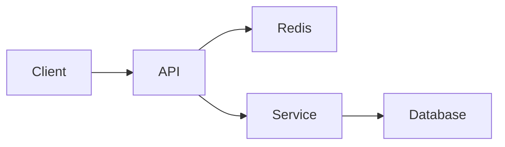

# Content Guide

Everything in this guide only requires writing a Markdown (or MDX) file, committing it, and
pushing — no code changes, no database migration.

## Adding a System Design article

Create `site/src/content/system-design/<slug>.md`:

```yaml
---
title: "Design a Distributed Rate Limiter"
description: "How to design and scale a distributed rate limiter in a system design interview."
date: 2026-09-15
updated: 2026-09-15       # optional
tags:
  - distributed-systems
  - redis
level:                     # optional
  - senior
  - staff
companies:                 # optional
  - stripe
featured: true              # optional, default false — shows on the homepage
draft: false                 # optional, default false — true hides it from all listings
---
```

Suggested (not required) sections: Problem, Requirements (Functional / Non-Functional),
Capacity Estimation, API Design, Data Model, High-Level Design, Deep Dive, Scaling,
Reliability and Failure Handling, Trade-offs, Interviewer Follow-up Questions, Common
Mistakes, Summary. Omit whatever doesn't apply — the schema in `site/src/content.config.ts`
doesn't require any of them.

## Adding a Coding article

Create `site/src/content/coding/<slug>.md`:

```yaml
---
title: "LRU Cache"
description: "Implementation, complexity analysis, and common interview follow-ups."
date: 2026-09-15
difficulty: medium          # optional: easy | medium | hard
patterns:                   # optional
  - hash-map
  - doubly-linked-list
languages:                  # optional
  - python
  - java
tags:
  - data-structures
featured: false
draft: false
---
```

Suggested sections: Problem, Key Insight, Approach, Complexity, Implementation, Walkthrough,
Edge Cases, Alternative Solutions, Interview Follow-ups.

## Adding an Interview Experience article

Create `site/src/content/interviews/<slug>.md`:

```yaml
---
title: "Staff System Design Interview Notes"
description: "Notes and lessons from a Staff-level system design interview."
date: 2026-09-15
company: "Some Company"     # optional
level: "Staff"                # optional
rounds:                        # optional, freeform
  - system-design
  - behavioral
tags:
  - staff
  - system-design
draft: false
---
```

All fields beyond `title`/`description`/`date`/`tags`/`draft`/`featured` are optional — not
every interview experience has the same shape (coding vs. behavioral vs. leadership rounds).
Don't invent details; write what actually happened.

## Images

Put image files under `site/public/images/` and reference them with an absolute path built
from the site base, e.g. in Markdown:

```md

```

(The `/eng-digest` prefix matches this deployment's `BASE_PATH` — see
`site/astro.config.mjs`. If that changes, e.g. to a custom domain with no prefix, update the
prefix here too.)

## Mermaid diagrams

Fenced ` ```mermaid ` blocks render as diagrams automatically:

````md

````

Rendering happens client-side (progressive enhancement) — with JavaScript disabled, the block
still displays as readable Mermaid source in a code block instead of a diagram.

## Tags

Any string under `tags:` in frontmatter works — no tag needs to be registered anywhere.
`/tags/<tag>/` pages are generated automatically at build time for every tag that appears on
at least one non-draft article. Tag URLs are slugified (lowercased, non-alphanumeric runs
collapsed to a single `-`).

## Drafts

Set `draft: true` to keep working on an article without it appearing in any listing, the
homepage, tag pages, or search. Draft pages are excluded entirely (`getStaticPaths` filters
them out), so they don't build a public URL either.

## Frontmatter validation

`site/src/content.config.ts` defines a Zod schema per collection. `npm run check` (also run in
CI) fails the build if a required field is missing or a field has the wrong type — check there
first if a new article won't build.

## Engineering Digest content

Digest pages under `/eng-digest/` are **not** manually authored — they're generated from
`digests/digest-YYYY-MM-DD.md`, which the `eng_digest` Python pipeline writes on its own
schedule. Don't add files to `site/src/content/generated-digests/` directly; it's rebuilt by
`npm run import-digests` on every build and is gitignored.
