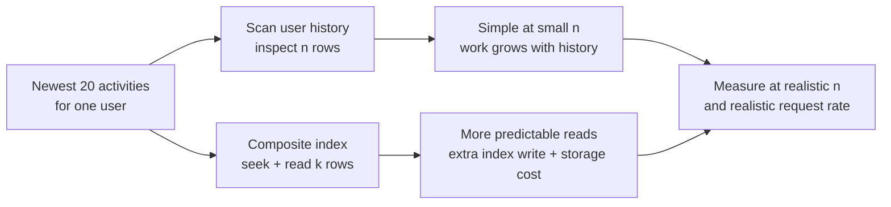
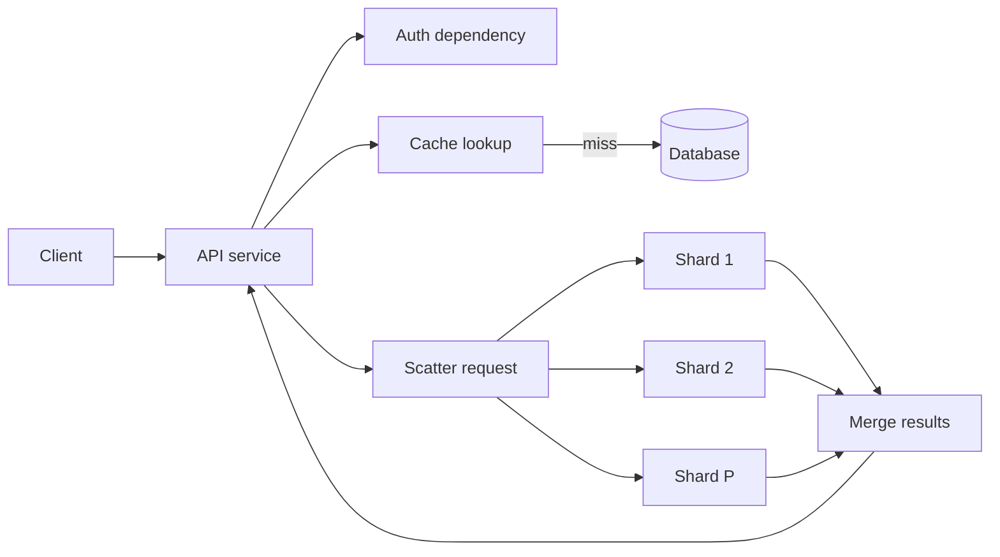

A service answers “show this user's 20 most recent activities” by reading the user's entire activity list, sorting it, and returning 20 rows. At 30 activities per user, nobody notices. After a year, some users have 100,000 activities. The response is still only 20 rows, but the service now reads and sorts 100,000. Should the design discussion begin with Big-O?

Yes—but it should not end there. **Big-O tells us how work grows as an input grows. It does not tell us how expensive one unit of work is, where that work happens, how many times a request triggers it, or what happens when the system is overloaded.** An engineer who ignores complexity can build a workload that becomes impossible to serve. An engineer who optimizes only the complexity class can build a fast algorithm inside a slow, fragile system.

## Start with the small, correct solution

The first implementation may be a linear scan: read the user's events, filter them, sort by timestamp, and take 20. For a small, bounded list, it is easy to build and easy to verify. If there are `n` events, scanning is `O(n)` and sorting the matches is up to `O(n log n)`. A streaming top-20 heap could avoid sorting everything, but it still has to inspect every candidate. The more important question is not whether a heap is cleverer. It is **which input can grow without bound**.

Suppose we only need the newest events. A database index on `(user_id, event_time DESC)` can locate the user's range and read roughly the first 20 entries. As an abstract index operation, think `O(log N + k)`, where `N` is the indexed row count and `k` is the number returned. The database still pays for pages, row lookups, locks or contention, and network transfer; writes must maintain the index. A sequential scan may actually win for a tiny table or a query returning most rows. [PostgreSQL's `EXPLAIN` guide](https://www.postgresql.org/docs/current/using-explain.html) shows why the planner compares access paths using estimated costs rather than choosing an index just because its asymptotic lookup looks attractive.



The move to an index is a classical system-design transition: pay some cost on every write and in storage to avoid unbounded work on important reads. It is not a rule that every query needs an index. It is a response to an observed access pattern and a growing input.

## What Big-O actually says

For nonnegative functions, saying `f(n) = O(g(n))` means that beyond some input size, `f(n)` is bounded above by a constant multiple of `g(n)`. It is an **asymptotic upper bound**, not a stopwatch reading and not automatically a tight bound. `Θ(g(n))` gives a tight asymptotic bound. [MIT's introductory algorithms notes](https://ocw.mit.edu/courses/6-006-introduction-to-algorithms-fall-2011/ce8348ec64dce3841ced6a9d0c9e48f2_MIT6_006F11_rec01.pdf) make this distinction explicit. Also say whether a bound is worst-case, expected, or amortized: a hash-table lookup is commonly expected `O(1)` but can encounter collisions or resizing, while a service-level tail objective must survive more than an average operation. Space growth matters too—an `O(1)` lookup backed by an `O(N)` cache still has a capacity and recovery cost.

In system design, the hard part is often choosing the right *input variable*. `O(1)` with respect to the number of database rows says nothing about the number of RPCs, bytes returned, partitions contacted, or retries. A useful cost description names all relevant dimensions:

```text
N = records in the relevant dataset
k = records returned
P = partitions contacted
B = bytes transferred
R = requests per second

Indexed lookup:        roughly O(log N + k) index work, plus row/page reads
Broadcast to shards:   O(P) RPCs, even if each shard does O(1) local work
Output:                at least Ω(B) byte-handling work to send B bytes
Fleet work per second:  R × work per request, before retries and background jobs
```

These are different budgets. An API that returns a million rows cannot become cheap merely by making the search for the first row `O(log N)`: producing and transferring the result remains proportional to its size. Conversely, an `O(n)` pass over 30 items already in CPU cache may be faster and simpler than an indexed remote lookup. Complexity identifies **growth risk**; a workload model and measurements decide whether the risk matters here.

### A concrete growth check

Imagine 1,000 requests per second, each examining 1,000 event rows. That is about one million row examinations per second. If user histories grow to 100,000 rows while traffic stays fixed, the same scan asks for about 100 million examinations per second. Those are hypothetical counts, not a benchmark: the actual CPU, I/O, and latency depend on row width, memory residency, filtering, and storage. Still, the 100× increase is a useful warning before any machine-specific tuning.

Now imagine adding an index keeps the read near a small seek plus 20 entries. That changes how the work grows with history size. But if every write updates several indexes and the application writes far more often than it reads, the total system cost can rise. The right comparison is **read savings over the real read workload versus write, storage, and operational costs over the real write workload**.

## One request is a path, not one algorithm

A user-visible request may authenticate, read a cache, call a database, fan out to services, serialize a response, and cross a network. Its latency is closer to the sum of serial stages plus the slowest parallel branch than to one Big-O label:

```text
serial stages:    T ≈ T_auth + T_cache + T_database + T_serialize + T_network
parallel fan-out: T ≈ T_startup + max(T_shard_1, ..., T_shard_P) + T_merge
```

These are simplified models, not promises of independence or perfectly parallel execution. They are useful because they force us to locate the expensive boundary. Replacing a local `O(n)` operation that takes 50 microseconds is unlikely to fix a 40-millisecond remote read. Reducing 20 serial RPCs to two may matter more than changing the algorithm inside any one service.



Scatter/gather illustrates a subtle trade-off. With `P` shards, each local scan might shrink from `O(N)` to roughly `O(N/P)`, and the scans run in parallel. User latency can fall. But total scan work may remain `O(N)`, the coordinator sends `O(P)` messages, and the request now waits on the slowest shard. If each shard independently has a 1% chance of exceeding a chosen latency threshold, the chance that **at least one of 20 shards** exceeds it is `1 - 0.99^20 ≈ 18%`. Independence is an illustrative assumption, not a production guarantee; correlated overload may be worse. The underlying tail-latency problem is described in Google's [*The Tail at Scale*](https://research.google/pubs/the-tail-at-scale/).

That is why “parallelize it” is not a free asymptotic improvement. Narrow the shard set when possible, cap fan-out, budget deadlines, and consider whether a precomputed result is worth its update cost.

## Throughput, concurrency, and the queue you did not draw

Big-O describes how an operation's work scales with an input. It does not describe how **arrival rate** interacts with **service capacity**. If a stage receives `λ` requests/s but can complete only `μ` requests/s, then for a sustained overload its backlog grows at roughly `λ - μ` requests/s. At 6,000 arrivals/s and 5,000 completions/s, that is about 60,000 extra requests in one minute. Better constants or a better algorithm may raise `μ`; a queue alone cannot make `λ > μ` sustainable.

For a stable system, Little's Law gives `average concurrency = average throughput × average time in system`. At 2,000 requests/s and a **mean** duration of 100 ms, about 200 requests are in flight. If the mean rises to 500 ms at the same completion rate, about 1,000 are in flight, occupying connections and memory. Do not substitute p99 for the mean in this equation; p99 is a separate user-facing tail metric. [AWS's Lambda concurrency guide](https://docs.aws.amazon.com/lambda/latest/dg/lambda-concurrency.html) gives a concrete operational application of rate times duration.

As a bottleneck approaches saturation, small slowdowns can create long queues and trigger timeouts. Clients retry; offered load rises; the queue grows further. Google SRE's [overload guidance](https://sre.google/sre-book/handling-overload/) discusses limiting work, degrading gracefully, and shedding load rather than allowing overload to cascade. None of that is visible in the statement “the handler is `O(1)`.”

## Classical choices, and what each buys

| Choice | Growth it improves | What it costs or risks |
| --- | --- | --- |
| Better algorithm or index | Fewer operations as `N` grows | More code, memory, index writes, or changed access pattern |
| Cache or precomputed view | Less repeated source work per read | Staleness, invalidation, hot keys, cold-start load, extra writes |
| Batch/vectorize | Less per-item overhead | Added latency to fill a batch, larger failure unit |
| Partition and parallelize | Less work per worker and potentially shorter critical path | Fan-out, skew, coordination, cross-partition operations |
| Approximate or limit | Bounded work or bytes | Explicit loss of accuracy or completeness |

These alternatives do not all solve the same problem. A cache reduces **how often** source work occurs; an index reduces **how much** work a lookup requires; partitioning redistributes work; batching reduces overhead per item; approximation changes the result contract. When evaluating a proposal, say which resource it saves and which new obligation it creates. For example, a cache does not repair an unbounded database query if a synchronized cache expiry sends every request back to that query.

An index also moves work, rather than making it disappear. A B-tree stores ordered keys and references in pages. Searching follows a short path through internal pages to a leaf; appending or updating indexed rows may modify index pages and generate write-ahead-log traffic. A query returning many rows may prefer a sequential scan because contiguous reads and fewer random page fetches outweigh the index seek. Use `EXPLAIN (ANALYZE, BUFFERS)` on representative data to inspect estimated versus actual rows, loops, timing, and buffer activity; [PostgreSQL documents](https://www.postgresql.org/docs/current/using-explain.html) both the plan structure and why estimates can be wrong. `EXPLAIN ANALYZE` executes the query, so use care with writes.

## Failure changes the cost model

A healthy-path complexity estimate is incomplete without its failure path.

- **Cache loss or stampede:** thousands of nominally `O(1)` reads become source queries. Coalesce identical misses, rate-limit fallback, warm deliberately, and test the source's miss budget.
- **Hot partition:** fleet-wide average utilization looks low while one key range throttles. More partitions help only if the key distribution can actually spread the hot work. [DynamoDB's partition-key guidance](https://docs.aws.amazon.com/amazondynamodb/latest/developerguide/bp-partition-key-design.html) makes the per-partition limit and item-size dependence concrete.
- **Plan regression or data skew:** a database switches from a selective lookup to a scan, or a join's actual cardinality dwarfs its estimate. Watch plan changes and real rows/buffers, not just query text.
- **Retry storm:** a downstream slowdown raises tail latency, timeouts, and retries, multiplying work during the least favorable moment. Use bounded retries, deadlines, jitter, and overload signaling.
- **Shard or region failure:** a surviving set must carry the displaced load; a cross-region fallback adds network time. Recompute both capacity and the critical path under failure, not merely the number of available machines.

The failure question is often more revealing than “What is the steady-state Big-O?” A system with a brilliant normal-path lookup and an unbounded recovery scan may be operationally worse than a simpler design with controlled degradation.

## How the design evolves with scale

For a small system, a single relational database and a few well-chosen indexes may be enough. A linear pass over a short bounded collection is fine. The key is to know the bound and monitor whether it remains true.

As data and traffic grow, separate high-frequency access patterns. Add the index that matches the query, a cache where repeated reads justify invalidation complexity, and asynchronous jobs where work need not block the user. Batch background operations to reduce per-item overhead. Each change should be driven by a specific measured bottleneck, not by an architecture checklist.

At larger scale, partition when one machine cannot hold or serve the workload. Choose a partition key from the access pattern, measure skew, and avoid scatter/gather for a request that ought to target one shard. Replicas can add read capacity or resilience, but they introduce staleness and failover behavior. At global scale, regional placement can reduce network latency and isolate failures, while cross-region consistency and migration may dominate the cost of the local algorithm. None of these transitions makes `O(N)` magically become `O(1)`; they change where the work is performed and which failure boundary contains it.

## How production teams reason about it

Three real engineering practices illustrate the larger lesson.

First, PostgreSQL's planner evaluates alternative query plans using statistics and a cost model. It may choose a scan over an index because *physical access cost* matters in addition to asymptotic entry count. The practical lesson is to inspect actual row counts and buffer reads, then fix statistics, query shape, index design, or data layout—whichever explains the measured cost. [Its `EXPLAIN` documentation](https://www.postgresql.org/docs/current/using-explain.html) is a useful guide to that process.

Second, DynamoDB distributes data over partitions and offers adaptive capacity, yet concentrated traffic can still throttle a hot partition even when the table has unused aggregate capacity. The practical lesson is to distinguish **total capacity from capacity at the hottest key** and to account for item size and read consistency when comparing operations. [AWS documents the hot-partition failure mode](https://docs.aws.amazon.com/amazondynamodb/latest/developerguide/throttling-key-range-limit-exceeded-mitigation.html), not just the nominal key-value lookup API.

Third, Google's *The Tail at Scale* studies services whose requests touch many components. The slowest dependency often determines the user's latency. The general lesson is that fan-out can improve parallel work distribution while increasing exposure to stragglers; p50 local operation time is not an end-to-end latency budget. This is a production observation, not a claim that every service needs Google's specific mitigation techniques.

Recent developments change our **implementation options**, not the mathematics. PostgreSQL 18, released in **September 2025**, added asynchronous I/O for operations including sequential and bitmap scans and exposed more execution details in `EXPLAIN`. That can improve I/O overlap and measurement, but a full scan still grows with data volume. The [official release notes](https://www.postgresql.org/docs/release/18.0/) describe the change. In **November 2024**, DynamoDB introduced visible warm throughput and optional pre-warming so teams can prepare for sharp traffic jumps; this addresses immediate capacity readiness, not a hot key that cannot be distributed. [AWS's announcement](https://aws.amazon.com/about-aws/whats-new/2024/11/amazon-dynamodb-warm-throughput-ondemand-provisioned-tables/) and its [warm-throughput scenarios](https://docs.aws.amazon.com/amazondynamodb/latest/developerguide/warm-throughput-scenarios.html) make that distinction. In **March 2026**, OpenTelemetry Profiles entered public **alpha**, aiming to standardize continuous production profiling and correlate resource-use samples with traces. It is promising for finding the real hot path, but alpha status means it is an emerging observability option, not a prerequisite for performance engineering. See the [OpenTelemetry announcement](https://opentelemetry.io/blog/2026/profiles-alpha/) and [specification status](https://opentelemetry.io/docs/specs/otel/profiles/).

## Measure the workload you actually own

Before a migration or optimization, record the input distribution and the user-visible objective. Instrument p50/p95/p99 latency by endpoint and tenant, request arrivals versus completions, in-flight work, queue age, CPU time, allocation, disk I/O, bytes transferred, cache hit/miss rate, database rows and buffers examined, downstream RPC count, retries, and hottest partition. Averages alone can hide the exact customer or shard that is failing.

Benchmark at several input sizes, not just a convenient tiny dataset. Include realistic row widths, cardinality, read/write mix, cold and warm cache states, and concurrent traffic. Ramp until the target latency or error budget fails; run a soak test to expose compaction, memory growth, and maintenance work; test a dependency outage to observe the fallback path. Compare **cost per successful request at the required latency**, including replicas, data transfer, and operational burden. A change that saves CPU but doubles cross-region traffic may be a poor trade.

Roll out an index, cache, or routing change gradually. Capture a baseline, measure the new path, and retain a rollback route. For a database index, estimate build time, extra storage, and write amplification. For a new cache, measure the cold-start load and invalidation delay. For repartitioning, plan dual reads/writes or controlled migration and decide which version is authoritative during cutover. Big-O can justify investigating a change; production validation decides whether it was successful.

## Misconceptions and a more useful mental model

“`O(1)` means fast” is false: a constant number of remote calls can be slower than thousands of local operations. “`O(n)` is always bad” is false when `n` is deliberately bounded and small. “More shards always improve latency” ignores fan-out, skew, and the slowest branch. “A cache changes the algorithm to `O(1)`” hides miss paths and invalidation. “Big-O predicts p99” confuses input growth with scheduling, I/O, and partial failure.

An experienced engineer asks four questions before choosing a mechanism:

1. **What grows?** Name the independent variables and the largest realistic values.
2. **Where is the work?** Count CPU operations, pages, bytes, RPCs, and repeated calls along the critical path.
3. **How often and how unevenly?** Multiply cost by arrival rate, then inspect hot keys and tail latency.
4. **What changes under failure?** Include retries, cache misses, failover, backfills, and recovery work.

Big-O is the **growth lens**, not the whole design review. Use it to catch work that scales with the wrong dimension. Then use measurements, capacity models, and failure tests to decide whether reducing that work is worth the added complexity. The best system is not the one with the most impressive complexity label; it is the simplest one that keeps the important workload within its latency, reliability, and cost budgets as it grows.

## Further reading

- [MIT 6.006, *Asymptotic Complexity*](https://ocw.mit.edu/courses/6-006-introduction-to-algorithms-fall-2011/ce8348ec64dce3841ced6a9d0c9e48f2_MIT6_006F11_rec01.pdf) — A precise, approachable distinction between `O`, `Θ`, and `Ω`.
- [PostgreSQL, *Using EXPLAIN*](https://www.postgresql.org/docs/current/using-explain.html) — Shows how logical query choices become actual plans, row counts, loops, and buffer work.
- [Google Research, *The Tail at Scale*](https://research.google/pubs/the-tail-at-scale/) — Explains why fan-out makes the slowest component important to end-to-end latency.
- [Google SRE, *Handling Overload*](https://sre.google/sre-book/handling-overload/) — Connects variable request cost, queueing, load shedding, and graceful degradation.
- [AWS Lambda, *Understanding Function Scaling*](https://docs.aws.amazon.com/lambda/latest/dg/lambda-concurrency.html) — A practical application of arrival rate, mean duration, and concurrency.
- [DynamoDB, *Partition-Key Design*](https://docs.aws.amazon.com/amazondynamodb/latest/developerguide/bp-partition-key-design.html) — Makes hot-key and per-partition capacity limits concrete.
- [PostgreSQL 18 Release Notes](https://www.postgresql.org/docs/release/18.0/) — Documents recent asynchronous I/O and execution-plan improvements without changing scan complexity.
- [DynamoDB, *Warm Throughput Scenarios*](https://docs.aws.amazon.com/amazondynamodb/latest/developerguide/warm-throughput-scenarios.html) — Distinguishes prepared fleet capacity from an unsolved hot partition.
- [OpenTelemetry, *Profiles Public Alpha*](https://opentelemetry.io/blog/2026/profiles-alpha/) — An emerging approach to correlating production resource costs with traces; note its alpha maturity.
