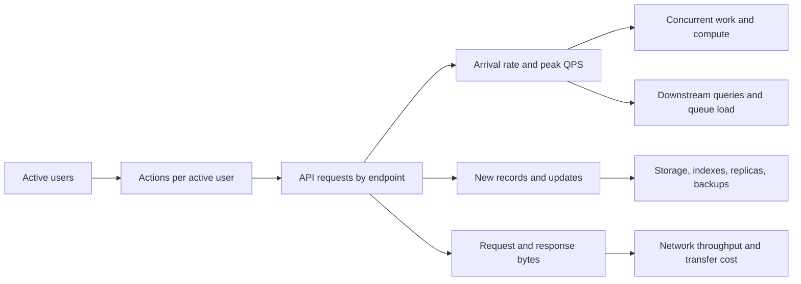

“We have two million daily users. How many servers do we need?” The number of users is a useful starting point, but it does not answer the question. One user may open a page once; another may generate hundreds of API calls. Their requests may arrive together after a notification, carry wildly different payloads, or trigger work in several downstream services. A daily average can look comfortable while a five-minute peak exhausts a database or a network link.

**Capacity estimation is the bridge from product behavior to resource demand.** It is not a promise that a spreadsheet can predict a production system exactly. A good estimate exposes its assumptions, keeps units consistent, identifies the likely bottleneck, and tells you what to measure next. This note develops that method from first principles using DAU/MAU, QPS, peak traffic, storage, bandwidth, and concurrency.

## Start with behavior, not machine count

Imagine a small API with two million daily active users (DAU) and ten million monthly active users (MAU). Its team proposes “one request per user per minute,” then divides by 60. The answer looks precise, but the premise is invented. An active user does not make requests uniformly throughout the day, and a screen load may call several endpoints.

Define the time window and identity rule first. Here, **DAU** means distinct users active on one UTC calendar day; **MAU** means distinct users active during a rolling 30-day window. Those are product metrics, not concurrent connections or requests. `DAU / MAU = 20%` in this example means 20% of the monthly-active IDs were active on that day; it does **not** tell us the peak QPS. Bots, anonymous users, background polling, time zones, and a changed analytics definition can all distort the translation.

The missing variable is *operations per active user*. Ideally, measure it by endpoint and user cohort. If the product does not exist yet, use a small range of explicit hypotheses and revise them after a prototype or launch. Count client retries and background work separately: a failed request may produce multiple **attempts**, and one API call may produce several database queries.



Every arrow is a conversion that needs an assumption or a measurement. Skipping an arrow is how “two million users” turns into an unjustified server count.

## A worked estimate, with units attached

Suppose each DAU generates **30 API requests per day**, creates **two durable records per day**, and receives **12 kB of response data per request on average**. Assume each new record occupies **1 kB of logical data**, retention is **90 days**, and the busiest sustained interval is **8× the daily-average request rate**. These are hypothetical planning inputs, not industry constants.

| Quantity | Calculation | Result |
| --- | --- | --- |
| API requests per day | `2,000,000 users × 30 requests/user/day` | 60 million requests/day |
| Average API QPS | `60,000,000 / 86,400 seconds/day` | About 694 requests/s |
| Illustrative peak API QPS | `694 × 8` | About 5,600 requests/s |
| New records per day | `2,000,000 × 2` | 4 million records/day |
| Logical data added per day | `4,000,000 × 1 kB` | 4 GB/day |
| Logical data at 90 days | `4 GB/day × 90 days` | 360 GB |
| Response transfer per day | `60,000,000 × 12 kB` | 720 GB/day |

Here `kB`, `GB`, and `TB` use decimal multiples: 1 kB = 1,000 bytes. Operating systems and some storage tools report binary `KiB`, `GiB`, and `TiB`; do not silently mix them. The table also describes *completed application requests*. Edge-cache hits, CDN transfers, retries, service-to-service calls, uploads, and replication require separate lines.

The 8× multiplier is only a scenario. A real service may have a 2× morning rise, a 20× notification surge, or a launch that has no historical pattern. Describe a **peak window**—for example, the busiest five-minute sustained rate—and separately test a much shorter burst. A one-second spike may be absorbed by a small queue, while five minutes above service capacity will not be.

### From QPS to concurrent work

QPS is a *rate*. Concurrency is the number of operations *in flight*. In a stable interval, Little's Law gives a useful relationship:

```text
average in-flight requests ≈ completed requests/second × average time/request
```

At 5,600 requests/s and a **mean** end-to-end time of 120 ms, roughly `5,600 × 0.12 = 672` requests are in flight. If mean time rises to 500 ms without a throughput change, concurrency rises to about 2,800. Those extra requests occupy sockets, memory, connection-pool slots, and perhaps downstream work. Do not plug **p99** latency into this steady-state mean formula; use p99 separately as a user-facing performance constraint. [AWS's Lambda concurrency documentation](https://docs.aws.amazon.com/lambda/latest/dg/lambda-concurrency.html) gives the same operational rate-times-duration relationship for functions.

One request may spend 120 ms end to end but only 8 ms using a database connection. Estimate each bottleneck's concurrency from the time that resource is actually held. A pool of 100 connections cannot be sized from HTTP concurrency alone; neither can CPU from network wait time.

### From logical records to physical storage

The 360 GB above is only retained **logical payload**. Suppose indexes add 40% of that size and there are three full physical copies. A first physical estimate is:

```text
360 GB × (1 + 0.40 index overhead) × 3 copies ≈ 1.51 TB
```

That is before write-ahead logs, compaction or temporary rewrite space, snapshots, backups, encryption overhead, and growth beyond the 90-day window. Compression may reduce some components; indexes may grow faster than payload. Measure real bytes per record and index amplification on a representative dataset. Replicas are not backups: an accidental deletion can propagate to all live copies.

Also distinguish *retained bytes* from *write rate*. Four million new records per day average about 46 records/s, but a burst may be much higher and each logical write may update an index, write a log, and replicate data. A database that can store 1.5 TB is not necessarily able to ingest the peak write workload within its latency target.

### From payloads to bandwidth

The response estimate is `720 GB/day / 86,400 s ≈ 8.3 MB/s` averaged over the day. If response size stayed constant during the 8× request peak, outbound throughput would be about **67 MB/s**, or **533 Mb/s** because one byte is eight bits. The actual peak must use the **peak payload mix**: a burst of image downloads could be far larger than a burst of small API responses.

Calculate ingress and egress separately. Then account for CDN misses, request headers, TLS and protocol overhead, cross-zone replication, multi-region copies, object-store transfers, and client retries. Do not bill the same byte twice in a model: if a CDN serves 90% of a static asset's requests, origin bandwidth and end-user egress have different counts and possibly different owners on the bill. A network link rated at a headline number still needs headroom for packet overhead, uneven routing, and failover traffic.

## Peak QPS is a distribution, not one magic multiplier

The classical back-of-the-envelope method takes daily requests, divides by 86,400, and multiplies by a peak factor. It is excellent for checking whether a design is in the neighborhood of hundreds, thousands, or millions of QPS. It is not enough to choose production quotas or a launch plan.

Build a time series of **offered requests**, not only successful completions. Examine one-second, one-minute, and five-minute windows, and break them down by endpoint, region, tenant, and client type. A daily average hides the day/night cycle; a one-minute average can hide a one-second burst; a global sum can hide one region or tenant that is already saturated. A percentile of historical windows is useful for normal operations, but it can exclude exactly the rare event the product promises to survive. Model launches, campaigns, and failover as explicit scenarios.

The next refinement is **workload-weighted QPS**. A cached profile read, full-text search, report export, and write transaction are all “one request,” but they consume very different CPU, I/O, and downstream capacity. Google's [SRE discussion of overload](https://sre.google/sre-book/handling-overload/) explicitly warns that raw QPS can be a poor proxy for the cost of different queries. A practical capacity model tracks at least read/write mix, payload-size distribution, cache-hit ratio, database calls per request, and expensive operations separately. If one endpoint fans out to ten services, estimate its fan-out load rather than pretending it costs one backend operation.

## Turn demand into a capacity plan

Assume a load test—not a vendor benchmark—shows one application instance can **safely sustain 600 of this workload's requests/s** while meeting its latency and error targets. The arithmetic minimum for 5,600 peak QPS is `ceil(5,600 / 600) = 10` instances. Ten is not a resilient deployment: any instance loss, rollout, uneven load, or rising request cost removes the margin.

If instances are placed evenly across three failure zones and the service must survive the complete loss of one zone *without waiting for new machines*, five instances per zone give 15 normally and 10 survivors. Under the same measured per-instance capacity, survivors can handle `10 × 600 = 6,000 requests/s`—only a modest margin above the illustrative 5,600 peak. Growth or another bottleneck may require more. AWS's [static-stability guidance](https://aws.amazon.com/builders-library/static-stability-using-availability-zones/) explains why a design should not rely solely on emergency scale-up after a zone fails.

The 600 requests/s figure is valid only for the tested request mix and the **whole dependency chain**. If the database safely handles 4,000 of the relevant operations per second, adding API instances cannot make it complete 5,600. At 5,600 arrivals/s and 4,000 completions/s, backlog grows by **1,600 requests/s**, or **96,000 in one minute**. A queue buys time for short bursts; it does not make sustained overload disappear. Bound queues, use deadlines, shed excess load, and avoid retries that amplify an already overloaded dependency.

| Approach | Strength | What it misses if used alone |
| --- | --- | --- |
| Back-of-the-envelope model | Fast order-of-magnitude check before a system exists | Real request mix, tail latency, burst shape, and bottlenecks |
| Historical demand forecast | Seasonality, regional trends, known launch effects | Novel traffic, changed product behavior, and missing telemetry |
| Representative load and failure tests | Observed safe throughput, queue growth, and recovery | Future features, untested data growth, and genuinely new peaks |

These methods should reinforce each other. [Google SRE's capacity-planning guidance](https://sre.google/sre-book/introduction/) combines organic and launch-driven forecasts with recurring load tests that connect raw resources to actual service capacity. A spreadsheet is the hypothesis; testing and production telemetry are the correction loop.

## Failure scenarios belong in the estimate

A healthy-day estimate is incomplete. Consider four common ways it fails:

1. **A traffic spike outruns scale-up.** New instances need scheduling, image startup, connection warmup, and cache warmup. Keep minimum capacity or pre-scale for known events; rate-limit or shed work if the burst exceeds the available envelope.
2. **A dependency slows down.** Longer request time raises concurrency even if QPS stays flat. Pools fill, queues grow, clients time out and retry, increasing offered load. Track attempts as well as successes and enforce retry budgets.
3. **A zone or region disappears.** Surviving locations receive more traffic. Calculate post-failure capacity and data placement explicitly; “three replicas” does not prove the serving path has enough capacity or that replicas are in independent failure domains.
4. **The size distribution changes.** A new feature adds larger responses, wider database rows, or a new index. QPS may remain unchanged while bandwidth, storage, compaction, and egress cost jump. Re-measure bytes and cost per operation after product changes.

Hot tenants and hot keys add a fifth trap: system-wide spare capacity cannot necessarily help a partition whose single owner is saturated. Partition-level throughput and skew matter as much as fleet totals. For durable queues, estimate arrival and **drain** rates, message bytes, and maximum tolerable queue age. A queue with one hour of storage but a two-day drain time is not a recovery plan.

## Operating the model in production

Keep a small capacity worksheet or dashboard with every assumption, its source, its update date, and a low/base/high range. Reconcile forecast with observed demand weekly or after releases. Measure request arrivals, accepted and rejected rates, p50/p95/p99 latency, in-flight work, per-endpoint cost, CPU and memory saturation, database pool wait, disk IOPS and free space, replication lag, queue age, payload-size distributions, and network ingress/egress. Track quotas as well as utilization: a managed service can throttle below the capacity you expected to buy.

Use a **ramp test** to find where p99 and errors first rise, a **spike test** to measure warmup behavior, a **soak test** to expose leaks and compaction, and a **failure test** to validate zone-loss assumptions. Specify the arrival process and request mix in the test; a closed-loop client that waits for each response can unintentionally reduce its offered QPS as the server slows. Watch completed throughput and backlog, not just CPU. Google's [production-service guidance](https://sre.google/sre-book/service-best-practices/) recommends checking forecasts against reality and re-running load tests because a server-to-QPS ratio can change as software changes.

Forecast at least as far ahead as the time needed to obtain capacity, raise quotas, migrate data, or pre-warm a service. Reserve the ability to roll back a feature whose per-request cost is higher than expected. Compare options using **cost per completed operation at the required latency**, including failover headroom, data transfer, replicas, and operational work—not only monthly price per server.

## What production systems teach us

Managed platforms move some sizing work to a provider, but they do not erase the workload model. [AWS Lambda](https://docs.aws.amazon.com/lambda/latest/dg/lambda-concurrency.html) makes concurrency directly visible as arrival rate times execution duration; a slower function needs more concurrent executions at the same request rate. [Cloud Run's autoscaling documentation](https://docs.cloud.google.com/run/docs/about-instance-autoscaling) shows a different implementation: it responds to CPU and request concurrency, but also has instance limits, cold starts, and downstream-connection considerations. In both cases, estimate the application and its dependencies, even when instances appear automatically.

Database request units are another reminder that QPS is not capacity by itself. [DynamoDB's documented units](https://docs.aws.amazon.com/amazondynamodb/latest/developerguide/Constraints.html) depend on item size, read consistency, and transactional operation. Two applications making 5,000 requests/s can demand very different read/write units. The general lesson is to translate user operations into the **billing and throttling unit** of the specific dependency, without making that vendor unit the center of your architecture.

## Recent changes: better controls, same physics

In **November 2024**, DynamoDB introduced [warm throughput and pre-warming](https://aws.amazon.com/about-aws/whats-new/2024/11/amazon-dynamodb-warm-throughput-ondemand-provisioned-tables/). Even an on-demand table has a rate it is ready to serve *immediately*; teams anticipating a sharp launch can examine and raise that prepared capacity ahead of time. This is an established managed-service capability, not evidence that burst planning has become unnecessary. Pre-warming also has a cost, so the decision still depends on the expected peak and its business value.

Predictive scaling has become a practical complement to reactive scaling for recurring daily or weekly patterns. [AWS's documented approach](https://docs.aws.amazon.com/autoscaling/application/userguide/application-auto-scaling-predictive-scaling.html) uses historical metrics to forecast capacity and can be evaluated in forecast-only mode before taking action. It is most useful when demand patterns repeat and instances need time to start. It cannot reliably predict a novel viral spike or replace failure headroom. Treat the forecast as a model whose error is measured, not as an availability guarantee.

In **December 2025**, Kubernetes 1.35 made [in-place Pod resize stable](https://kubernetes.io/blog/2025/12/19/kubernetes-v1-35-in-place-pod-resize-ga/). That can reduce the disruption of adjusting CPU or memory allocations for suitable workloads, although a resize still needs actual node resources and application/runtime compatibility. It changes an operational option for meeting a measured demand; it does not change the arithmetic of arrivals, service time, bytes, or failure capacity.

## Misconceptions and a usable mental model

“DAU tells me QPS” omits actions per user and time distribution. “Peak is always 10× average” turns one scenario into a law. “Autoscaling means I need no spare capacity” ignores reaction time, quotas, and zone failure. “A terabyte of data means a terabyte of disks” ignores indexes, copies, logs, and backups. “Network bandwidth is requests per second times payload size” is only true after you specify **which** payload, direction, cache boundary, and time window.

An experienced engineer asks what resource is actually saturated, at which percentile and in which failure domain; where a request fans out; how long it takes to add capacity; whether the proposed reserve can survive a release or a zone loss; and which assumptions a launch might invalidate. A simple estimate is valuable precisely because it makes those questions visible before a complex design hides them.

The mental model is a chain:

```text
users → actions → requests over time → work per request → concurrency and throughput
      → bytes created and transferred → retained physical capacity
      → headroom for failures, growth, and imperfect forecasts
```

Every conversion should have a unit, an assumption, and a way to test it. Start with a rough range, measure a representative system, then update the model. The goal is not to predict the exact number of machines from DAU; it is to know **which workload and failure promise those machines must satisfy**.

## Further reading

- [Google SRE, *Introduction*—Demand Forecasting and Capacity Planning](https://sre.google/sre-book/introduction/) — Connects traffic forecasts, launches, provisioning lead time, and recurring load tests.
- [Google SRE, *Handling Overload*](https://sre.google/sre-book/handling-overload/) — Explains why raw QPS can misrepresent request cost and how systems should behave beyond capacity.
- [Google SRE, *Production Services Best Practices*](https://sre.google/sre-book/service-best-practices/) — Practical guidance on forecast validation, overload tests, and reserve capacity.
- [AWS Builders' Library, *Static Stability Using Availability Zones*](https://aws.amazon.com/builders-library/static-stability-using-availability-zones/) — Shows why post-failure serving capacity must be considered before an outage.
- [AWS Lambda, *Understanding Function Scaling*](https://docs.aws.amazon.com/lambda/latest/dg/lambda-concurrency.html) — A concrete explanation of request rate, duration, and concurrent executions.
- [Google Cloud, *Cloud Run Instance Autoscaling*](https://docs.cloud.google.com/run/docs/about-instance-autoscaling) — Documents how concurrency, CPU, startup, and instance bounds affect managed scaling.
- [AWS DynamoDB, *Capacity Unit Constraints*](https://docs.aws.amazon.com/amazondynamodb/latest/developerguide/Constraints.html) — Demonstrates why item size and consistency change the cost of a “request.”
- [AWS DynamoDB, *Warm Throughput*](https://docs.aws.amazon.com/amazondynamodb/latest/developerguide/warm-throughput.html) — Explains preparedness for immediate bursts and when pre-warming matters.
- [Kubernetes, *In-Place Pod Resize Becomes Stable*](https://kubernetes.io/blog/2025/12/19/kubernetes-v1-35-in-place-pod-resize-ga/) — Shows how a newer operational mechanism changes resizing without changing capacity fundamentals.
