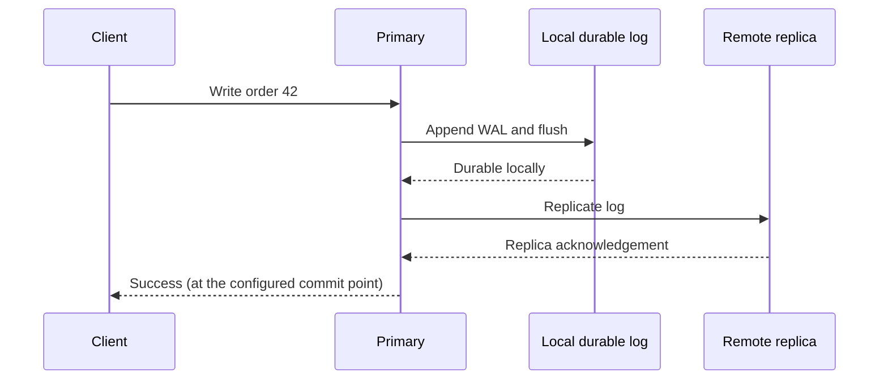
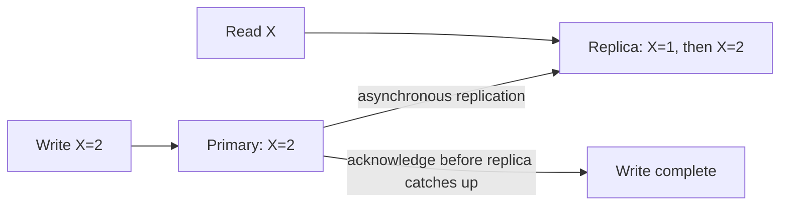

An API returns `200 OK` in 40 milliseconds. Is it a good system? Perhaps the response came from a stale replica. Perhaps an acknowledged write still exists only in memory. Perhaps it stays fast for one user but collapses at 10,000 requests per second. A single success tells us almost nothing about how the system behaves under load or failure.

Five questions make the discussion concrete:

| Dimension | Question to ask | Example of a measurable contract |
| --- | --- | --- |
| **Latency** | How long does one operation take? | 99% of successful reads finish within 200 ms, measured at the client. |
| **Throughput** | How much useful work completes per unit of time? | Sustain 5,000 reads/s and 500 writes/s at the latency target. |
| **Availability** | Can a valid request get a useful answer now? | 99.9% of valid reads succeed over a rolling 30 days. |
| **Durability** | Will an acknowledged write survive the failures we care about? | An acknowledged order survives one machine failure; backups meet a stated recovery point objective. |
| **Consistency** | Which version of state may an operation observe? | After a write completes, a later read of that item returns it or a newer value. |

These are not five independent knobs. A cross-region acknowledgement can improve durability but increase write latency. A nearby asynchronous replica can improve read latency and regional availability while permitting stale reads. Rejecting writes during a network partition can preserve a strong consistency contract while reducing availability. The job of system design is to make those consequences explicit.

## Start with one small service

Imagine a service that stores a user's settings. One application process writes to one database on one machine. A request updates `theme=dark`, receives an acknowledgement, and a subsequent read returns `dark`. At modest traffic, this is refreshingly easy to reason about: one authoritative copy, no replica lag, no cross-region coordination.

Even here, the five questions remain. Does the database acknowledge before its log is safely written? Does a power loss erase the last update? What happens when the machine is rebooted? What is the p99 latency when a large query competes for disk I/O? The simple system is not wrong; it simply has a smaller failure and load envelope.

Suppose the same service receives 10,000 requests per second. If a worker spends 20 ms actively processing each request, its theoretical maximum at full utilization is 50 requests/s. That does **not** mean 200 workers will be enough in production: peaks, uneven keys, GC pauses, database contention, and headroom matter. Adding application workers also does not remove a database bottleneck. First measure which resource saturates.

## Latency is a distribution, not one number

Latency is elapsed time from a specified start to a specified finish. A server-side timer may omit DNS, connection setup, queues at the edge, and the return trip; a user-visible SLO should say where it is measured. The useful breakdown is often:

```text
client-observed latency
  = network + admission/queueing + application work
  + downstream calls + response transfer
```

This is an accounting model, not an assertion that every stage runs sequentially. Parallel downstream calls shorten some paths, but the slowest required dependency still holds up the result. The [Tail at Scale](https://research.google/pubs/the-tail-at-scale/) explains why fan-out makes tail latency especially important: when a request needs many components, it becomes more likely that at least one is slow.

For example, if each of 20 independent calls has a 1% chance of being slow, the chance that **at least one** is slow is `1 - 0.99^20`, about 18%. Independence is a simplifying assumption; shared overload can make the real situation worse. That is why p50 alone can be reassuring while users still complain. Report p50, p95, and p99 by operation and by region; track timed-out requests rather than silently excluding them from the latency distribution. Google SRE's [SLO guidance](https://sre.google/sre-book/service-level-objectives/) likewise emphasizes user-relevant measurements and the danger of averages hiding the tail.

## Throughput is not “the number of servers”

Throughput counts **completed useful work**: requests/s, messages/s, or bytes/s. Offered load can exceed completed throughput. Past a saturation point, queues grow, latency rises, and retries may consume the capacity that real work needed.

Little's Law gives a helpful steady-state intuition: `in-flight work ≈ arrival rate × average time in system`. At 2,000 requests/s and 100 ms average response time, expect roughly 200 requests in flight. If response time rises to one second at the same arrival rate, roughly 2,000 are in flight. This relationship describes a stable system; if arrivals outrun completions indefinitely, there is no stable queue to measure.

Batching and asynchronous work can increase throughput by amortizing per-operation overhead. They can also increase time-to-first-result or make results visible later. A bounded queue, admission control, and a clear overload response are often better than accepting unlimited work and timing out everything. Capacity tests should find the **highest sustained throughput at the required latency and error-rate targets**, not the biggest number printed by a benchmark just before the service fails.

## Availability is about the operation, not the process

A process can be running while its database is unreachable. A `200` with the wrong account balance may be less useful than an explicit error. Define availability around a specific request class and acceptable result. For example, reads may stay available during a regional failure while writes pause; an archive may permit delayed retrieval but not data loss.

A 99.9% monthly availability target allows approximately 43.2 minutes of unavailability in a 30-day month; 99.99% allows about 4.32 minutes. These are budgeting illustrations, not predictions of real incidents. A service-level objective (SLO) should define the window, eligible requests, and exclusions. An SLA is the external agreement, often with commercial consequences. The gap between 100% and an SLO is an **error budget**, useful for deciding how much operational risk the team can take. [Google's SRE book](https://sre.google/sre-book/service-level-objectives/) presents this distinction in more detail.

Replication improves availability only when failures are actually independent and routing can reach a healthy copy. Two replicas behind one broken load balancer share a failure path. Two regions whose writes require the same control plane may not be operationally independent. Fault isolation, health checks that reflect real dependency health, and rehearsed failover matter as much as replica count. [AWS's resilience guidance](https://docs.aws.amazon.com/wellarchitected/latest/reliability-pillar/shared-responsibility-model-for-resiliency.html) makes the distinction between provider infrastructure and the customer's workload-level design explicit.

## Durability begins at the acknowledgement boundary

Durability asks what can be lost *after the client is told the write succeeded*. A database may first change a memory page, append a write-ahead log (WAL) record, flush the log to stable storage, later write data pages, and perhaps replicate the log. The acknowledgement point determines the promise.



If success is returned after the local flush, a process crash can be recovered from the log, but loss of the whole machine's storage may still lose the write. Waiting for a remote acknowledgement changes that failure boundary and usually adds latency; whether the remote copy is itself durable depends on what its acknowledgement means. [PostgreSQL's WAL settings](https://www.postgresql.org/docs/16/runtime-config-wal.html) distinguish local synchronization, remote write, remote flush, and remote apply. They are materially different contracts, not synonyms for “replicated.”

Backups solve another problem: accidental deletion, corruption, or a bad migration can faithfully propagate to every live replica. Recovery point objective (RPO) describes how much data loss is tolerable; recovery time objective (RTO) describes how long restoration may take. A backup is credible only after a restore test with measured RPO and RTO.

## Consistency defines the allowed observations

Consistency has several meanings. Here it means the relationship among writes and reads of replicated data—not the “C” in database ACID transactions and not whether a schema is valid.

If Alice's write completes and Bob's later read of the same object begins, **linearizability** requires Bob to see Alice's value or a newer one. Concurrent operations may be ordered either way. **Eventual consistency** allows Bob to see an older value temporarily, provided replicas converge if writes stop and delivery succeeds. A useful middle ground is a session guarantee such as *read your writes*: Alice should see her own update even when other readers can lag. Strong consistency of one item also does not automatically give an atomic transaction across multiple items. The [Jepsen consistency-model reference](https://jepsen.io/consistency/models) is a careful guide to these distinctions.

The practical source of stale reads is straightforward:



Routing all reads to the primary may provide a simpler freshness story, but it can increase cross-region latency and concentrate load. A quorum or leader-mediated read can preserve a stronger contract across replicas, at the cost of coordination and possible unavailability when the required participants cannot communicate. A cache is not automatically a strongly consistent read path: a time-to-live value bounds neither freshness after an arbitrary update nor safe revocation unless the application has an explicit invalidation or version protocol.

## Classical approaches and their costs

| Approach | What it buys | What it costs or can break |
| --- | --- | --- |
| One primary with durable WAL | Simple write ordering and local recovery | One write authority and a machine/zone failure boundary. |
| Asynchronous read replicas | More read capacity and local reads | Replica lag, stale reads, and possible loss of unreplicated acknowledged writes if the primary is lost. |
| Synchronous replication or quorum commit | Stronger cross-node durability; a basis for stronger consistency | Extra round trips; writes or strong reads can stop without the required participants. |
| Cache near users | Fast reads and reduced origin load | Invalidation, stampedes, extra state, and a separate freshness contract. |
| Partitioning by key | More aggregate capacity | Hot keys, cross-partition operations, rebalancing, and per-partition failure handling. |

None is a default upgrade. A small service with one database may be easier to operate and more reliable in practice than a poorly understood three-region system. Add the next mechanism only when a measured requirement justifies its failure modes.

## Failure scenarios reveal the real design

Consider a timeout after a client sends a write. The server may have committed it even though the reply was lost. A blind retry can create a duplicate order. An idempotency key or an operation identifier stored with the transaction turns the retry into a lookup of the original result. A timeout is **unknown outcome**, not proof that nothing happened.

Now remove the primary's region. An asynchronously replicated standby may be fast to promote, but acknowledged writes not yet copied can disappear. A synchronous quorum can retain acknowledged data, but if it cannot form a majority, it must stop accepting operations that require that guarantee. Serving a stale cached value can keep some **explicitly stale-tolerant** reads available; it must not silently claim to be a strict read. During a network partition, there is no clever configuration that makes every side accept conflicting writes while also preserving a single linearizable order without coordination.

Finally, consider overload rather than a clean crash. A slow database raises request concurrency; retries create more traffic; healthy replicas become saturated; a small slowdown becomes a regional incident. Use deadlines, bounded retries with jitter and budgets, admission control, circuit breaking where appropriate, and isolation between workloads. Test partial and “gray” failures, not just process kills; [AWS's multi-AZ resilience paper](https://docs.aws.amazon.com/whitepapers/latest/advanced-multi-az-resilience-patterns/advanced-multi-az-resilience-patterns.html) specifically discusses failures that are hard to classify as simply healthy or dead.

## How the architecture grows

A reasonable progression is incremental. Start with one application and one durable database, then remove measured bottlenecks: multiple stateless application instances for CPU and connection capacity, a replica for read-heavy traffic *if stale reads are acceptable*, and a cache only for data with a clear invalidation rule. At higher scale, partition state by an explicit key and isolate hot tenants or workloads. For disaster recovery, decide whether a warm standby and a tested restore meet the RTO/RPO, or whether multiple active regions are actually necessary.

Each transition changes the operating model. Adding a replica means tracking lag, promotion, and stale-read behavior. Adding a cache means owning invalidation and stampede behavior. Adding a second region means owning routing, data residency, conflicting writes, and failover exercises. The transition is not complete when resources are provisioned; it is complete when failure behavior is understood and tested.

## Production contracts and observability

Choose a small set of user-facing SLIs by **operation and region**: successful-request fraction, p50/p95/p99 latency, and completed throughput. Pair them with explanatory metrics: queue depth, CPU and I/O saturation, database connection wait, retry rate, replica lag, WAL flush latency, and restore-test age. For consistency-sensitive paths, add semantic checks—for example, write a versioned object and verify that a strict read sees at least that version. Ordinary uptime probes cannot catch stale-but-successful responses.

Roll out changes with a traffic ramp and compare both latency *and* correctness. A new cache can lower p99 while increasing stale reads; a new synchronous standby can improve recovery confidence while slowing writes. Set alerts on sustained SLO burn and on leading indicators such as lag or queue growth. Keep a runbook for failover, replay, and restoring from backups, then rehearse it. Observability is not a substitute for a defined contract; it tells you whether the implementation meets one.

## What production systems demonstrate

[Google Spanner's original paper](https://research.google/pubs/spanner-googles-globally-distributed-database-2/) shows one end of the spectrum: globally distributed transactions and strong external consistency built using coordinated replication and clock uncertainty. Its lesson is not that every system needs global transactions. It is that strong global guarantees require an explicit protocol and latency/availability budget. [Spanner's replication documentation](https://docs.cloud.google.com/spanner/docs/replication) distinguishes strong reads from stale reads and explains when a non-leader read consults the leader.

[Amazon S3 documents](https://docs.aws.amazon.com/AmazonS3/latest/userguide/Welcome.html) strong read-after-write behavior for object operations within its stated scope. That is a reminder to read the precise API guarantee: a storage service can strengthen consistency without making every surrounding workflow atomic. By contrast, [DynamoDB global tables](https://docs.aws.amazon.com/amazondynamodb/latest/developerguide/V2globaltables_HowItWorks.html) explicitly offer a choice between multi-region eventual consistency and multi-region strong consistency. The strong mode synchronously replicates to another region before success and requires three regions, with either three replicas or two replicas and a witness. It makes the latency and quorum trade-off a product-level choice rather than hiding it.

## What changed recently—and what did not

Two developments from the last few years are useful because they expose different layers of the problem. The 2022 [HTTP/3 RFC](https://www.rfc-editor.org/rfc/rfc9114.html) standardizes HTTP over QUIC, whose stream multiplexing can avoid transport-level head-of-line blocking between streams and improve connection setup in some conditions. It can reduce a **network component** of latency; it does not fix an overloaded database, slow application work, or a poor p99 caused by fan-out.

In [June 2025](https://aws.amazon.com/about-aws/whats-new/2025/06/amazon-dynamo-db-global-tables-multi-region-strong-consistency-generally-available/), AWS made multi-region strong consistency for DynamoDB global tables generally available. This expands the set of managed consistency choices, but does not overturn the underlying rule: global strong writes still need coordination, and a region without a quorum cannot offer the same strict operations. Managed infrastructure moves protocol and operational work to a provider; it does not repeal distance or failure boundaries. Treat such features as established vendor capabilities with documented constraints, not as universal defaults.

## Misconceptions worth retiring

“More replicas mean stronger durability and availability” is incomplete. **When** a replica receives a write and **which failures** it survives determine durability; routing and independent fault domains determine availability. “Five nines” without a request definition and time window is marketing, not an engineering target. “Eventual consistency means inconsistent forever” is also wrong: convergence is part of the model under its assumptions, although a specific stale-read bound requires a stronger, explicit contract. And “a cache always makes a service faster” ignores misses, invalidations, hot keys, and the possibility that correctness work costs more than the latency saved.

## How experienced engineers make the call

A junior engineer may ask which database is fastest. A senior engineer asks which operation is slow, at what percentile, and under which load. A staff engineer asks where state lives, what the acknowledgement means, which failure domain can take down a strict read, and how a migration changes the contract. A principal engineer also asks whether the product truly needs the expensive guarantee, whether teams can operate it, and whether a simpler architecture has enough headroom.

For each critical operation, write down five sentences: **how fast; how much; how often available; how much data can be lost; how fresh the answer must be.** Add the measurement point and failure scope to each sentence. If two sentences conflict—for example, globally linearizable writes with local-only latency and always-on writes during a partition—the conflict is the design discussion, not something to conceal in a diagram.

## A compact mental model

Follow the request to its **completion point**, the write to its **acknowledgement point**, and the read to its **source of truth**. Then break one dependency at a time. That exercise reveals most latency, throughput, availability, durability, and consistency trade-offs before any vendor comparison begins.

The best architecture is not the one that maximizes all five dimensions on a slide. It is the least complex one whose *measured* behavior and failure promises match what the product actually needs.

## Further reading

- [Google SRE, *Service Level Objectives*](https://sre.google/sre-book/service-level-objectives/) — How to define user-facing measurements and error budgets without hiding tail behavior.
- [Dean and Barroso, *The Tail at Scale*](https://research.google/pubs/the-tail-at-scale/) — Why latency outliers become a major concern in distributed fan-out.
- [Jepsen, *Consistency Models*](https://jepsen.io/consistency/models) — Precise distinctions among consistency guarantees.
- [PostgreSQL, *Write Ahead Log configuration*](https://www.postgresql.org/docs/16/runtime-config-wal.html) — Concrete commit and replication acknowledgement choices.
- [Corbett et al., *Spanner: Google's Globally-Distributed Database*](https://research.google/pubs/spanner-googles-globally-distributed-database-2/) — A foundational strong-consistency design and its mechanisms.
- [Google Cloud, *Spanner replication*](https://docs.cloud.google.com/spanner/docs/replication) — Operational detail on leader placement, strong reads, and stale reads.
- [AWS, *DynamoDB global tables: How it works*](https://docs.aws.amazon.com/amazondynamodb/latest/developerguide/V2globaltables_HowItWorks.html) — A current, explicit comparison of eventual and strong multi-region modes.
- [IETF, *RFC 9114: HTTP/3*](https://www.rfc-editor.org/rfc/rfc9114.html) — What a newer transport can and cannot change about request latency.
- [AWS, *Advanced Multi-AZ Resilience Patterns*](https://docs.aws.amazon.com/whitepapers/latest/advanced-multi-az-resilience-patterns/advanced-multi-az-resilience-patterns.html) — How partial and gray failures challenge tidy availability assumptions.
