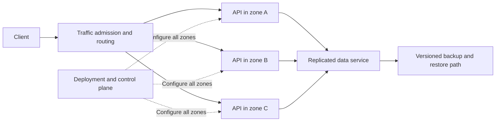
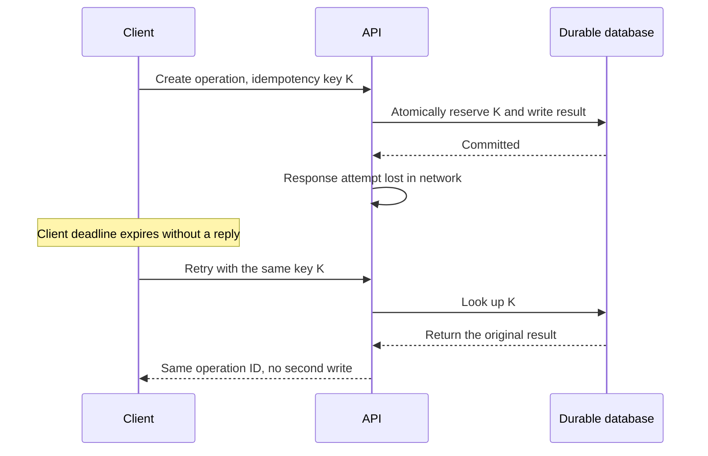
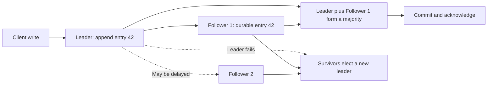

A service handles every request correctly—until one database connection stalls. The API waits, clients time out and retry, connection pools fill, and otherwise healthy servers begin to fail. Adding a second server did not solve the problem: both servers waited on the same database and both amplified the retry traffic.

This is the question behind reliability engineering: **when a component stops behaving as expected, which user promises still hold, and how does the system return to a known-good state?** Fault tolerance is not a decorative layer of replicas. It is a set of deliberately chosen responses to specific faults, each with a cost and a boundary.

The [Five Constraints of System Design](/field-notes/five-constraints-of-system-design/) introduces availability and durability as separate service contracts. Here we go deeper into the mechanisms that protect those contracts under failure.

## Start with the smallest useful system

Imagine a single API process and a single database. A client submits a change, the API writes it, and the database acknowledges after its local durable log is flushed. This may be the right initial architecture: one authority, few moving parts, straightforward recovery from an API-process crash.

Now consider three different faults. If the API process crashes, restarting it may restore service. If the database host and its storage disappear, there may be no recent data to restore. If the database commits but the reply is lost, the client cannot tell whether retrying will duplicate the change. All three look like “the request failed” from the client, yet they need different responses. Adding a second API process helps with only the first.

A *fault* is an underlying problem, such as a broken disk, delayed packet, software bug, or overloaded dependency. A *failure* occurs when the system no longer meets its promised behavior. Fault tolerance means some specified faults do **not** become user-visible failures, or that the resulting degradation stays within an explicit contract. It does not mean the system survives every possible combination of faults.

## Define what must survive

Reliability is a broad claim about dependable behavior over time. Turn it into narrower, measurable contracts:

| Contract | Question |
| --- | --- |
| Availability | Can this class of valid requests receive a useful response now? |
| Durability | What acknowledged data survives a process, machine, zone, or region loss? |
| Correctness | Can a recovery path duplicate a charge, lose an update, or return stale state as current? |
| Recovery time objective (RTO) | How long may the service remain impaired after a defined disaster? |
| Recovery point objective (RPO) | How much recent data may be lost, measured back from the disruption? |

Specify the operation and the failure scope. “99.9% available” is incomplete without eligible requests, measurement point, and time window. If availability is measured **by time**, 99.9% over 30 days permits an illustrative **43.2 minutes** outside the objective; a request-based SLO instead budgets failed requests, not minutes. Neither promises that any one outage will last no more than the budget. Google's [SLO guidance](https://sre.google/sre-book/service-level-objectives/) explains why the indicator should reflect what users actually experience. AWS's [recovery guidance](https://docs.aws.amazon.com/wellarchitected/2024-06-27/framework/rel_planning_for_recovery_objective_defined_recovery.html) distinguishes RTO from RPO.

The service might allow an old analytics chart during an outage but must not return an old account balance as if it were current. “Useful response” is a product decision with correctness consequences, not merely an HTTP `200`.

## First principle: isolate faults before recovering from them

The simplest response to a process crash is restart. A second instance behind a load balancer lets requests reach the survivor while the first restarts. But both instances may share the same deployment, database, network path, credentials, or configuration. Those are **common failure domains**. Independence must be designed and tested, not inferred from instance count.

The diagram has two warnings. First, the replicated data service is still on every critical path; its failure may defeat all three API zones. Second, the common deployment and control plane can break all zones together. Replication handles selected hardware faults, while isolation, staged rollouts, rollback, and recoverable configuration handle different faults.

Capacity is part of isolation. Suppose each of three zones has a *measured safe capacity* of 2,000 requests/s and total peak load is 3,000 requests/s. Normally each serves 1,000 requests/s. Lose one zone and the other two each serve 1,500 requests/s, or 75% of their safe capacity. If normal load were 5,000 requests/s, a zone failure would demand 2,500 requests/s from each survivor—above the tested limit. A routing rule cannot manufacture missing capacity. AWS's [static-stability discussion](https://aws.amazon.com/builders-library/static-stability-using-availability-zones/) makes this point operationally: critical data paths should keep working with already-provisioned capacity, not depend on a scaling action succeeding during the outage.

## Timeouts and retries: recovery or amplification?

A network timeout is an **unknown outcome**. The server may never have seen the request; it may be executing it; it may have committed the result while the response was lost. A retry is safe only if the operation's semantics make it safe.

The key must be scoped to the caller and operation, stored atomically with the side effect, and retained for the documented retry horizon. Reusing a key with different parameters should be rejected. If the idempotency record and the business write can commit separately, a crash between them reintroduces ambiguity. Amazon's [idempotent-API guidance](https://aws.amazon.com/builders-library/making-retries-safe-with-idempotent-APIs/) illustrates the same issue for provisioning workflows.

Set a deadline for the *whole* request, then allocate part of it to each downstream call. A 200 ms user deadline is not satisfied by three sequential dependencies each configured with a 200 ms timeout. Retry only transient failures, at a layer that owns the remaining deadline, with bounded attempts, exponential backoff, and jitter. If three layers each make three attempts, one user request can generate **27 leaf calls**. Retries can therefore worsen the outage they were supposed to hide. The AWS [timeouts and retries](https://aws.amazon.com/builders-library/timeouts-retries-and-backoff-with-jitter/) article and Google SRE's [cascading-failure guidance](https://sre.google/sre-book/addressing-cascading-failures/) both emphasize that retries must be budgeted and coordinated.

## Replication protects data only at a defined commit point

Classical database resilience starts with a durable local log and another copy of the data. With asynchronous replication, the leader can acknowledge after its local log is durable and send the record to a follower later. That gives low write latency, but a leader loss before replication can lose an **acknowledged** write. Synchronous replication waits for another copy before success, reducing that loss window at the cost of network latency and possible write unavailability.

For an ordered, strongly consistent replicated log, a three-voter majority is two. A leader proposes entry 42, appends it locally, and sends it to followers. When one follower has durably accepted it, a majority has the entry and it can become committed according to the protocol's rules. If the leader fails, the two surviving voters may elect a new leader that preserves committed entries. With only two voters, a majority is still two; losing either voter prevents new majority commits. The [Raft paper](https://raft.github.io/raft.pdf) is a clear explanation of the leader terms, replicated log, election rules, and why committed entries survive leader change.

This is not “every replica has every acknowledged byte immediately.” It is a specific majority-and-log guarantee, with assumptions about durable storage and the implemented protocol. When a majority cannot communicate, strict writes stop. A stale follower might still answer a read *if the API explicitly permits stale reads*; it cannot silently claim to provide the same strict read contract. Adding replicas across distant regions can improve failure-domain coverage while increasing write latency. Quorum arithmetic is easy; mapping it to actual failure domains and acknowledgement behavior is the hard part.

Failover also needs **fencing**. Suppose a former leader pauses, loses its lease, and another leader takes over. When the old process resumes, it must not write to the database, object store, or external worker as if it still owned the resource. A monotonically increasing epoch or fencing token must be checked by the resource being changed; merely storing an epoch in the old leader's memory does nothing. Clock-based leases alone are risky when clocks or pauses do not match the assumptions of the design.

Finally, live replicas are not backups. A mistaken deletion or corrupt deployment can replicate perfectly to all copies. Keep recoverable, versioned backups outside the live replication path and rehearse restoring them. AWS's [backup guidance](https://docs.aws.amazon.com/wellarchitected/latest/reliability-pillar/back-up-data.html) explicitly calls for periodic recovery tests, not just successful backup jobs.

## Overload is a failure mode, not just a performance problem

When a dependency slows, each request occupies a connection longer. A full connection pool causes queueing; queued requests time out; retries add more work. The useful control points are a bounded queue, a concurrency limit, an end-to-end deadline, and an admission decision that rejects excess work before it consumes scarce downstream resources.

A circuit breaker can temporarily stop calls that are likely to fail, but it needs a recovery probe and must not turn one transient error into a long self-inflicted outage. Bulkheads reserve separate capacity for critical and optional work: a reporting export should not consume every database connection needed by order writes. Backpressure keeps a consumer from accepting more work than it can complete; load shedding explicitly sacrifices lower-priority work to preserve an essential operation. These mechanisms trade some immediate availability for a smaller blast radius and faster recovery.

Health checks are part of this control loop. Kubernetes [readiness probes](https://kubernetes.io/docs/concepts/workloads/pods/probes/) remove an unready Pod from Service endpoints; liveness probes restart a Pod that cannot make progress. Making liveness depend on a slow shared database can restart every application Pod during a database incident, reducing capacity just when it is needed. Readiness should reflect the operations a Pod can actually serve, but “all Pods unready” can also become an outage. Probe design is a system contract, not a generic `/health` endpoint.

## Failure scenarios worth rehearsing

| Fault | What can go wrong | A useful test or mitigation |
| --- | --- | --- |
| Process or host crash | In-flight work disappears; a replacement starts cold. | Drain on planned shutdown, replay durable work, test cold-start time. |
| Lost reply after commit | Client retries a completed mutation. | Atomic idempotency record and stable operation ID. |
| Slow dependency | Queues, timeouts, and retries cascade. | Deadline, concurrency cap, retry budget, and load shedding. |
| Network partition | Two sides disagree about who owns writes. | Majority protocol or single-writer fencing; pause strict writes without quorum. |
| Stale replica | Reads succeed but violate the freshness contract. | Version-aware routing or explicitly labeled stale-read mode. |
| Zone loss | Survivors overload or share the same hidden dependency. | Reserve measured failover capacity and practice zonal isolation. |
| Bad deployment or deletion | Every live replica copies the mistake. | Staged rollout, rollback, versioned backup, tested restore. |
| Region loss | Routing changes but state or credentials are unavailable elsewhere. | Declare RTO/RPO, rehearse promotion, check data and control-plane dependencies. |

The test should assert **user-visible behavior**, not just that a new Pod eventually appeared. During a zone evacuation, measure successful requests, p99 latency, stale reads, lost acknowledgements, and the time until the system returns within its contract.

## How the design changes as the blast radius grows

On one machine, start with durable writes, restartability, backups, and idempotent mutations. With more traffic, add stateless instances and isolate optional work; verify that their common database remains within safe capacity. Across zones, place both serving capacity and necessary state in independent failure domains, while avoiding a control-plane dependency on the critical path. Across regions, choose whether backup-and-restore, warm standby, or active serving is justified by the RTO/RPO and latency contract.

These are choices, not a mandatory maturity ladder:

| Strategy | Strongest benefit | Principal cost or boundary |
| --- | --- | --- |
| Backup and restore | Recovers from data corruption and large disasters | Restore time and possible data loss since last recovery point. |
| Asynchronous standby | Faster regional recovery without cross-region write latency | May lose acknowledged but unreplicated writes. |
| Synchronous quorum | Stronger acknowledged-write survival and ordering | Cross-node latency; strict operations stop without quorum. |
| Active-active with conflict resolution | Local writes can continue in more locations | Application-specific merge rules and potentially surprising results. |
| Graceful degradation | Preserves a smaller useful service during dependency loss | Requires explicit rules for staleness, authorization, and user communication. |

The right answer depends on the operation. A search page may serve a stale index during an outage; a payment capture should not silently repeat or invent a result. A global cache can preserve a read-only view but cannot make a strict read correct by adding a TTL. Multi-region can reduce one failure domain while creating new consistency and operational problems.

## Operate the recovery path, not only the happy path

Monitor user-facing successful-request fraction and p50/p95/p99 latency by operation and region. Add the explanatory signals: in-flight requests, queue wait and depth, rejected load, retry attempts per original request, circuit-breaker state, replica lag, quorum health, leader changes, log flush latency, backup age, and **measured** restore duration. Alert on SLO burn and on leading indicators such as a queue that will exceed its deadline before it drains. Count semantic failures—duplicate mutations or stale strict reads—even when they return `200`.

Run failover and restore exercises against a written hypothesis: “If zone A stops serving, the remaining zones handle peak traffic within 200 ms p99, with no acknowledged write loss.” Record the observed gap, not just pass/fail. Use staged rollouts aligned to failure domains so a bad release can be contained. Keep runbooks for promotion, rollback, queue replay, and backup restore; update them after every exercise and incident. Fault injection needs guardrails and stop conditions, as [AWS Fault Injection Service](https://docs.aws.amazon.com/fis/latest/userguide/stop-conditions.html) documents.

## What production systems teach—and what changed recently

Google's [SRE work on cascading failures](https://sre.google/sre-book/addressing-cascading-failures/) demonstrates that retry storms and resource exhaustion can propagate a local slowdown into a broad outage. The transferable lesson is to budget retries and reject work that cannot complete, rather than treating every failed call as permission to try harder. Amazon's [static-stability pattern](https://aws.amazon.com/builders-library/static-stability-using-availability-zones/) takes a complementary approach: keep enough capacity and local dependencies already running so recovery does not require a fragile scale-up or control-plane change. Kubernetes' readiness/liveness split makes a narrower lesson concrete: traffic removal and process restart are different actions with different risks.

Recent tools have made these principles easier to exercise, not obsolete. In **November 2023**, AWS introduced [Route 53 ARC zonal autoshift](https://aws.amazon.com/about-aws/whats-new/2023/11/route-53-application-recovery-zonal-autoshift/), which can move supported load-balancer traffic away from an impaired availability zone. Its practice runs test whether the remaining zones have capacity. That is an established managed routing capability within its documented scope—not a fix for a shared database, missing state, or insufficient survivor capacity. Microsoft says [Azure Chaos Studio became generally available in November 2023](https://azure.microsoft.com/en-us/blog/advancing-microsoft-azure-resilience-with-chaos-studio/), making managed fault injection more accessible. Its newer Workspace/Scenario model is still described as [public preview](https://learn.microsoft.com/en-us/azure/chaos-studio/chaos-studio-overview); do not confuse a preview testing interface with a production reliability guarantee.

An adjacent, more adaptive idea is to let a proxy adjust concurrency from observed latency. [Envoy's adaptive-concurrency filter](https://www.envoyproxy.io/docs/envoy/latest/configuration/http/http_filters/adaptive_concurrency_filter.html) describes this control loop. It can help find a safer operating point as backend conditions change, but its measurements, tuning, and scope still need validation for a particular workload. Automated controls are best understood as implementations of old principles—admission, isolation, and feedback—not as proof that a system can ignore capacity planning.

## Misconceptions and decision rules

“Two replicas mean twice the reliability” assumes independent failures, correct routing, and spare capacity. A shared bug, control plane, or exhausted database invalidates the assumption. “A timeout means the write failed” confuses lack of a response with lack of a commit. “Exactly once” is not a property a queue or retry loop grants to every external side effect; the acknowledgement and idempotency boundaries must be specified. “Failover is automatic” may mean only that traffic moves, not that the new data owner is safe, current, and authorized to write. “Five nines” without an operation, measurement window, and tolerated degradation is not a design.

Use the least complex mechanism that meets a measured contract, but do not mistake simplicity for having no recovery plan. Start by listing the faults worth surviving. For each, identify the state owner, the acknowledgement point, the detection signal, the failover action, the capacity after failover, and the way to test the result. If the contract cannot be stated, more replicas will not make it true.

## How experienced engineers frame the decision

A senior engineer can make a call safe to retry and make a crashed worker resume its job. A staff engineer asks whether all instances share the same failure boundary, whether a zone loss leaves enough capacity, and whether a new leader can be fenced from the old one. A principal engineer asks whether the promise is worth its latency, cost, operational load, and migration risk—and whether the organization can repeatedly demonstrate it under realistic failure.

The compact mental model is **promise → fault → boundary → recovery → proof**. State the user promise. Name the fault. Find the boundary that contains it. Define the recovery action and what it may sacrifice. Then prove, with an exercise and user-visible measurements, that the promise still holds. Reliability is not the absence of failure; it is a tested account of what happens next.

## Further reading

- [Google SRE: Service Level Objectives](https://sre.google/sre-book/service-level-objectives/) — How to express reliability as user-relevant indicators, targets, and error budgets.
- [Google SRE: Addressing Cascading Failures](https://sre.google/sre-book/addressing-cascading-failures/) — Why overload, retries, and bad recovery behavior can spread an incident.
- [Amazon Builders' Library: Static Stability Using Availability Zones](https://aws.amazon.com/builders-library/static-stability-using-availability-zones/) — How pre-provisioned capacity and dependency isolation protect the data path.
- [Amazon Builders' Library: Timeouts, Retries, and Backoff with Jitter](https://aws.amazon.com/builders-library/timeouts-retries-and-backoff-with-jitter/) — Practical timeout and retry design, including their overload hazards.
- [Amazon Builders' Library: Making Retries Safe with Idempotent APIs](https://aws.amazon.com/builders-library/making-retries-safe-with-idempotent-APIs/) — The ambiguous-outcome problem and a concrete API contract for safe retries.
- [Ongaro and Ousterhout: In Search of an Understandable Consensus Algorithm](https://raft.github.io/raft.pdf) — The foundational explanation of leader election and majority-backed replicated logs.
- [Kubernetes: Liveness, Readiness, and Startup Probes](https://kubernetes.io/docs/concepts/workloads/pods/probes/) — The different operational effects of restarting a process and removing it from traffic.
- [AWS Well-Architected: Back Up Data](https://docs.aws.amazon.com/wellarchitected/latest/reliability-pillar/back-up-data.html) — Why a backup strategy includes restore verification.
- [AWS: Route 53 ARC Zonal Autoshift](https://aws.amazon.com/about-aws/whats-new/2023/11/route-53-application-recovery-zonal-autoshift/) — A 2023 example of automated traffic evacuation paired with practice runs.
- [Microsoft Azure: Advancing Resilience with Chaos Studio](https://azure.microsoft.com/en-us/blog/advancing-microsoft-azure-resilience-with-chaos-studio/) — A 2024 account of managed fault injection and scenario-based resilience testing.
