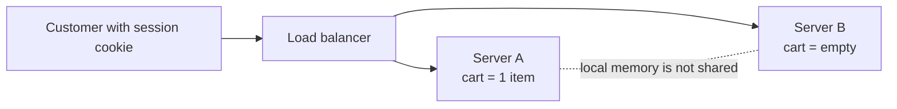
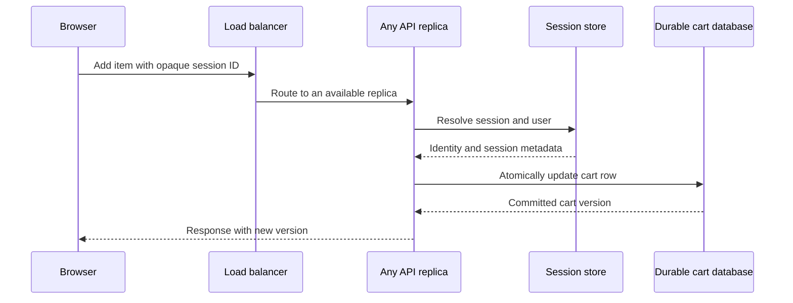
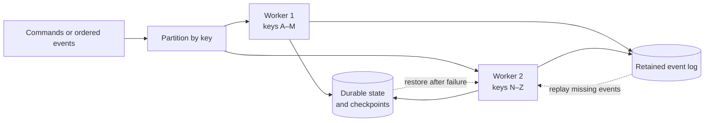

A customer adds one item to a cart. The next page says the cart is empty. Both requests succeeded, but a load balancer sent them to different application servers. Server A remembered the cart in its own memory; server B had never seen it.

This is the practical question behind **stateless versus stateful** design: *which component must remember what, for how long, and what happens when that component changes or disappears?* “Make the service stateless” can be excellent advice for a web tier, but it never makes the customer's cart, an account balance, or a streaming aggregate disappear. It moves the responsibility for that state somewhere else.

## Begin with one server

The simplest cart service keeps a map in process memory:

```text
cartBySession[sessionId] = { productId: quantity, ... }
```

On each request, the server reads the session ID, changes the map, and returns the new cart. This is fast and understandable. No network trip to a session store is needed. For a short-lived prototype with one process, it may be exactly right.

Now add a second process. Unless both processes share the map, a request sent to B cannot see a cart last updated on A. Pinning the user to A appears to fix it, but a deployment, machine failure, or load-balancer change can still erase the session. If one million sessions each occupy an illustrative 2 KB, the logical session data is about **2 GB** before runtime overhead and redundancy. Capacity and recovery are no longer trivial.



The problem is not that the network protocol secretly chooses the wrong server. [HTTP is specified as a stateless request/response protocol](https://www.rfc-editor.org/rfc/rfc9110.html): one request does not, by itself, require knowledge of an earlier request. Applications can build stateful sessions on top of HTTP, often by sending a cookie that identifies the session; the [cookie specification](https://www.rfc-editor.org/rfc/rfc6265.html) describes that mechanism. A stateless *protocol* does not imply a stateless *application*.

## Define the boundary before using the label

A component is **stateless with respect to a particular workflow** when any healthy interchangeable instance can handle the next request using the request and accessible external state. It may still hold temporary variables, connection pools, compiled code, and disposable caches. The important condition is that losing one instance does not lose the only authoritative copy of data required for the next operation.

A component is **stateful** when its identity or local state matters across operations. A database shard owns records; a stream processor maintains a per-key rolling count; a game actor knows the current turn. That state might be in memory, on a local disk, or in attached durable storage. “Stateful” does not mean “unscalable,” and “stateless” does not mean “no data.”

It helps to separate three independent properties:

| Question | Example | Why it matters |
| --- | --- | --- |
| Who owns the state? | Any API replica can fetch a cart, or one keyed actor owns it | Determines routing and coordination |
| Where is the authoritative copy? | Database row, replicated log, local memory | Determines durability and recovery |
| What state is disposable? | Parsed templates, read cache, socket bookkeeping | Determines what a restart may safely lose |

A WebSocket gateway, for example, necessarily remembers open connections while they exist. It can still be **stateless for business decisions** if reconnecting to another gateway reconstructs the user's authoritative workflow from a durable service. The distinction is more useful than calling the whole system simply stateless or stateful.

## The classical choices for a web session

The first solution is **sticky routing**: a load balancer uses a cookie or another affinity key to send a user's requests to the same server. It saves repeated reads from a shared store, and can be an acceptable optimization for short, recoverable sessions. But affinity is not replication. [AWS's load-balancer documentation](https://docs.aws.amazon.com/elasticloadbalancing/latest/application/edit-target-group-attributes.html) describes the routing mechanism; the same family of documentation notes that when a sticky target fails, a different target receives the request. The cart is gone unless it was persisted elsewhere. Unevenly popular sessions can also make a few instances hot.

The more common choice for ordinary web applications is an **interchangeable application tier plus an external store**. The browser carries a small opaque session identifier. Any API instance uses that key to load and update the session in a database or a replicated cache. [AWS Well-Architected guidance](https://docs.aws.amazon.com/wellarchitected/2023-10-03/framework/rel_mitigate_interaction_failure_stateless.html) recommends this separation when replaceable service instances are the goal. The application servers become easier to roll or autoscale; the session store becomes a new latency and availability dependency. That is a trade, not a free improvement.



Do not put every kind of state into one session blob. Authentication/session metadata might expire after inactivity; a cart may need to survive for weeks; a paid order must live in the durable transactional system of record. Different lifetimes and correctness rules call for different stores. A replicated cache can serve ephemeral sessions, but if it evicts data or loses an asynchronously replicated write, the product needs a defined fallback—often reauthentication—not a claim that the session is durable.

A third choice is a **self-contained, signed client token** carrying claims such as user ID and expiry. This can eliminate a session lookup for some requests. But a signature proves integrity, not secrecy; do not put sensitive data into a readable token merely because it is signed. Immediate logout, revocation, changing permissions, and per-user rate limits may still require server-side state. The token also grows request bytes and creates key-rotation work. It is useful when bounded claim staleness is acceptable, not a universal replacement for a session store.

| Approach | What it buys | What it makes harder | Good fit |
| --- | --- | --- | --- |
| Local session + sticky routing | Fast local access, minimal infrastructure | Instance failure, uneven load, draining and migration | Small or explicitly recoverable sessions |
| External session store | Interchangeable API replicas, independent scaling | Store latency, replication, cost, store outage | Typical multi-instance web applications |
| Signed client claims | Fewer per-request session reads | Revocation, claim freshness, token size, key rotation | Short-lived claims with acceptable staleness |
| Keyed stateful owner | Local repeated updates and ordered operations | Ownership moves, hot keys, checkpoints, failover | Games, stream aggregates, collaboration |

## Moving state does not remove concurrency

Suppose a cart row contains quantity `1`. Two requests read it at the same time, both calculate `2`, and both write `2`. The API tier is now “stateless,” but one increment was lost. The shared store solved *where* state lives, not *how* concurrent changes compose.

For a simple counter in SQL, an atomic `UPDATE ... SET quantity = quantity + 1` can avoid that read-modify-write race. For a more complex cart mutation, use a transaction or a versioned compare-and-swap: write only if `version = 7`, then increment to 8; a competing writer that observes a conflict retries against the new state. [Redis documents `WATCH`](https://redis.io/docs/latest/develop/interact/transactions/) as one way to make a transaction conditional on keys not changing. A retry also needs an idempotency key if repeating a successfully committed request would add the item twice.

Store distance matters too. If a request takes 5 ms of local work but makes two 3 ms network round trips to a session store, the remote state path is a substantial part of its latency even before contention. Conversely, keeping all state locally can make failover or rescaling far more expensive. Measure the complete path; do not optimize only one function call.

Externalizing state can concentrate load. At 50,000 requests/s, one session read and one session write per request can produce **100,000 store operations/s** before retries and background work. Avoid needless writes—for instance, updating “last seen” on every request if a coarser interval suffices. Partition by a stable key if the store supports it, watch hot users, and keep true business records in the appropriate durable system rather than turning a cache into a hidden database.

## When state should stay close to computation

Some workloads repeatedly update the same key and require ordered decisions. A stream processor calculating a rolling total, or a collaborative room deciding the next document version, may benefit from one owner per key. Sending each tiny operation through a remote read and write can cost more than processing it beside local working state.

The scalable unit is then **the key**, not “one giant stateful server.” A router assigns each key to one worker; many keys spread across workers. The worker can cache hot state, but recovery must read a durable checkpoint and replay a retained log—or load the latest durable state. Ownership changes need fencing or an equivalent coordination mechanism so an old worker cannot commit after a new one takes over.



This is not a recommendation to turn every API into an actor system. State locality helps when repeated keyed work and coordination dominate; it hurts when one key is too hot, data must be queried across many keys, or ownership changes are frequent. A supposedly single-threaded actor also needs care around asynchronous calls: yielding during external I/O can allow other requests to interleave unless the runtime or application enforces the intended ordering.

[Apache Flink's state documentation](https://nightlies.apache.org/flink/flink-docs-stable/docs/learn-flink/fault_tolerance/) illustrates a mature version of this idea: keyed state is distributed among tasks, and checkpoints pair operator state with stream positions for recovery. Checkpoints are not merely periodic copies of memory; their source positions are what make replay coherent. For stateful services in Kubernetes, a [StatefulSet](https://kubernetes.io/docs/concepts/workloads/controllers/statefulset/) gives pods stable identity and storage association. It does **not** implement application replication or prevent every split-brain scenario by itself; Kubernetes explicitly warns against force-deleting a possibly still-running stateful pod without understanding that risk.

## Failure paths reveal the real architecture

| Failure | Local sticky session | Externalized or keyed state design |
| --- | --- | --- |
| API process crashes | In-memory-only session disappears | Another API replica can fetch authoritative state; a keyed owner must restore before accepting writes |
| Request times out after commit | Client may retry and mutate twice | Preserve an idempotency result or use an operation that is safe to retry |
| Session store slows down | Not on the hot path, but local sessions remain fragile | Bound waits, shed load, use a safe degraded mode; do not let unbounded retries saturate it |
| Replication lags or a region fails | Sticky routing may strand users | Define which copy may serve reads and how much acknowledged state may be lost |
| Old and new owners both run | Local state can diverge | Fence stale writers at the durable commit point |
| One key becomes hot | One sticky instance overloads | Isolate or split work where semantics allow; one ordered key cannot be divided blindly |

For a cart, a temporary failure might justify returning “cart temporarily unavailable.” For a bank transfer, returning a cached balance as current or accepting an uncommitted write is much more dangerous. Availability is not meaningful without the operation's correctness contract. If session storage is unavailable, decide whether users must sign in again, can view read-only data, or should receive a retryable error. Do not silently fabricate success.

## Scale in stages, not by slogan

At small scale, one API process plus a durable database may be simpler than introducing a session cache. When the application tier needs replicas, keep durable business state in the database and move only necessary session metadata into a shared store or bounded client token. Once the shared store is hot, reduce avoidable accesses, size its connection pools, partition by key where appropriate, and test failover. When a particular workflow benefits from serialization and local state, introduce a keyed owner for **that workflow** instead of making every service stateful.

At global scale, proximity and consistency become harder to combine. A nearby stateless API can receive requests anywhere, but an authoritative account or session still has a region, replication policy, and failover behavior. Multi-region writes to the same logical state need explicit conflict handling or a single-writer boundary. “The edge is stateless” says little about where its next network call goes.

Operationally, monitor p50/p95/p99 end-to-end latency, session-store request rate and saturation, cache or store hit rate, reconnect/relogin rate, retry and conflict rate, partition skew, per-key backlog, checkpoint duration, replay time, and failover data loss. On deployment, drain connections and hand off keyed ownership before terminating old workers. Exercise a real restore, not just a container restart. Capacity planning should include peak session count, state bytes per key, replication overhead, and the bandwidth needed to move state during rebalance.

## What recent systems change—and what they do not

Recent infrastructure has made **placement and lifecycle management** of state more flexible; it has not removed consistency, durability, or locality trade-offs.

In **April 2025**, Cloudflare made [SQLite-backed Durable Objects generally available](https://developers.cloudflare.com/changelog/post/2025-04-07-sqlite-in-durable-objects-ga/). The architectural idea is a uniquely addressed, stateful unit with attached transactional storage, while ordinary edge Workers can remain interchangeable. This is useful for a room, game, or other coordination key: requests for that key meet at one owner. Cloudflare's [Durable Objects guidance](https://developers.cloudflare.com/durable-objects/best-practices/rules-of-durable-objects/) also warns that `async` work can interleave requests and that holding a global concurrency block across slow I/O harms throughput. The product packages state ownership; it does not make a single hot object infinitely scalable.

Also in **2025**, [Apache Flink 2.0 introduced a disaggregated state backend](https://flink.apache.org/2025/03/24/apache-flink-2.0.0-a-new-era-of-real-time-data-processing/) that can place primary state on distributed storage while using local caching and asynchronous access. This targets operational costs such as local-disk limits and rescaling very large state. It changes the *implementation balance* between local access and remote durability; it does not turn a rolling aggregate into a stateless computation. The project's published benchmark is evidence for its tested workloads, not a universal performance guarantee for every operator.

The older [Kubernetes Deployment/StatefulSet distinction](https://kubernetes.io/docs/concepts/workloads/) remains useful: interchangeable pods are operationally different from pods that require stable identity and volumes. Managed services and serverless runtimes reduce infrastructure work, but the engineering questions stay the same: what is the consistency boundary, where is the authoritative copy, and how does a new owner recover? None of these examples means the industry has settled on one universally best placement for state.

## Misconceptions and design heuristics

**“HTTP is stateless, so the website must be stateless.”** HTTP requests can be interpreted independently at the protocol layer; a cookie can still link them into a stateful application session.

**“A stateless API means the system has no state.”** The state usually moved to a database, cache, token, log, or another service. Trace the dependency before claiming improved availability.

**“Sticky sessions make state durable.”** They improve routing affinity, not replication. Restart the target and see what survives.

**“Stateful services cannot scale out.”** They can partition independent keys across owners. The hard case is a hot indivisible key or a cross-key transaction.

**“A signed token is always better than a session lookup.”** It trades lookup latency for claim staleness, revocation complexity, token bytes, and key management. Choose according to the security and freshness contract.

Start with the simplest state boundary that meets the required failure and latency behavior. Keep disposable caches local; keep durable facts in a durable store; place frequently updated, coordinated state near its owner only when the benefit exceeds the routing and recovery cost. Those are heuristics, not laws. A tiny service may deliberately keep ephemeral state in one process; a high-volume stream processor may deliberately be stateful.

## The senior-engineer question

A junior design discussion may ask, “Should this API use Redis?” A stronger discussion asks: *Which state is authoritative? Who can mutate it? Which operation needs ordering? What is the cost of one extra network hop? What happens when the owner, store, or region fails? How will we migrate the state when the deployment changes?* The answer may be a plain database transaction, a shared session store, or a keyed stateful service. The right abstraction is the one whose failure boundary matches the product promise.

Keep this mental model: **state has an owner, a lifetime, and a recovery path**. Name those three things before calling a component stateless or stateful. A replaceable worker is valuable when its required state is safely accessible elsewhere; a stateful owner is valuable when locality and order justify explicit ownership. Either way, the state still has to live somewhere.

## Further reading

- [RFC 9110, HTTP Semantics](https://www.rfc-editor.org/rfc/rfc9110.html) — Defines what “stateless” means at the HTTP protocol boundary, not at the entire application boundary.
- [RFC 6265, HTTP State Management Mechanism](https://www.rfc-editor.org/rfc/rfc6265.html) — Explains how cookies associate requests with a stateful session over HTTP.
- [AWS Well-Architected: Make services stateless where possible](https://docs.aws.amazon.com/wellarchitected/2023-10-03/framework/rel_mitigate_interaction_failure_stateless.html) — Shows the classical replaceable-web-tier plus shared-session-store pattern.
- [AWS Application Load Balancer sticky sessions](https://docs.aws.amazon.com/elasticloadbalancing/latest/application/edit-target-group-attributes.html) — Documents what affinity does and why it should not be mistaken for durable state.
- [Redis transactions and `WATCH`](https://redis.io/docs/latest/develop/interact/transactions/) — Demonstrates optimistic concurrency when multiple stateless workers update shared state.
- [Kubernetes StatefulSets](https://kubernetes.io/docs/concepts/workloads/controllers/statefulset/) — Describes stable workload identity and persistent-volume association, alongside their limits.
- [Apache Flink: Fault tolerance via state snapshots](https://nightlies.apache.org/flink/flink-docs-stable/docs/learn-flink/fault_tolerance/) — Connects keyed state, checkpoints, source positions, and replay.
- [Apache Flink 2.0 release notes](https://flink.apache.org/2025/03/24/apache-flink-2.0.0-a-new-era-of-real-time-data-processing/) — Explains the motivation and measured trade-offs of disaggregated state.
- [Cloudflare Durable Objects: SQLite general availability](https://developers.cloudflare.com/changelog/post/2025-04-07-sqlite-in-durable-objects-ga/) — A concrete 2025 example of managed, keyed stateful compute with attached storage.
