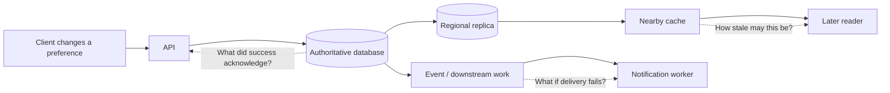
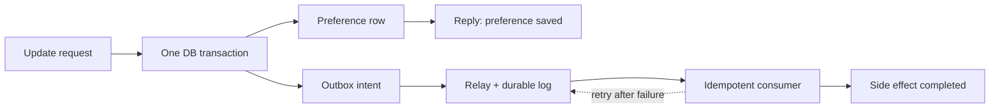

“Make it faster, more reliable, and cheaper” sounds like one request. It is usually three requests that pull the design in different directions. A nearby cache can shorten a read but add stale state. A remote write acknowledgement can protect data but add a network round trip. A queue can get a response off the critical path but make the result arrive later. None of these mechanisms is inherently good or bad: each **moves a cost across a boundary**.

This Field Note is about how to make that movement visible. The [five constraints](/field-notes/five-constraints-of-system-design/) describe the main qualities we measure. Here we will use them to reason through the choices engineers repeatedly face—without pretending there is one universally correct architecture.

## Start with the smallest working system

Suppose an application stores a user's notification preference. One API process writes a row in one database and reads it back from the same database. At modest load, this is a good design. The write has one authority, the read has an obvious source of truth, and a transaction can update related rows together. You can explain a failure without reconstructing an event stream.

Now imagine the product grows. Most requests only read the preference, so we add a cache. The service expands to another region, so we add a replica. A preference change should also update an email-sending system, so we publish an event. Each addition solves a real problem, but each introduces a new question:

- If the database commits and event publication fails, will the email system ever learn about the change?
- If the local replica lags, may the user still receive notifications after opting out?
- If the cache serves an old preference, which component removes it, and how quickly?
- If a region fails, which operations may continue and which must stop?

The most useful starting artifact is not a diagram of products. It is an **operation contract**: what the caller is told, what state is durable at that moment, what a subsequent reader is allowed to observe, and what happens when one dependency is slow or unreachable. The same design may be perfectly acceptable for a cosmetic theme setting but unacceptable for a consent or payment setting. Requirements, not fashion, determine the boundary.



The arrows reveal **three different boundaries**: the acknowledgement boundary for durability, the observation boundary for freshness, and the delivery boundary for side effects. Adding a component changes at least one of them.

## The mechanics beneath most trade-offs

A request has a *critical path*: the operations that must finish before the caller receives success. Moving work off that path may lower response latency, but only if the caller is allowed to receive a weaker result such as “accepted for processing.” A queue does not make work disappear. It turns immediate work into a backlog with a separate completion time and failure mode.

An authoritative copy is the place that decides the current value. A replica, cache, search index, or materialized view is a **derived copy** with its own update path. Before serving from one, ask what freshness guarantee that path can actually enforce. A cache with a 60-second TTL does not mean every response is at most 60 seconds behind an arbitrary update: refresh timing, outages, and stale-serving policy matter.

Finally, every component has a *failure domain*. Two copies on the same host do not protect against host loss. Two regions that both require one remote coordinator may not make strict writes available when that coordinator is isolated. The trade-off is therefore not a slogan like “consistency versus availability”; it is a statement about a particular operation under a particular failure.

For capacity, keep two simple relationships in mind. If arrivals are `λ` operations/s and the system sustainably completes only `μ < λ`, backlog grows at roughly `λ - μ` operations/s. At 1,000 arrivals/s and 800 completions/s, one minute adds about **12,000 queued operations**. Even if arrivals then stop, draining those 12,000 at 800/s takes at least **15 seconds**. In a stable system, Little's Law gives `average in-flight work = arrival rate × average time in system`; at 1,000 completed requests/s and 0.2 seconds average time, around 200 requests are in flight. Neither relationship says that a queue is safe merely because it accepts the workload.

## Trade-off 1: synchronous completion versus asynchronous progress

The simplest preference update performs the database write and downstream action synchronously, then returns success. This gives the caller a clear completion point but couples latency and availability to every required dependency. If the email system is slow, the preference API is slow. If it is down, the update may fail even though the database is healthy.

Moving the downstream action to a queue shortens the critical path. The API can acknowledge once the preference change and a durable intent to notify are recorded. The worker later processes that intent. The caller must now understand two states: **preference saved** and **side effect completed**. If the second state matters, expose it or provide a status check; do not label an enqueue as end-to-end completion.

There is a classic dual-write trap: commit the database row, then publish a message. A crash between those operations leaves the row changed but no message. A transactional outbox writes the row and an outbox record in the *same local transaction*; a relay publishes the record later. [Debezium's outbox documentation](https://debezium.io/documentation/reference/stable/transformations/outbox-event-router.html) describes one production implementation. Delivery can still be duplicated, so the consumer needs an idempotency key and a defined retry policy. [Kafka's design documentation](https://kafka.apache.org/40/design/design/) distinguishes at-least-once delivery from exactly-once processing within supported workflows; it is not a blanket guarantee for arbitrary external side effects.



Asynchrony is preferable when the side effect can finish later and the queue's age is observable. Synchronous completion is preferable when the caller cannot proceed safely until *all* required effects are confirmed. A hybrid is common: commit the correctness-critical part synchronously, then move enrichment, indexing, or notification off-path.

## Trade-off 2: a nearby copy versus a fresh answer

Reading the database directly is easy to reason about, but a distant or overloaded database increases latency and cost. A cache can serve many reads without visiting the origin. An asynchronous regional replica can make reads local and add capacity. Their hidden cost is a second version of truth.

For a cached setting, the hard question is not “How high is the hit ratio?” but “What happens immediately after an update?” You can invalidate or version the cached key on write, route read-after-write requests to the authority, or accept a bounded stale window. Each has costs. Invalidation messages can be delayed or lost; version checks add a lookup or metadata protocol; routing to the authority gives back some of the latency you were saving. A thundering herd of misses after a global purge can overload the origin. [Cloudflare's cache guidance](https://developers.cloudflare.com/cache/how-to/purge-cache/purge-everything/) explicitly warns that purging everything turns subsequent requests into origin fetches; targeted purges reduce that blast radius.

There is also a distinction between *purge* and *soft invalidation*. Cloudflare's [current cache documentation](https://developers.cloudflare.com/cache/guides/invalidate-cache/) explains that invalidated content can be served stale during revalidation or an origin failure, while purged content is removed. That is a useful general lesson: a stale-while-revalidate strategy may be excellent for an article thumbnail and unacceptable for a revoked permission. The same cache technology can support both policies, but the operation contract decides which policy is safe.

Choose the copy by data class. A public image can be cached aggressively; a user's own preference may need read-your-writes; an authorization revocation may require a stronger version or invalidation protocol. Do not silently give all three the same TTL.

## Trade-off 3: local independence versus coordinated consistency

An asynchronous replica receives writes after the primary acknowledges them. It may serve low-latency local reads while briefly returning an old value. If the primary's region fails before replication catches up, acknowledged data may be lost on failover. Synchronous replication makes the acknowledgement wait for another fault domain; this can improve the survival guarantee, but the remote round trip is now on the write path.

Even “synchronous” has multiple meanings. In PostgreSQL, `synchronous_commit=remote_write` waits for the standby to write WAL to its file system, `on` waits for a remote flush, and `remote_apply` waits until the standby has replayed the record so a query there can see it. [PostgreSQL documents](https://www.postgresql.org/docs/current/runtime-config-wal.html) these as distinct acknowledgement points. Waiting for more stages generally makes the promise stronger and the response later. It can also stop the write when the required standby cannot respond.

For strict multi-region state, a quorum or leader protocol provides an ordering point; it cannot keep accepting strict writes independently on disconnected sides. An eventually consistent design may let both sides continue, then reconcile conflicts. The choice depends on whether the domain has a safe merge rule. A shopping-list addition might merge; two conflicting withdrawals from one balance cannot simply be unioned.

The decision is per operation. A product can require strong writes and strict reads for an account balance, while allowing stale analytics or cached product descriptions. Strong consistency is not an all-or-nothing badge attached to a whole service.

## Trade-off 4: throughput versus the tail of latency

Batching amortizes fixed overhead: one network call or disk flush handles multiple operations. Larger batches often raise throughput, but a request may wait for the batch to fill, and a large batch can monopolize a worker. Similarly, high utilization looks efficient until a small burst creates a queue. The average can remain attractive while p99 grows sharply.

Suppose a worker can process 1,000 simple requests/s at the required p99 but a peak brings 1,200/s for one minute. An unlimited queue does not preserve the latency target; it records 12,000 extra requests to finish later. A bounded queue, admission control, or a cheaper degraded response may be a more honest user contract than accepting work that will time out. [Google's SRE guidance on overload](https://sre.google/sre-book/handling-overload/) emphasizes that requests differ in cost and priority, so a single QPS limit can be misleading. [The Tail at Scale](https://research.google/pubs/the-tail-at-scale/) explains why one slow dependency becomes increasingly visible when a user request fans out to many services.

Retries can turn a slowdown into an outage. If the server finished a request but its response was lost, a retry can repeat the side effect; if the server is overloaded, retries spend the capacity needed for original work. Use stable idempotency keys for side-effecting operations, finite deadlines, retry budgets, and backoff with jitter. The [AWS SDK retry reference](https://docs.aws.amazon.com/sdkref/latest/guide/feature-retry-behavior.html) documents retry quotas and jitter as concrete controls, not a license to retry forever.

The right throughput target is **sustained completed work while meeting the latency and error objective**. A benchmark maximum obtained after p99 has collapsed is not useful capacity.

## Trade-off 5: one owner versus partitioned scale

One database owner makes transactions, joins, and ordering relatively simple. When it saturates, partitioning can give different keys different owners. The distribution rule—perhaps a hash of `tenant_id`—becomes part of the architecture. It decides which operations remain local and which require fan-out or coordination.

A partitioned log illustrates the same principle. Kafka maintains ordering within a partition, not a global order across all partitions; adding partitions can raise parallelism, but work for a single hot key still goes to one partition under key-based assignment. [Kafka's design guide](https://kafka.apache.org/40/design/design/) describes partition ordering and consumer coordination. If one tenant accounts for 40% of the traffic, adding empty partitions will not split that tenant's serial work. You may need to change the key, isolate the tenant, relax ordering, or redesign the aggregation.

Partitioning also makes migrations operational work. During a re-shard, old and new owners may briefly disagree about placement. A safe plan needs a versioned routing map, a way to copy or replay state, a cutover rule, and rollback or reconciliation. Scale-out is useful when an actual owner is the bottleneck; it is not an automatic improvement for a small system whose shared dependency is elsewhere.

## Trade-off 6: redundancy versus cost and operational surface

Replicas, spare capacity, and regional isolation cost money. They can also reduce the blast radius of host or region failure. But more components introduce more upgrades, credentials, control planes, monitoring, and failure combinations. A second region without tested routing and data-recovery procedures can give an expensive illusion of resilience.

Capacity planning should include the failure scenario, not just normal load. If three equal zones must survive loss of one without emergency scaling, the two survivors need enough **pre-existing** capacity for the target workload. Conversely, not every batch report needs active-active regional service; a restore from backup may satisfy its recovery time and recovery point objectives at much lower cost. Availability is a promise about a specific operation, not a count of regions on a diagram.

## A comparison you can actually use

| Choice | Prefer it when | You accept | Measure or rehearse |
| --- | --- | --- | --- |
| Synchronous side effect | Caller needs completion before success | More dependencies on the critical path | End-to-end p99, dependency failures |
| Durable asynchronous work | Delay is acceptable and work must survive crashes | Lag, duplicates, separate completion state | Oldest queue age, retry and dead-letter rates |
| Cached or replica read | Data has an explicit stale-read policy | Invalidation or replica-lag risk | Stale-read samples, hit ratio, origin load |
| Coordinated write/read | Current ordering matters more than local independence | Extra latency and quorum unavailability | Commit latency, quorum health, failover |
| Partitioned ownership | One owner is a measured bottleneck | Hot keys and cross-partition operations | Skew, rebalance time, fan-out cost |
| More redundancy/headroom | Failure targets justify it | Money and operational complexity | Fault-injection and restore results |

These are not mutually exclusive rows. A sound design often combines a durable synchronous write, asynchronous indexing, cached public reads, and strict reads for account state. The important part is **not mixing their guarantees in one vague API response**.

## Failure scenarios expose the actual price

**A process crashes after commit but before responding.** The client does not know whether the write happened. Retrying with a new operation ID may duplicate it; retrying with the same idempotency key allows the server to return the original outcome.

**The database commits but event publication fails.** Without a local outbox or another atomic handoff, downstream state can diverge permanently. With an outbox, publication can resume; consumers must still tolerate duplicates.

**A region is isolated.** An asynchronous local copy may continue serving old data under an explicitly stale-tolerant contract. A strict read or write that requires a quorum may have to fail. Do not silently switch a strict API to stale data merely to keep HTTP success high.

**A cache is purged during origin trouble.** Every miss can amplify load on an already sick origin. Use targeted invalidation or protection such as request coalescing where staleness is acceptable; for security-sensitive revocation, prioritize correctness and plan origin capacity for the purge.

**A retry storm follows a timeout spike.** Outstanding work and resource usage rise together. Bound attempts and queue length, propagate deadlines, shed nonessential traffic, and monitor offered load separately from completed throughput.

These are not edge cases to append after selecting a technology. They are the cases that define which technology is appropriate.

## What real platforms show—and what changed recently

The contrast between [PostgreSQL's commit modes](https://www.postgresql.org/docs/current/runtime-config-wal.html) and [Kafka's delivery semantics](https://kafka.apache.org/40/design/design/) shows two established practices: expose the acknowledgement boundary precisely, and make retries and duplicates part of the design. Cloudflare's [purge-versus-invalidation documentation](https://developers.cloudflare.com/cache/guides/invalidate-cache/) makes a freshness choice similarly explicit at the edge. These products differ, but the general lesson is the same: **name the guarantee at the boundary where a caller relies on it**.

Recent infrastructure has made some choices easier to purchase, not eliminated their cost. In **2022**, [HTTP/3 was standardized](https://www.rfc-editor.org/rfc/rfc9114.html) over QUIC. Independent streams can avoid transport-level head-of-line blocking between streams, but an application still waits for a slow database or a serial dependency. In **2025**, AWS made [multi-region strong consistency for DynamoDB global tables generally available](https://aws.amazon.com/about-aws/whats-new/2025/06/amazon-dynamo-db-global-tables-multi-region-strong-consistency-generally-available/). Its [design documentation](https://docs.aws.amazon.com/amazondynamodb/latest/developerguide/bp-global-table-design.html) states that strict reads and writes involve cross-region communication, require a three-region arrangement, and carry higher latency than the eventually consistent mode. Managed coordination reduces the work the application team implements; it does not make a strict operation locally independent during a quorum loss.

Those examples also prevent an unhelpful “old versus modern” story. The fundamentals—distance, queueing, ordering, failure isolation, and recovery—remain. New protocols and managed services change where implementation work lives and which points on the trade-off curve are practical for a team.

## Misconceptions that lead to bad decisions

“Asynchronous is faster” confuses **response time** with **completion time**. “More replicas mean more availability” ignores shared dependencies and the quorum required by a strict operation. “A cache is safe if its TTL is short” ignores stale serving during failure, delayed invalidation, and the difference between a public thumbnail and an authorization decision. “Exactly once” in a broker does not make an arbitrary external side effect exactly once. “More partitions fix hotspots” fails when one key owns the hot work.

The productive question is never “Which technology wins?” It is: **What promise becomes weaker or more expensive if we choose this mechanism?**

## How senior and staff engineers make the decision

Start by separating product needs from implementation preferences. Record the peak and normal workload, the operation's p99 target, acceptable staleness, acknowledgement durability, recovery point and recovery time objectives, and the failure domain to survive. Make unknowns explicit; do not turn an estimate into a requirement without a load test or product decision.

Then draw the request's critical path and locate the source of truth. Ask what happens if each dependency times out, and whether a retry is safe. Identify the **unit of scale** (request, tenant, key, partition, region) and any shared bottleneck that adding replicas will not remove. Compare at least two feasible designs with the cost of operating and migrating between them. A staff-level choice includes the rollback plan and the on-call burden, not merely the steady-state benchmark.

One compact decision record can be enough:

```text
Operation: update a notification preference
Required: durable after success; user sees own change immediately
Allowed: email worker catches up within 60 seconds
Failure policy: fail write if authoritative DB cannot commit
Choice: synchronous DB transaction + outbox; async email update
Measure: write p99, outbox oldest age, duplicate suppression, restore test
Revisit when: worker age or DB write saturation breaches the agreed limit
```

The numbers in such a record are **hypothetical until the product owner accepts them**. Its value is the explicit connection between a requirement and the mechanism chosen to meet it.

## A mental model to keep

For every optimization, ask four questions: **What became faster or easier? What work or state moved elsewhere? Which failure now hurts? Who can tell when the promise is broken?** A cache moves state toward readers; a queue moves work into the future; a replica moves copies into another fault domain; a partition moves ownership across nodes. The name of the technology matters less than that movement.

The best system design is not the one with the most mechanisms. It is the simplest design whose latency, freshness, durability, and failure behavior satisfy a stated, measurable contract—and whose team can operate that contract when things go wrong.

## Further reading

- [Google SRE, *Handling Overload*](https://sre.google/sre-book/handling-overload/) — Why admission, request cost, and priority matter more than a headline QPS limit.
- [Dean and Barroso, *The Tail at Scale*](https://research.google/pubs/the-tail-at-scale/) — The foundational explanation of tail latency in fan-out systems.
- [PostgreSQL, *Write Ahead Log configuration*](https://www.postgresql.org/docs/current/runtime-config-wal.html) — Concrete local and remote acknowledgement choices.
- [Apache Kafka, *Design*](https://kafka.apache.org/40/design/design/) — Ordering, partitions, retries, and delivery guarantees under one log architecture.
- [Debezium, *Outbox Event Router*](https://debezium.io/documentation/reference/stable/transformations/outbox-event-router.html) — A practical implementation of reliable database-to-event handoff.
- [Cloudflare, *Invalidate cached content*](https://developers.cloudflare.com/cache/guides/invalidate-cache/) — Why purge and soft invalidation make different freshness promises.
- [AWS, *Retry behavior*](https://docs.aws.amazon.com/sdkref/latest/guide/feature-retry-behavior.html) — Retry quotas and jitter as overload controls.
- [IETF, *RFC 9114: HTTP/3*](https://www.rfc-editor.org/rfc/rfc9114.html) — What a newer transport changes, and what it leaves to the application.
- [AWS, *Using DynamoDB global tables*](https://docs.aws.amazon.com/amazondynamodb/latest/developerguide/bp-global-table-design.html) — A documented, current choice between eventual and coordinated multi-region consistency.
