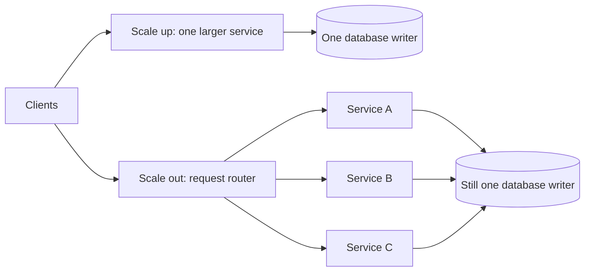
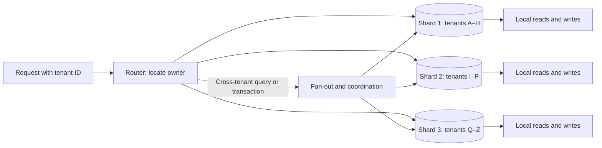

An API and its database run comfortably on one machine. Traffic doubles. CPU graphs climb, response time rises, and someone asks: “Should we buy a bigger machine or add more machines?” The question sounds like a choice between two diagrams. In practice, it asks **which resource is exhausted, which part of the work can move, and what remains shared after it moves**.

The [Scalability Field Note](/field-notes/what-scalability-really-means/) defines scalability as preserving a service contract as a particular workload grows. Here we examine its two most basic capacity moves: make a unit larger (**vertical scaling**, or *scale up*) and add units (**horizontal scaling**, or *scale out*). Neither is an architectural virtue by itself.

## Start with the smallest working system

Suppose one application process talks to one relational database. At 300 requests/s, its p99 latency is 120 ms against a 200 ms objective. The application uses 75% of one CPU allocation at peak; the database uses 30%. Giving the application more CPU might be the fastest, safest improvement. There is no reason to shard the database just because the system has grown.

But “75% CPU” alone is not a diagnosis. If requests wait on a saturated database connection pool, extra application CPU does little. If the hot operation is single-threaded, adding cores may increase *concurrent* requests without shortening that operation. If the database spends its time reading pages from disk, more memory may help by keeping more pages in its buffer cache; more CPU may not. First trace a representative slow request and measure CPU run time, memory pressure, disk and network I/O, lock contention, queueing, and dependency time.

The naive response to growth is to increase every resource. It works until the bill rises faster than useful throughput, the next machine size is unavailable, or one shared dependency becomes the limit. The classical alternative is to duplicate application servers. That works only if work can be routed among them without requiring all requests to wait on the same bottleneck.

## What actually changes when a node grows?

Scaling *up* can mean adding virtual CPUs, memory, I/O bandwidth, or a larger instance class. These are not interchangeable. More cores help work that can run simultaneously. More memory helps a cache-heavy database if it reduces page misses, but it does not fix a lock held by every transaction. Faster storage helps a scan-bound workload, not one blocked on an external API. For a managed database, a larger writer may increase its CPU and memory while the storage system behind it is already distributed.

For a single task with serial fraction `f`, [Amdahl's original argument](https://www.cs.cmu.edu/~18742/papers/Amdahl1967.pdf) gives an idealized upper bound on speedup from `n` parallel workers:

```text
speedup <= 1 / (f + (1 - f) / n)
```

If 10% of one operation cannot be parallelized, eight workers offer at most `1 / (0.1 + 0.9/8) ≈ 4.7×` speedup *for that operation*, even before communication overhead. This does **not** mean an API serving independent requests is capped at 4.7× throughput: separate requests can run concurrently. It means the serial part of a particular operation—and any shared serial resource—does not disappear when we add workers.

Scaling *out* changes the number of independently schedulable units. A load balancer can send different requests to different API instances. For stateful data, replication makes additional **copies** that may serve reads, while partitioning gives different owners **different subsets** of data. These are distinct forms of horizontal scale. Replicas do not automatically increase the single writer's throughput; partitions can, but introduce routing and cross-partition work.



The right-hand design has more application capacity and better tolerance of an application-host failure. It has **not** multiplied database write capacity. Indeed, three new connection pools can overload the writer faster than the original server did.

## Follow capacity through a request

Imagine an API peak of 6,000 requests/s. A load test shows that one instance safely completes 900 requests/s while satisfying its p99 latency target. The arithmetic minimum is `ceil(6,000 / 900) = 7` instances. Seven is not a deployment plan: it leaves almost no room for a failed instance, rolling deployment, uneven routing, or a burst.

If the service runs evenly across three zones and must survive any one zone failing *without first creating new capacity*, four instances per zone give 12 normally and eight survivors after a zone loss. The survivors' measured capacity is `8 × 900 = 7,200 requests/s`, enough for the 6,000-request peak under these simplified assumptions. Three per zone would leave only `6 × 900 = 5,400`. The calculation is deliberately simple; real load tests must include the database, cache, connection pools, and failover routing. AWS's [static-stability guidance](https://aws.amazon.com/builders-library/static-stability-using-availability-zones/) makes the same operational point: high-availability capacity should already exist when a zone fails, rather than depending on an emergency scale-up succeeding.

Now suppose each request performs one write and the database writer safely handles 4,000 writes/s. The 12 application instances can admit more traffic, but the database cannot complete it. At 6,000 arrivals/s and 4,000 completions/s, a queue grows by roughly 2,000 requests every second. More application replicas can increase the rate at which work piles up. Before changing topology, optimize avoidable queries, transaction length, indexes, and connection usage; then ask whether the write workload really requires multiple owners.

## From a bigger machine to multiple owners

A common progression is to scale up a stateful database while scaling out stateless application processes. This preserves one transaction authority and simple queries for as long as that authority meets the measured requirement. Read replicas can offload reads whose freshness contract tolerates lag. They usually receive changes asynchronously, so they are a poor destination for a read that must immediately observe its own write; [RDS documents both the read-scaling use case and asynchronous replica updates](https://docs.aws.amazon.com/AmazonRDS/latest/UserGuide/USER_ReadRepl.html).

If one writer's sustained write rate, I/O, or data size genuinely becomes the ceiling, partition by an access key such as `tenant_id`. A router maps each tenant to one shard. A transaction involving only one tenant stays local; a query across all tenants fans out and merges results; a transfer between tenants may require a distributed transaction or a redesigned workflow. Choosing the shard key is therefore choosing the future unit of scale *and* the locality boundary for correctness.



The diagram assumes ranges only to make ownership visible. Hash-based placement can spread many keys more evenly, but neither scheme splits a *single* hot tenant by magic. A hot key can saturate one owner while the rest are idle. Google's [Spanner split documentation](https://docs.cloud.google.com/spanner/docs/schema-and-data-model) describes automatic load-based range splitting; its [hot-split diagnostics](https://docs.cloud.google.com/spanner/docs/introspection/hot-split-statistics) explicitly call out a single hot row that cannot be divided further. A key-level bottleneck needs a changed data model, aggregation strategy, or workload contract—not merely more shards.

## The operational comparison

| Question | Scale up one unit | Scale out into more units |
| --- | --- | --- |
| What adds capacity? | More resources for an owner | More owners, replicas, or workers |
| What usually stays simple? | Local transactions, routing, debugging | Incremental application capacity and host-level failover |
| What is the hard limit? | Instance size and the next shared resource | Shared dependencies, skew, coordination, and network cost |
| What changes on failure? | A larger capacity slice may disappear at once | More failure points, but individual slices may be smaller |
| What can cost more? | Large-instance premium and overprovisioning | Replication, network traffic, orchestration, and engineering time |
| Best first fit | Stateful work still fits one owner | Independent work can be distributed cleanly |

This is not a fixed price comparison. A single larger node can be cheaper than several smaller nodes once load-balancing, replicas, network transfer, and on-call work are included. Conversely, keeping a huge node idle for rare peaks can be expensive. Compare **cost per completed request at the target latency**, including recovery capacity, rather than price per CPU or headline QPS.

## What breaks during failure and overload?

A larger machine increases the amount of capacity lost when that machine fails. A fleet reduces the size of one host failure, but shares software releases, credentials, routers, zones, and often one database. If every instance runs the same faulty release or depends on one unavailable writer, horizontal scale does not deliver independent availability. [The Reliability Field Note](/field-notes/reliability-fault-tolerance-recovery/) explores these common failure boundaries in more detail.

During a partial outage, a slow downstream call keeps request slots occupied. Clients retry; new instances accept more retries; the dependency receives even more work. Set end-to-end deadlines, bound queues and connection pools, make retried writes idempotent, and shed excess load before useful work collapses. A failed read replica may send traffic back to the primary, so test whether that primary has enough headroom for the failover read mix. A missing shard is different: requests for its keys cannot simply be routed to an unrelated shard without replicated state and a promotion protocol.

Scaling changes can themselves fail. A VM size change may require restart or migration and enough replacement capacity. A new Pod may remain Pending because no node has room. A database repartition can produce stale routing, duplicate writes, or long tail latency while data moves. Use staged rollout, checksums or reconciliation for moved data, a reversible routing change, and a clear ownership epoch so two nodes do not both act as the writer. Keep backups and restore tests separate from replica count: a replica faithfully copying an accidental deletion is not a backup.

## Autoscaling is a control loop, not instant capacity

An autoscaler observes a signal, calculates a desired size, requests the change, and waits for capacity to become ready. [Kubernetes HPA](https://kubernetes.io/docs/concepts/workloads/autoscaling/horizontal-pod-autoscale/) expresses its basic replica calculation as `ceil(currentReplicas × currentMetric / targetMetric)`. With four replicas averaging 80% CPU against a 40% target, the basic calculation requests eight. In practice, missing metrics, unready Pods, stabilization windows, replica limits, scheduling, image startup, and warmup affect when useful capacity arrives.

The signal must represent the bottleneck. CPU utilization is poor guidance if instances are mostly waiting on a database, while queue age or requests in flight may better express overload. CPU *utilization* in Kubernetes is also relative to a Pod's CPU **request**. Raising the request with vertical scaling can change the reported utilization percentage without changing the number of incoming requests. If HPA and a vertical resource controller both act on CPU utilization, they can work against each other unless their scopes and metrics are designed deliberately. A larger Pod still needs room on a physical node; [Kubernetes node-autoscaling documentation](https://kubernetes.io/docs/concepts/cluster-administration/node-autoscaling/) separates Pod replica changes from provisioning nodes for unschedulable Pods.

The practical path is to load-test the complete chain, set a minimum warm capacity for bursts and failure, cap the amount of work admitted at each stage, and use autoscaling to replenish or follow **predictable** changes—not to invent capacity after an instantaneous spike has already broken the latency budget.

## What production systems and recent changes teach us

Modern platforms combine the two moves instead of treating them as rivals. [Aurora Serverless v2](https://docs.aws.amazon.com/AmazonRDS/latest/AuroraUserGuide/aurora-serverless-v2.how-it-works.html) can adjust capacity for a writer or reader independently. This is vertical elasticity of database compute; additional readers can scale read traffic horizontally, while the writer remains a writer. It does not erase write-locality or read-lag questions. The minimum and maximum capacity settings, buffer-cache needs, and failover-reader sizing still matter.

In October 2024, [Aurora PostgreSQL Limitless Database became generally available](https://aws.amazon.com/about-aws/whats-new/2024/10/amazon-aurora-postgresql-limitless-database-generally-available/). Its [architecture](https://docs.aws.amazon.com/AmazonRDS/latest/AuroraUserGuide/limitless-architecture.html) places routers in front of data shards and coordinates distributed operations. The general lesson is that managed sharding can move routing and rebalancing work out of the application, but it cannot make cross-shard coordination free or make a poor shard key harmless. This is an available product approach, not a required destination for every relational database.

In December 2025, Kubernetes 1.35 made [in-place Pod CPU and memory resize stable](https://kubernetes.io/blog/2025/12/19/kubernetes-v1-35-in-place-pod-resize-ga/). This can avoid recreating a Pod for some vertical changes; it **does not** add CPU or memory to the underlying node, guarantee every resize can proceed, or make all runtimes react immediately to a lower memory limit. Vertical Pod Autoscaler is a separate add-on with update modes and its own rollout behavior, as the [Kubernetes VPA documentation](https://kubernetes.io/docs/concepts/workloads/autoscaling/vertical-pod-autoscale/) explains. Treat this as an improvement in *how* capacity is adjusted, not a repeal of capacity planning.

Also in 2025, Spanner made [manual pre-splitting generally available](https://docs.cloud.google.com/spanner/docs/release-notes). Automatic splitting remains valuable, but a known large launch can outrun a reactive splitter. Pre-splitting acknowledges the same principle as warm application capacity: if the burst is predictable, prepare the scale unit before traffic arrives. These changes are meaningful production tools; none changes the fundamental limits of serial work, shared state, skew, or coordination.

## Common misconceptions and a decision method

“Horizontal scaling is always more scalable” confuses *potential* with *observed* capacity. More stateless workers can be useful while one writer remains the ceiling. “Vertical scaling has no high availability” is also too broad: one component can scale up **and** have failover replicas, provided their capacity and promotion path are tested. “A managed autoscaler removes operations” hides warmup, bounds, metric selection, and failure-time capacity. “More memory means faster” fails if the working set already fits or lock contention dominates.

A senior engineer should ask what the real saturated resource is and whether an additional unit removes *that* constraint. A Staff or Principal engineer should also ask where state and transaction authority live, what becomes a shared failure domain, how ownership changes during migration, and whether the added coordination and on-call burden are worth the gain. The first question is not “How many nodes?” but “Which promise fails at the next workload level, and which resource is on its critical path?”

Use this mental model: **resource, unit, boundary**. Identify the exhausted resource; choose the smallest unit of work that can move independently; then name the consistency and failure boundary that remains shared. Scale up while one owner is comfortably sufficient. Scale out independent work when its demand justifies it. Partition state only when measurement shows one owner is the actual limit and the new ownership boundaries are acceptable.

## Summary

Vertical scaling buys simplicity and more capacity inside one owner. Horizontal scaling buys additional units of work and potentially smaller host-level failure slices, but only when routing, state, and dependencies allow useful work to spread. The most robust systems often use both: right-sized instances, multiple stateless workers, appropriately sized failover capacity, and partitioned state only where one owner is demonstrably insufficient. The architecture decision is not a vote for “up” or “out”; it is a testable claim about where the bottleneck will move next.

## Further reading

- [Gene Amdahl, *Validity of the Single Processor Approach* (1967)](https://www.cs.cmu.edu/~18742/papers/Amdahl1967.pdf) — the foundational argument for why serial work limits parallel speedup.
- [Kubernetes Horizontal Pod Autoscaling](https://kubernetes.io/docs/concepts/workloads/autoscaling/horizontal-pod-autoscale/) — the controller's metric-to-replica calculation and its operational caveats.
- [Kubernetes Node Autoscaling](https://kubernetes.io/docs/concepts/cluster-administration/node-autoscaling/) — why adding Pods and provisioning physical capacity are separate loops.
- [Kubernetes In-Place Pod Resize, v1.35](https://kubernetes.io/blog/2025/12/19/kubernetes-v1-35-in-place-pod-resize-ga/) — what recent vertical-resize support changes and what it does not.
- [AWS Builders' Library, Static Stability](https://aws.amazon.com/builders-library/static-stability-using-availability-zones/) — a concrete way to reason about capacity after losing a zone.
- [Amazon RDS Read Replicas](https://docs.aws.amazon.com/AmazonRDS/latest/UserGuide/USER_ReadRepl.html) — read scale, asynchronous propagation, and replica limitations.
- [Aurora Serverless v2 Architecture](https://docs.aws.amazon.com/AmazonRDS/latest/AuroraUserGuide/aurora-serverless-v2.how-it-works.html) — a production example of elastic writer and reader sizing.
- [Aurora PostgreSQL Limitless Database Architecture](https://docs.aws.amazon.com/AmazonRDS/latest/AuroraUserGuide/limitless-architecture.html) — a concrete router-and-shard design with distributed-query trade-offs.
- [Spanner Hot-Split Statistics](https://docs.cloud.google.com/spanner/docs/introspection/hot-split-statistics) — why extra storage nodes cannot divide a single hot row.
