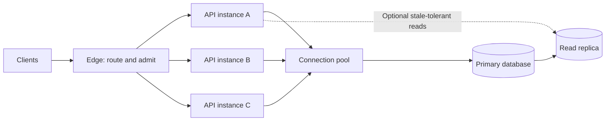

“Our system scales” sounds reassuring. It is also incomplete. Does it mean twice as many requests, ten times as much stored data, a million open connections, or users on another continent? Does the system still meet its latency and correctness requirements? How much extra infrastructure and operational work does that growth require?

**Scalability is the ability to accommodate a specified increase in workload while preserving an acceptable service contract at an acceptable cost.** It is a relationship among workload, resources, and outcomes—not a property that a database or programming language possesses in isolation. A system may scale reads beautifully while a single writer remains its limit. It may ingest events rapidly but need hours to make them searchable. It may double throughput with twice the servers while p99 latency becomes unusable.

The [previous Field Note](/field-notes/five-constraints-of-system-design/) defines latency, throughput, availability, durability, and consistency as separate service dimensions. Scalability asks whether the chosen promises can survive growth, and how efficiently capacity can be added when they cannot.

## Start with a small, honest system

Imagine an API with one application instance and one relational database. It handles 400 requests per second at peak, 20% of them writes. Queries are indexed, p99 response time is below 200 ms, and deployment is straightforward. That design may be entirely sufficient. A load balancer, cache, queue, and five-way database shard would add failure modes without solving a current problem.

Now suppose traffic grows tenfold to 4,000 requests per second. A load test shows each application instance can **sustain** 500 requests per second while meeting the p99 target. The arithmetic lower bound is eight instances. A real plan needs spare capacity for a failed instance, uneven traffic, deployments, and short bursts. But before ordering those instances, inspect the database: writes rise from 80 to 800 per second. If its measured safe write capacity is 600 per second, adding application instances alone just moves the queue to the database.

This is the central pattern of scaling: **after relieving one bottleneck, another becomes visible**. The correct next step depends on the workload, not on a generic diagram.

## Define the workload before the architecture

“Requests per second” hides important differences. A read of one small row and a query that scans millions of rows count as one request each. A workload description should include the operation mix, payload and result sizes, key distribution, peak-to-average ratio, concurrency, data growth, retention, geographic origin, and any consistency requirement. It should distinguish offered traffic from **completed useful work**.

One practical capacity definition is: *the maximum sustained throughput while p99 latency stays below 200 ms and fewer than 0.1% of eligible requests fail*. Record the hardware, software version, dataset size, request mix, and test duration. Without that boundary, a benchmark can claim a record throughput at a latency no user would tolerate.

Growth also has more than one axis. More active users may increase connection count without increasing CPU proportionally. Larger records may stress network and storage before request rate changes. One celebrity account can create a hot key even when total traffic is modest. A product launch creates a burst faster than autoscaling can react. Scalability is therefore a **capacity curve for a particular workload**, not a single QPS number.

## Why extra capacity eventually stops helping

Suppose a request has 15 ms of CPU work and 35 ms waiting on a shared database. Adding application instances can parallelize the CPU work across more machines; it does not shorten the shared database step. If every new instance also opens a large connection pool, it may make the database slower by increasing contention.

Queues create a second limit. For a stable system, Little's Law says average work in the system equals throughput times average time in the system: `L = λW`. At 1,000 completed requests per second and 100 ms average time, about 100 requests are in flight. If time rises to one second at the same completed rate, about 1,000 are in flight. The law does not promise that the overloaded system is stable; it helps explain why latency growth consumes connections, memory, and concurrency slots.

A simple queue model makes the danger visible. If a single worker completes `μ` jobs per second and jobs arrive at rate `λ`, an idealized M/M/1 model gives average time in system as `1 / (μ - λ)` while `λ < μ`. Moving from 50% to 90% utilization does not merely add 40% to response time in that model; expected time rises from `2/μ` to `10/μ`. Real traffic and service times rarely fit its assumptions, so do not use the formula as a production forecast. Use it as a warning that **headroom protects latency**. Google's [Tail at Scale](https://research.google/pubs/the-tail-at-scale/) explains why outliers become even more visible when one user request fans out to many components.

## The classical scaling moves

| Move | Mechanism | Best when | Main limit or new obligation |
| --- | --- | --- | --- |
| Scale up | Give one node more CPU, memory, or I/O | The workload fits one machine and simplicity matters | Hardware ceiling, larger failure domain, and often nonlinear cost. |
| Scale out stateless compute | Put more interchangeable instances behind a router | Application CPU or concurrency is the bottleneck | Shared storage, sessions, connection pools, and load balancing remain. |
| Replicate | Keep additional copies of state | Reads or failover need more locations | Replication lag, write ordering, promotion, and stale-read policy. |
| Cache | Serve repeated work from a faster nearby copy | Reuse is high and freshness rules are clear | Invalidation, misses, hot keys, stampedes, and extra memory. |
| Queue and batch | Decouple arrival from processing; amortize overhead | Results need not be immediate | Backlog, delayed visibility, retries, and delivery semantics. |
| Partition | Give different keys or ranges to different owners | One state owner cannot meet write or storage demand | Hot partitions, routing, rebalancing, and cross-partition work. |

These techniques do different jobs. Replication makes **copies** of data; partitioning **divides** data. A read replica may increase read capacity while leaving the primary's write limit unchanged. A queue can absorb a burst temporarily, but if arrivals exceed workers' completions for an hour, the backlog grows for an hour. A cache can remove expensive reads from an origin but cannot make a strict read fresh by declaration. Good scaling designs specify the exact operation each mechanism helps.

## Follow one request through the bottlenecks

At the edge, a request needs an admission decision and a healthy destination. Each API instance spends CPU time and may wait for a connection. The connection pool bounds concurrent database work; increasing it indiscriminately can move waiting inside the database instead of removing it. In this simple topology, the primary handles writes and reads that require its authoritative state. A replica can take only the reads whose consistency contract permits its state. Measure queueing and saturation at **each** boundary, not just end-to-end latency.

Load balancing itself is more subtle than round-robin. Instances can differ in capacity, background work, or current requests in flight. Google's [2024 Prequal paper](https://research.google/pubs/load-is-not-what-you-should-balance-introducing-prequal/) describes a production load balancer that uses probes, estimated latency, and requests in flight rather than simply equalizing CPU load. The general lesson is that an even request count is not necessarily an even *cost* or a low user-visible tail latency.

## When state must scale out

The hardest bottleneck is usually stateful. If one database writer is saturated, first eliminate avoidable work: missing indexes, full-table scans, excessive round trips, inefficient transactions, and reads that do not require the primary. An index is not free—it adds write maintenance and storage—but it may postpone a much more expensive partitioning project.

When a single writer is genuinely insufficient, choose a **scaling unit**. For example, `tenant_id` may keep one tenant's records and transactions together on a shard. A router maps the key to an owner; each owner stores and indexes only its subset. A good key distributes load without turning common operations into cross-shard joins. Hashing spreads many distinct keys; range partitioning supports range scans but can concentrate monotonically increasing writes at one end. Neither automatically fixes a single hot tenant or a globally shared counter.

Cross-shard work is where the bill arrives. A query without a shard key may fan out to all shards and merge results. A transaction touching two owners needs coordination, additional failure handling, and often more latency. Rebalancing must move state while reads and writes continue, so routing metadata, migration states, and rollback paths matter. [DynamoDB's partition-key guidance](https://docs.aws.amazon.com/amazondynamodb/latest/developerguide/bp-partition-key-uniform-load.html) makes the hot-partition problem concrete: uneven key access can cause throttling even when aggregate table capacity looks ample.

At another extreme, Google's [Bigtable paper](https://research.google/pubs/bigtable-a-distributed-storage-system-for-structured-data/) shows the older foundational idea of distributing structured data over many machines with explicit layout and serving trade-offs. The durable lesson is not “use Bigtable”; it is that scalable storage requires a data model whose access patterns can be partitioned.

## Scaling under failure and overload

Capacity plans made for healthy days are incomplete. Lose one node and surviving nodes inherit its traffic. Lose one zone and a region may run above safe utilization. A hot key can overload one shard while others look idle. A slow dependency holds connections open; retries increase offered load; then an autoscaler adds API instances that create even more database connections. A cache stampede can produce the same cascade after one popular entry expires.

Bound each stage. Use deadlines and bounded queues so obsolete work does not consume resources indefinitely. Admit only what can be processed inside the service target; reject excess work promptly or deliberately degrade a **noncritical** feature. Apply retry budgets, jitter, and idempotency to prevent recovery traffic from duplicating writes or overwhelming a sick dependency. Google SRE's [overload guidance](https://sre.google/sre-book/handling-overload/) and [cascading-failure chapter](https://sre.google/sre-book/addressing-cascading-failures/) explain why graceful load shedding can preserve useful capacity when accepting everything would make the whole service fail.

Autoscaling is helpful but is not instantaneous or omniscient. [Kubernetes HPA](https://kubernetes.io/docs/concepts/workloads/autoscaling/horizontal-pod-autoscale/) is a periodic control loop: it observes configured metrics, computes a desired replica count, and asks the workload controller to change capacity. New Pods still need scheduling, startup, readiness, and warmed connections. CPU is the wrong scaling signal if the limiting resource is queue depth, active streams, or database I/O. Maintain spare capacity for bursts that arrive faster than the control loop can react.

## How a production scaling plan evolves

A small system should use measurements to find its first real limit. A growing service can make the application tier stateless, pool database connections, and add replicas for explicitly lag-tolerant reads. If expensive tasks need not complete in the request path, place them behind a durable queue with a measured backlog and recovery time. When write capacity or data size exceeds one owner, introduce partitioning with an explicit shard key and migration plan. Only then consider multi-region active serving if latency, locality, or disaster-recovery objectives demand it.

This is a sequence of **hypotheses**, not a mandatory maturity ladder. Some workloads need a queue on day one. Others never need a cache or more than one database. Geography can make data residency or cross-region consistency the dominant concern before raw QPS becomes large. At each step, state which limit was measured, which metric should improve, which new failure mode appears, and how the change will be rolled back.

## What has changed recently

The underlying limits—coordination, queueing, locality, and skew—have not disappeared. Several 2023–2024 developments changed **who operates the mechanisms** and **where work runs**.

In 2024, AWS made [Aurora PostgreSQL Limitless Database generally available](https://aws.amazon.com/about-aws/whats-new/2024/10/amazon-aurora-postgresql-limitless-database-generally-available/). Its [architecture documentation](https://docs.aws.amazon.com/AmazonRDS/latest/AuroraUserGuide/limitless-architecture.html) describes routers that direct SQL to shards and coordinate distributed transactions. Managed sharding removes much application-owned routing work, but a query that spans shards still has coordination cost. It is an established vendor option for suitable workloads, not evidence that shard-key design has become irrelevant.

In 2023, Cloudflare introduced [Smart Placement](https://blog.cloudflare.com/announcing-workers-smart-placement/) for Workers. The [current placement documentation](https://developers.cloudflare.com/workers/configuration/placement/) explains the idea: an edge function that makes several round trips to one backend may be faster when the **compute** moves closer to that backend, even if the initial client-to-compute path gets longer. The lesson is to optimize the *whole request path*, not reflexively run every instruction at the location nearest the user. Static assets can still be served near the user.

Google's [2024 Prequal research](https://research.google/pubs/load-is-not-what-you-should-balance-introducing-prequal/) illustrates another shift: better placement of work among heterogeneous servers can improve tail latency and utilization without adding a new storage technology. It is a documented production technique, but results from one environment should be treated as evidence to test, not a guarantee for every service.

## Trade-offs and misconceptions

More machines do not imply linear throughput: serial sections, shared databases, coordination, uneven keys, and network hops create diminishing returns. “Serverless” and “managed” do not mean infinite capacity; quotas, per-key limits, cost, and upstream dependencies still exist. Microservices do not automatically scale better than a modular monolith; they make some components independently deployable and scalable while adding RPCs and operational boundaries. Multi-region is not a free capacity multiplier when writes must agree across regions.

The most useful comparison is not “vertical versus horizontal—which wins?” It is: *what resource is saturated, how much headroom is needed, and what is the least costly mechanism that moves that specific limit?* Scaling up is attractive when one machine is enough and operational simplicity matters. Scaling out helps when work can be divided. Partitioning is worth its complexity when state ownership itself is the limit. Caching is attractive when repeated reads and acceptable staleness justify an invalidation protocol. Those are conditional choices, not universal best practices.

## How experienced engineers evaluate a scaling proposal

An engineer first asks for the capacity curve: throughput, p95/p99 latency, error rate, and resource saturation under a representative workload. A senior engineer identifies the current bottleneck and tests one change at a time. A staff engineer also asks for the scaling unit, skew and hot-key behavior, consistency boundary, failure domain, and migration plan. At a broader level, the question is whether the added coordination, cost, and on-call burden are justified by an actual product objective.

Before approving a change, run a load test through the **whole** request path, including the real database and realistic data volume. Test a burst, a failed node, a slow dependency, and a hot key. Watch completed work rather than only incoming traffic; observe queue length, retry rate, connection wait, replication lag, and cost per successful operation. Roll out gradually and compare the new capacity curve to the old one. If the bottleneck simply moved, that is still useful information—but not proof the system now scales to the next order of magnitude.

## A mental model to keep

For every growth claim, ask four questions:

1. **What grows?** Requests, bytes, connections, keys, geography, or a particular hot tenant?
2. **What promise stays fixed?** Latency percentile, availability, correctness, freshness, or cost ceiling?
3. **What owns the bottleneck?** A worker, queue, network hop, database writer, partition, or coordination step?
4. **What happens when that owner fails or saturates?** Can work move, wait safely, degrade, or be rejected clearly?

Scalability is not the presence of many components. It is an observed, repeatable ability to add the **right kind of capacity** while preserving the service promise through both normal growth and predictable failure.

## Further reading

- [Google SRE, *Handling Overload*](https://sre.google/sre-book/handling-overload/) — Practical admission, degradation, and retry choices when demand exceeds capacity.
- [Google SRE, *Addressing Cascading Failures*](https://sre.google/sre-book/addressing-cascading-failures/) — Why a local overload can spread and how bounded work helps contain it.
- [Dean and Barroso, *The Tail at Scale*](https://research.google/pubs/the-tail-at-scale/) — The foundational explanation of tail-latency amplification in large services.
- [Chang et al., *Bigtable*](https://research.google/pubs/bigtable-a-distributed-storage-system-for-structured-data/) — A primary source on partitioned storage and data-layout decisions.
- [Kubernetes, *Horizontal Pod Autoscaling*](https://kubernetes.io/docs/concepts/workloads/autoscaling/horizontal-pod-autoscale/) — The actual control-loop mechanics behind a common autoscaling tool.
- [Google Research, *Prequal*](https://research.google/pubs/load-is-not-what-you-should-balance-introducing-prequal/) — A recent production study of latency-aware request placement.
- [AWS, *Aurora PostgreSQL Limitless Database architecture*](https://docs.aws.amazon.com/AmazonRDS/latest/AuroraUserGuide/limitless-architecture.html) — A concrete modern example of routers, shards, and distributed transaction trade-offs.
- [AWS, *DynamoDB partition-key design*](https://docs.aws.amazon.com/amazondynamodb/latest/developerguide/bp-partition-key-uniform-load.html) — Why hot keys defeat apparently ample aggregate capacity.
- [Cloudflare, *Workers placement*](https://developers.cloudflare.com/workers/configuration/placement/) — How moving compute toward its backend can beat placing every function near its user.
