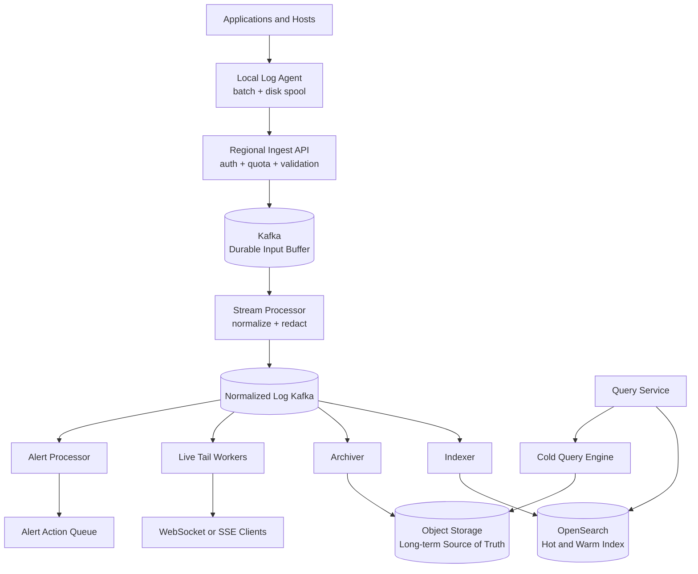
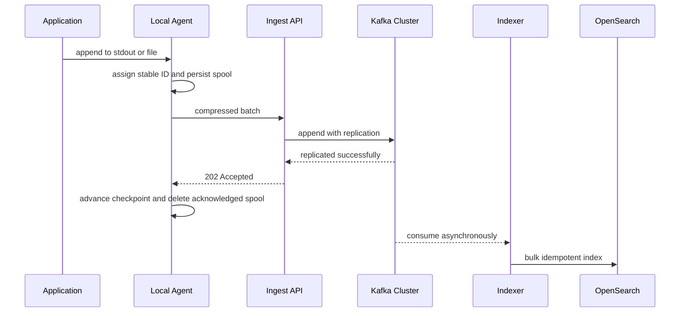
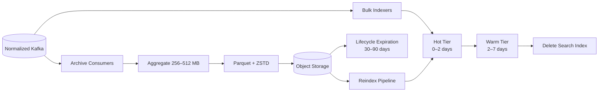
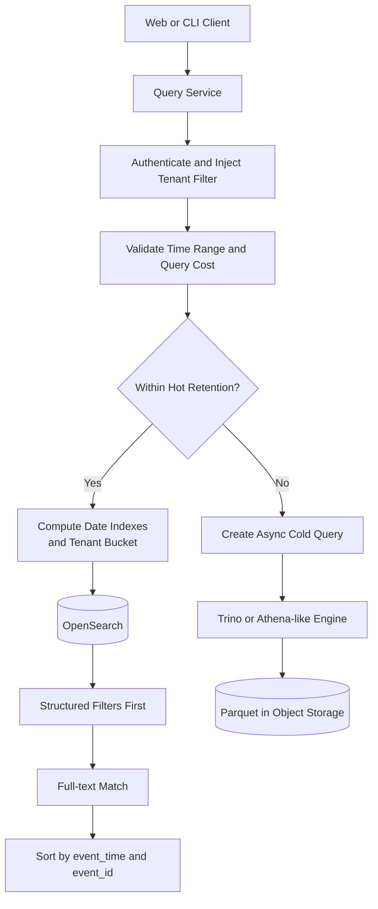
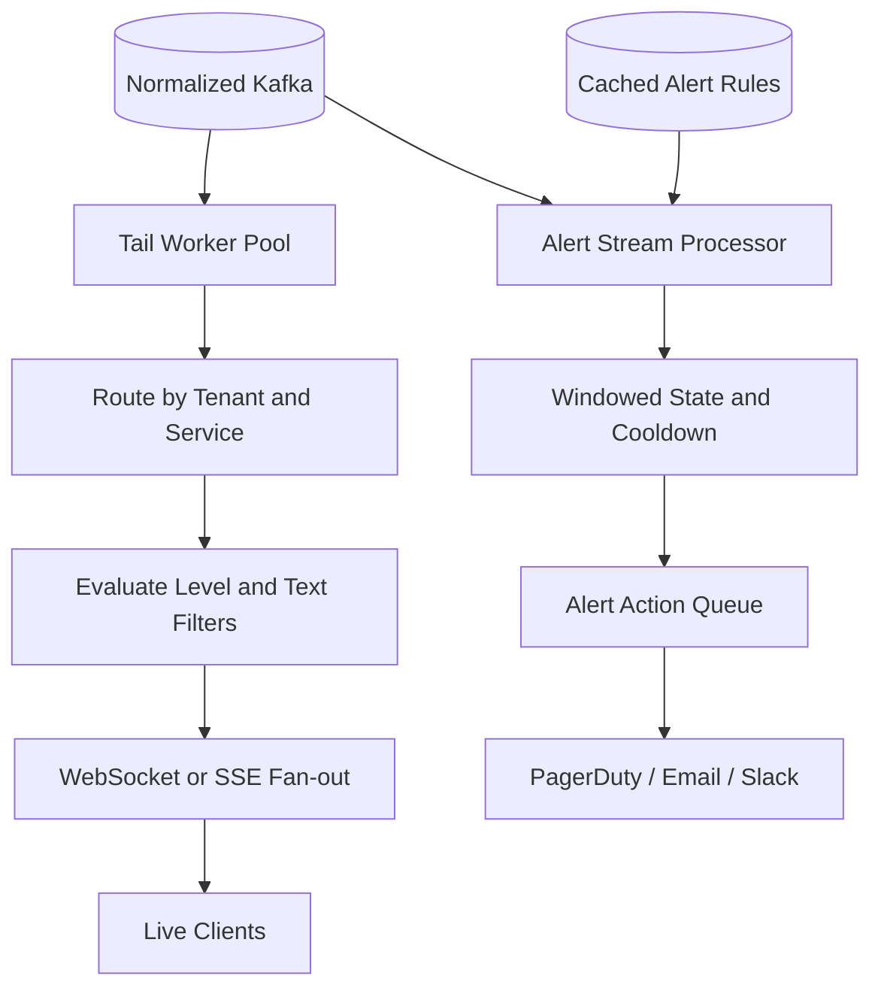
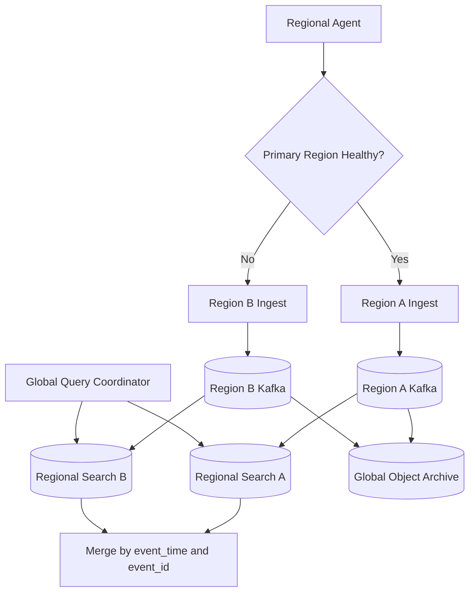

Design a centralized logging platform similar in spirit to Splunk, Datadog Logs,
CloudWatch Logs, or the ELK stack. Applications across many hosts and containers continuously
produce structured and unstructured events. The platform must collect those events reliably,
retain them economically, make recent data searchable within seconds, and support streaming
features such as live tail and log-based alerts.

The most important architectural decision is this:

> Object storage is the long-term system of record. Kafka is the durable transport log, and
> OpenSearch is a derived, rebuildable serving index.

This separation prevents the availability and cost profile of the search engine from defining
the durability of the entire logging platform.

## Scope and Requirements

The design focuses on a multi-tenant logging service with regional ingestion. We will design
one region in detail, then extend it to multiple regions.

### Functional requirements

| Priority | Capability | Notes |
|---|---|---|
| P0 | Reliable collection | Files, stdout/stderr, containers, and SDKs |
| P0 | Durable retention | Tenant-specific 7, 30, or 90-day policies |
| P0 | Near-real-time search | Time, service, host, level, trace ID, attributes, and text |
| P1 | Live tail | Stream matching events without polling the search cluster |
| P1 | Structured logs | Flexible attributes with controlled indexing |
| P1 | Multi-tenancy | Authentication, RBAC, isolation, and quotas |
| P2 | Log-based alerting | Windowed thresholds and pattern matches |
| P2 | Cold search | Slower queries over historical object-store data |

Dashboards, anomaly detection, and automated root-cause analysis are useful extensions, but
they are not required for the core design.

### Non-functional requirements

- **Availability:** ingestion should target at least 99.99% availability. A logging outage must
  not take down production applications.
- **Durability:** once acknowledged, logs should be extremely unlikely to disappear.
- **Delivery:** at-least-once. Rare duplicates are better than lost diagnostic evidence.
- **Ordering:** best effort within a source or process; no global ordering across hosts or
  regions.
- **Ingestion latency:** p99 under one second from agent to Kafka.
- **Search freshness:** p99 under five seconds from emission to searchability.
- **Query latency:** common recent queries should finish within one second at p95.
- **Security:** TLS, encryption at rest, tenant isolation, RBAC, audit trails, and PII redaction.

## Capacity Estimation

Assume 100,000 active hosts or containers, each producing an average of 20 log events per
second:

```text
100,000 hosts × 20 events/s = 2 million events/s average
Peak traffic                        = 5 million events/s
Average event size                  = 700 bytes
Raw average throughput              ≈ 1.4 GB/s
Raw data per day                    ≈ 121 TB
Compressed at roughly 4:1           ≈ 30 TB/day
30-day compressed retention         ≈ 900 TB
```

Even before accounting for replicas, inverted indexes, doc values, and segment metadata, the
retention footprint approaches one petabyte. Keeping all of it in OpenSearch would be both
expensive and operationally fragile. A reasonable policy is one or two days on hot search
nodes, up to seven days on warm nodes, and the complete retention window in object storage.

At a compressed peak near 0.9 GB/s, bandwidth alone may require roughly 50–100 Kafka
partitions. Consumer parallelism and recovery time usually push the practical design toward
200–500 or more partitions.

## High-Level Architecture



The synchronous acceptance path ends at the first replicated Kafka append. Everything after
Kafka—normalization, indexing, archival, live tail, and alert evaluation—is asynchronous and
can recover independently.

### Local log agent

Applications normally write to stdout, stderr, or local files. A daemon such as Fluent Bit,
Vector, or a custom agent tails those streams and performs the reliability work that should
never run in the application request path:

- assigns a stable `event_id` and monotonically increasing source sequence number;
- batches hundreds of events or a target byte size;
- compresses batches with Zstandard;
- persists unacknowledged data to a local disk spool;
- checkpoints file inode and offset state;
- retries with exponential backoff and jitter.

The agent makes logging non-blocking for the application and absorbs short backend or network
outages without losing data.

### Ingest service

The ingest tier is stateless and horizontally scalable. It authenticates credentials, derives
the tenant identity, enforces byte and event quotas, validates batch size and shape, and
publishes accepted batches to Kafka.

It must not wait for OpenSearch indexing or object-store archival. Doing so would couple
producer latency and availability to two downstream systems with very different failure
modes.

### Kafka and stream processing

Kafka absorbs spikes and gives each downstream capability its own consumer offset and retry
lifecycle. The first topic contains accepted batches. A lightweight processor then normalizes
timestamps, parses JSON, attaches `ingest_time`, redacts sensitive fields, extracts controlled
attributes, and publishes canonical events to a normalized topic.

The normalized topic becomes the fan-out point for indexing, archival, tailing, and alerting.

## Canonical Event Model

Every event uses a common envelope:

```text
LogEvent
---------------------------------
event_id             tenant_id
source_id            agent_instance_id
sequence_no          schema_version

event_time           ingest_time

service              environment
region               host
container_id          level

message              trace_id
span_id               attributes
```

Both timestamps are required. `event_time` is supplied by the application; `ingest_time` is
assigned by the platform. Application clocks can be skewed, a laptop may reconnect after 20
minutes offline, and old spools may be replayed. The system must never trust application time
as its only physical partitioning signal.

A stable event ID can be derived from immutable source coordinates:

```text
event_id = hash(source_id, agent_instance_id, sequence_no)
```

Retries must retain this ID. Generating a new UUID on every retry would make downstream
deduplication impossible.

## Reliable Ingestion and Acknowledgement



Conceptually, Kafka uses a replication factor of three across availability zones, `acks=all`,
and a minimum in-sync replica count that prevents acknowledgement after only one broker has
the data.

### At-least-once delivery

Suppose Kafka stores event `E123`, but the response to the agent is lost. The agent times out
and retries, so Kafka may contain two copies. This is expected.

The OpenSearch index uses `_id = event_id`, turning a duplicate write into an idempotent
overwrite. The immutable archive may tolerate rare duplicates, compact them later, or dedupe
at query time. This is considerably simpler and more credible than claiming end-to-end
exactly-once delivery across agents, brokers, storage, and search.

### Partition key and ordering

Using only `tenant_id` as the Kafka key sends all traffic for a large tenant to one partition.
Using only `event_id` distributes perfectly but removes useful source ordering. A balanced
default is:

```text
partition_key = hash(tenant_id, source_id)
```

This spreads a tenant's hosts while preserving best-effort order for one source. If a single
source becomes extremely hot, add a stripe such as `sequence_no % N`. That increases
throughput at the explicit cost of strict per-source Kafka ordering; event time and sequence
number remain available for reconstruction.

### Backpressure and overload

The ingest tier uses bounded queues, per-tenant token buckets, `429` or `503` responses, and
`Retry-After`. Agents back off with jitter while continuing to write to disk.

Disk is finite, so the overflow policy must be explicit: preserve `ERROR` and `FATAL`, sample
or drop `DEBUG`, choose whether to discard the oldest or newest remaining records, increment a
`dropped_log_count` metric, and alert loudly. Logs should never disappear silently.

## Storage and Retention

Different data belongs in different systems:

| Data | Storage |
|---|---|
| Canonical raw and normalized logs | Object storage |
| Recent interactive search index | OpenSearch |
| Durable pipeline buffer | Kafka |
| Tenants, retention, indexed fields, alert rules | PostgreSQL |
| Quotas and hot configuration | Local cache and optionally Redis |



### Object-store layout

Never write one object per event. Billions of tiny objects increase request cost, listing
latency, and cold-query overhead. Archive consumers should aggregate events into roughly
256–512 MB Parquet files compressed with Zstandard:

```text
s3://logs/
  tenant_bucket=17/
  region=us-west-2/
  ingest_date=2026-09-20/
  hour=14/
  service_bucket=03/
  part-000123.parquet.zst
```

Physical partitions use ingest time because application clocks are untrusted. The event still
retains `event_time` for user-facing queries. Parquet enables column pruning, predicate
pushdown, compression, and min/max statistics during cold search.

The archiver commits its Kafka offset only after the object has been stored successfully.
Kafka retention must be longer than the expected object-store recovery window—often 72 hours
or several days—so an archival outage becomes backlog rather than data loss.

### Search index layout

Recent OpenSearch documents use controlled mappings:

| Field | Mapping | Reason |
|---|---|---|
| `tenant_id`, `service`, `level`, `host` | `keyword` | Exact filters |
| `event_time`, `ingest_time` | `date` | Ranges and sorting |
| `trace_id`, `span_id` | `keyword` | Exact correlation |
| `message` | `text` | Inverted full-text search |
| selected numeric attributes | typed fields | Range filters and aggregation |

Do not create one index per tenant, and do not put every tenant in one giant index. Combine a
time bucket with a tenant bucket:

```text
tenant_bucket = hash(tenant_id) % 64

logs-2026.09.20-bucket-00
logs-2026.09.20-bucket-01
...
logs-2026.09.20-bucket-63
```

A query for one tenant and two dates can calculate the bucket and touch only two indexes.
Very large “whale” tenants receive dedicated indexes or nodes. This hybrid shared-and-
dedicated model prevents both tiny-shard explosion and noisy-neighbor overload. Shards should
roll over by size, time, or document count, targeting a practical size such as 20–50 GB.

### Preventing mapping explosion

Arbitrary JSON attributes cannot automatically become OpenSearch fields. Random or conflicting
keys can create millions of mappings and exhaust cluster metadata and heap.

Store the complete attribute map in the canonical archive, but index only a typed tenant
allowlist such as `http_status`, `latency_ms`, or `payment_provider`. Other attributes remain
stored but unindexed, or use a flattened key-value representation.

> Fields that are stored and fields that are indexed are deliberately different sets.

The control plane keeps tenant, retention, indexed-field, quota, RBAC, and alert-rule metadata
in PostgreSQL. Ingestion and normalization use local caches, backed optionally by Redis, rather
than performing a SQL lookup for every event.

## External APIs

Agents submit compressed batches:

```http
POST /v1/logs:batch
Authorization: Bearer <token>
Content-Encoding: zstd
```

```json
{
  "events": [
    {
      "event_id": "e123",
      "source_id": "host-123",
      "sequence_no": 8821,
      "event_time": "2026-09-20T14:20:01Z",
      "service": "checkout",
      "environment": "prod",
      "level": "ERROR",
      "message": "payment timeout",
      "trace_id": "abc123",
      "attributes": {
        "provider": "stripe",
        "latency_ms": 920
      }
    }
  ]
}
```

`202 Accepted` means the batch is durably replicated in Kafka. It does not mean that the
events are already searchable.

Search uses a POST because the query object may be structured and large:

```json
{
  "start_time": "2026-09-20T14:00:00Z",
  "end_time": "2026-09-20T14:30:00Z",
  "filter": {
    "service": "checkout",
    "level": ["ERROR"]
  },
  "text": "payment timeout",
  "limit": 200,
  "cursor": null
}
```

The API requires a time range, applies tenant identity from authentication rather than the
request body, and returns a cursor for the next page.

## Query Execution



Structured filters for tenant, time, service, and level reduce the candidate set before the
more expensive full-text match. The service enforces a maximum time range, result count,
timeout, tenant concurrency quota, regex restrictions, and a query-cost budget. Large or old
queries become asynchronous cold-search jobs rather than unbounded interactive requests.

Offset pagination such as `from=1,000,000` is too expensive because every shard may need to
materialize all preceding hits. Use an OpenSearch point-in-time snapshot plus `search_after`,
sorting by `(event_time, event_id)`. The event ID is a stable tie-breaker when many events share
the same timestamp.

The OpenSearch refresh interval creates intentional eventual consistency. A one-to-five-
second refresh interval is a reasonable balance between indexing throughput and search
freshness.

## Live Tail and Alerting

Polling OpenSearch every second for every live-tail session would turn 100,000 connected users
into 100,000 search queries per second. Both live tail and alerts should reuse the streaming
path.



Tail workers share a finite number of Kafka consumers; there is not one consumer per user.
Subscriptions are indexed first by tenant and service, then evaluated for level and text so
each event is not compared with every connected client.

To show the previous 20 seconds when a tail opens, query that history from OpenSearch while
recording a Kafka watermark, switch to the live stream, and deduplicate the overlap by
`event_id`. Tail delivery can remain best effort because all durable history is still available
through search.

Alert processors cache rules by tenant, service, and level, then maintain windowed counts or
pattern state. A cooldown and an incident deduplication key such as `(tenant_id, rule_id)`
prevent one log storm from creating thousands of pages. Processor recovery uses Kafka replay
and checkpointed window state; alert delivery itself remains at-least-once.

## Multi-Tenancy, Quotas, and Security

Credentials resolve the tenant on the server. The system ignores or overwrites any
`tenant_id` supplied by a client. Every search receives an unremovable tenant filter, and RBAC
controls accessible services, environments, and fields.

Hierarchical token buckets can enforce global, tenant, and service-level byte and event rates.
This matters during a log storm—for example, a bug that changes 10,000 events per second into
10 million. Kafka absorbs short spikes, but quotas, agent-side sampling, and explicit
`LOG_RATE_LIMITED` or `LOG_DROPPED` metrics protect the platform from sustained overload.

Other required controls include TLS, encryption at rest, credential rotation, audit logging,
and redaction of tokens, passwords, email addresses, payment data, or health information in
the normalization stage. Redaction rules must themselves be versioned and auditable.

## Multi-Region Availability

Each region has an independent ingest stack so workloads normally send to the nearest region.
Within a region, stateless services span availability zones; Kafka uses cross-AZ replication;
OpenSearch holds replicas across zones; and object storage supplies multi-AZ durability.



Agents can fail over to a secondary regional endpoint. Stable event IDs make duplicates across
the failover boundary harmless. The design does not attempt global ordering: clock skew,
network delay, and independently operating regions make it expensive and unnecessary.

Global searches scatter to relevant regional indexes in parallel and merge results by
`event_time` and `event_id`. This coordination is optional for a first version; regional search
plus a global archive is often sufficient initially.

## Failure Modes

| Failure | System behavior |
|---|---|
| Logging backend unreachable | Application continues; agent buffers to disk |
| Agent crashes | Durable spool and file checkpoint recover progress |
| Ingest node crashes | Load balancer routes to another stateless node; agent retries |
| Kafka broker fails | Cross-AZ replicas elect a new leader |
| Kafka cluster unavailable | Agent buffers locally or fails over to another region |
| Stream processor stops | Kafka backlog grows until consumers recover |
| OpenSearch unavailable | Ingestion and archival continue; indexer catches up later |
| OpenSearch data is corrupted | Rebuild indexes from object storage |
| Object storage is unavailable | Archiver pauses; Kafka retains the backlog |
| Tail service fails | Clients reconnect; durable history remains searchable |
| Alert processor fails | Restore checkpoint and replay Kafka |
| PostgreSQL control plane fails | Data plane temporarily uses cached configuration |
| Search overload | Enforce time limits, query budgets, and concurrency quotas |

## Where the System Breaks First

Raw append throughput is not usually the hardest scaling problem. The dangerous areas are
search/indexing amplification and arbitrary query fan-out.

1. **OpenSearch write amplification.** A 700-byte event expands into `_source`, an inverted
   index, doc values, segment metadata, and replicas. Limit hot retention, indexed fields, and
   refresh frequency; use bulk writes.
2. **Query fan-out.** A 90-day regex over all services can scan hundreds of terabytes. Require
   time bounds, prune by tenant and date, budget cost, and route historical work to cold search.
3. **Mapping explosion.** Separate stored attributes from indexed typed fields.
4. **Kafka hot partitions.** Partition by tenant and source, then stripe exceptional sources.
5. **Object-store small files.** Aggregate large Parquet files and compact when necessary.
6. **Log storms.** Combine quotas, backpressure, durable spools, priority sampling, and
   dropped-log telemetry.

## Key Trade-offs

### Durability versus ingestion latency

Waiting for both object storage and OpenSearch before acknowledging would strengthen immediate
materialization but damage availability and latency. A replicated Kafka acknowledgement gives
durable acceptance, followed by eventual independent materialization.

### Search flexibility versus cost

Indexing every field makes arbitrary queries convenient but creates high storage cost and
mapping risk. Index common typed fields and send rare attribute queries to slower cold scans.

### Ordering versus scalability

One partition per source preserves order but cannot scale an exceptionally hot source.
Striping increases throughput while weakening order. Logging systems usually favor scale and
retain timestamps and sequence numbers for reconstruction.

### Hot retention versus cost

Keeping 90 days in OpenSearch is fast and expensive. Seven searchable days plus 90 days in
object storage keeps recent incident response fast while making long retention affordable.

## End-to-End Example

Consider a checkout service emitting `ERROR payment timeout`:

1. The application writes the event to stdout.
2. The local agent tails it, assigns event ID `E123`, increments its sequence number, and
   appends it to the disk spool.
3. The agent batches 500 events, compresses them, and calls `/v1/logs:batch`.
4. The ingest tier authenticates tenant A, checks quotas, validates the batch, and appends it
   to `hash(tenant A, source 123)` in Kafka.
5. Kafka replicates the append; the service returns `202`; the agent advances its checkpoint.
6. The stream processor normalizes and redacts the event, then publishes it to normalized
   Kafka.
7. The indexer calculates tenant bucket 17 and writes `_id=E123` to the current OpenSearch
   index.
8. The archiver eventually includes the event in a large Parquet object.
9. After the next index refresh, the query service searches only the relevant date and tenant
   bucket and returns `E123`.

## Interview Summary

The strongest version of this design communicates eight points clearly:

1. Applications never synchronously depend on the search backend; a local agent batches and
   durably buffers logs.
2. The ingestion service acknowledges only after a replicated Kafka append succeeds.
3. Delivery is at-least-once, with stable event IDs and idempotent indexing.
4. Kafka decouples ingestion from indexing, archival, live tail, and alerting.
5. Object storage is the long-term source of truth; OpenSearch is a rebuildable recent-search
   index.
6. Search data is partitioned by time and tenant bucket, with dedicated capacity for whale
   tenants.
7. Arbitrary attributes are stored, but only controlled fields are indexed.
8. The biggest risks are search amplification, fan-out, hot partitions, log storms, and small
   files—not accepting append traffic itself.

That architecture gives the platform a durable core, an economical retention model, and a
search experience that can scale independently from ingestion.
