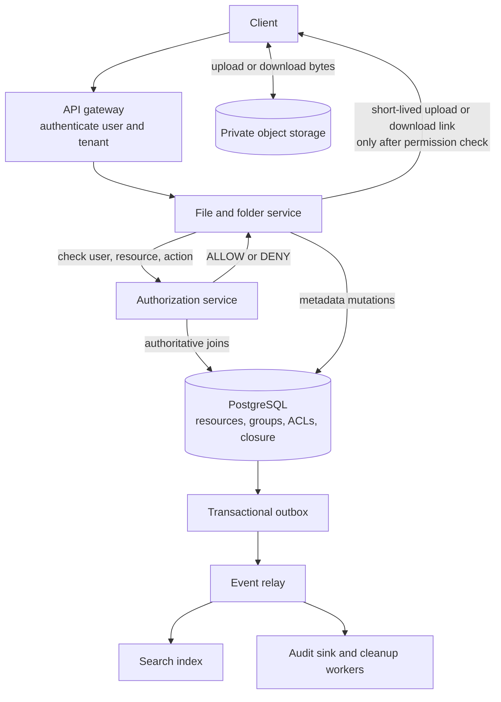
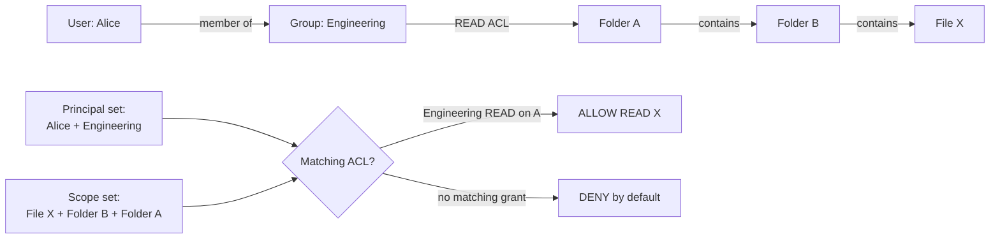
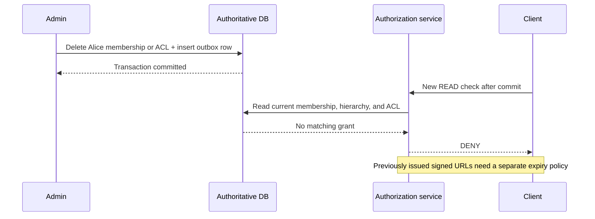

A file service is easy to sketch until somebody asks: “Alice belongs to Engineering, Engineering can read a parent folder, and an administrator just removed Alice from the group. Can she still download a file under that folder?” That question crosses user identity, group membership, the folder tree, inherited permissions, caches, and object-storage links.

The useful interview model is **two sets meeting at one ACL row**:

- **Who is asking?** The user plus their groups.
- **Where may permission come from?** The target file or folder plus its ancestor folders.
- **What is requested?** A specific permission such as `READ`.

If a matching grant exists, allow. Otherwise, **deny by default**. We will use an allow-only ACL and direct (not nested) group membership. Explicit deny, public links, and attribute-based rules are possible extensions, but adding them now would obscure the core design.

## Define the contract before drawing boxes

Each resource is either a file or a folder. Every non-root resource has exactly one parent folder; a folder may contain folders and files. A grant on a folder applies to that folder and all of its descendants. A grant on a file applies only to that file. All IDs and relationships are tenant-scoped: an ID from another organization must never be resolved through the current tenant's query.

For this design, `READ` permits viewing metadata, listing a readable folder, and downloading a readable file. `WRITE` permits creating, modifying, or deleting children in a folder; it **does not silently imply** `READ`. `ADMIN` permits permission changes and includes `READ` and `WRITE`. These are product semantics, not universal definitions of those words; state them explicitly in the interview. A newly created child should inherit the parent's grants without copying ACL rows.

The P0 operations are create folder, upload file, list folder, download file, grant/revoke an ACL, and add/remove a user from a group. P1 adds permission explanations, move/rename/delete, audit, and search. Authorization must happen **before** returning even a filename, path, size, or existence signal. For security-sensitive decisions, prefer a temporary failure or false deny to a false allow.

For sizing, suppose there are 10 million daily active users and each makes 40 metadata, listing, or download requests per day: about **400 million requests/day**, or **4.6K/s on average**. At an illustrative 8–10× peak, plan for roughly **40K authorization checks/s**. Suppose 450 million files average 2 MB each: their bodies approach **900 TB** before replication, so object storage—not PostgreSQL—holds the bytes. Database sizing also includes 50 million folders, ACLs, memberships, indexes, and closure rows. These are planning assumptions, not measured traffic.

## High-level architecture



The gateway authenticates *who* the caller is; it cannot infer whether that caller may read a particular file. The file service asks the authorization service before exposing metadata or issuing an object-storage link. PostgreSQL is the initial source of truth because this authorization check naturally joins resources, ancestors, ACLs, and group membership, while permission and hierarchy mutations need transactions. [PostgreSQL transactions](https://www.postgresql.org/docs/current/tutorial-transactions.html) make related database changes visible together.

Object storage is private. The application stores an `object_key`, not file bytes, in SQL. Search indexing and audit delivery follow a transactional outbox: the metadata change and outbox row commit together; workers deliver and retry events later. The queue is **not** in the authorization path. An eventually consistent search result is only a candidate; the authoritative permission check still decides whether it may be shown.

## The five-table relational model

| Table | Key fields | Why it exists |
| --- | --- | --- |
| `principals` | `(tenant_id, principal_id)`, `principal_type` (`USER` or `GROUP`) | One ACL target type for both people and groups |
| `group_members` | `(tenant_id, group_id, user_id)` | Direct group membership without copying group ACLs to users |
| `resources` | `(tenant_id, resource_id)`, `parent_folder_id`, `resource_type`, `status`, `object_key` | The authoritative one-parent tree and file metadata |
| `folder_closure` | `(tenant_id, ancestor_folder_id, descendant_folder_id, depth)` | Precomputed folder ancestry for fast inherited checks |
| `acl_entries` | `(tenant_id, resource_id, principal_id, permission)` | Direct grants on one file or folder |

`resources.parent_folder_id` is the authoritative parent link. The closure table is a **derived index**, not a second independently editable tree. Every folder has a self-row at depth zero. For `A → B → C`, it also has `A → B`, `B → C`, and `A → C`. A file does not need closure rows: its parent folder plus that folder's closure rows reveal all inherited scopes. At the illustrative 450 million files and depth seven, adding every file to closure would create billions of unnecessary rows.



Put `tenant_id` in primary and foreign keys so one tenant cannot attach a resource or principal from another tenant. Constrain `resource_type` and `permission`; validate that parent IDs are folders, group IDs really are groups, and moves never create cycles. Index `(tenant_id, parent_folder_id, resource_id)` for folder listings, `(tenant_id, user_id, group_id)` for a user's groups, `(tenant_id, descendant_folder_id, ancestor_folder_id)` for ancestry, and `(tenant_id, resource_id, permission, principal_id)` for ACL lookup. The reverse group index matters: a primary key ordered by `group_id, user_id` answers “who is in Engineering?” but not “which groups contain Alice?” efficiently.

## One authorization query to explain at the whiteboard

For `authorize(tenant, Alice, File X, READ)`, build Alice's principal set and File X's scope set, then test whether an eligible ACL intersects both. This query treats `ADMIN` as including `READ` under our stated semantics. `WRITE` alone does not grant `READ`.

```sql
WITH target AS (
    SELECT resource_id, parent_folder_id, resource_type
    FROM resources
    WHERE tenant_id = :tenant_id
      AND resource_id = :resource_id
      AND status = 'ACTIVE'
),
scopes AS (
    -- A direct grant on the file or folder.
    SELECT resource_id FROM target

    UNION

    -- For a file, start at its parent; for a folder, start at itself.
    SELECT fc.ancestor_folder_id
    FROM target t
    JOIN folder_closure fc
      ON fc.tenant_id = :tenant_id
     AND fc.descendant_folder_id = CASE
           WHEN t.resource_type = 'FILE' THEN t.parent_folder_id
           ELSE t.resource_id
         END
),
requester_principals AS (
    SELECT :user_id AS principal_id

    UNION

    SELECT gm.group_id
    FROM group_members gm
    WHERE gm.tenant_id = :tenant_id
      AND gm.user_id = :user_id
)
SELECT EXISTS (
    SELECT 1
    FROM acl_entries a
    JOIN scopes s ON s.resource_id = a.resource_id
    JOIN requester_principals p ON p.principal_id = a.principal_id
    WHERE a.tenant_id = :tenant_id
      AND a.permission IN ('READ', 'ADMIN')
) AS allowed;
```

For Alice in Engineering and `READ` on Folder A, the requester set contains Alice and Engineering; the scope set contains File X, Folder B, and Folder A. The ACL on `(Folder A, Engineering, READ)` matches, so the result is true. A missing, deleted, or wrong-tenant target produces no scope and therefore `false`. In a production implementation, also enforce that deleted ancestors cannot leave an active, reachable child. Route security-critical checks to the authoritative database or a replica with a **proven** revocation bound; a lagging read replica can reproduce the same stale-allow problem as a cache.

This is a bounded lookup by tree depth and the user's group count, not a scan of every file in the tenant. A closure table makes reads inexpensive but makes large folder moves more expensive—an intentional trade-off for a read-heavy authorization workload. [Recursive CTEs](https://www.postgresql.org/docs/current/queries-with.html) are an alternative if moves are frequent and precomputed closure maintenance becomes too costly.

### Explain access without expanding a million users

For “Why can Alice access File X?”, run the same scope and principal construction, but return each matching ACL's resource, principal, and permission instead of `EXISTS`. That gives concrete grant paths such as “Engineering's READ on Folder A.” An interviewer may next ask for a `JOIN`/`GROUP BY` query: “Which groups grant access, and how many direct members does each have?”

```sql
WITH target AS (
    SELECT resource_id, parent_folder_id, resource_type
    FROM resources
    WHERE tenant_id = :tenant_id
      AND resource_id = :resource_id
      AND status = 'ACTIVE'
),
scopes AS (
    SELECT resource_id FROM target
    UNION
    SELECT fc.ancestor_folder_id
    FROM target t
    JOIN folder_closure fc
      ON fc.tenant_id = :tenant_id
     AND fc.descendant_folder_id = CASE
           WHEN t.resource_type = 'FILE' THEN t.parent_folder_id
           ELSE t.resource_id
         END
)
SELECT a.principal_id AS group_id,
       p.display_name,
       COUNT(DISTINCT gm.user_id) AS direct_member_count
FROM scopes s
JOIN acl_entries a
  ON a.tenant_id = :tenant_id
 AND a.resource_id = s.resource_id
JOIN principals p
  ON p.tenant_id = a.tenant_id
 AND p.principal_id = a.principal_id
 AND p.principal_type = 'GROUP'
LEFT JOIN group_members gm
  ON gm.tenant_id = a.tenant_id
 AND gm.group_id = a.principal_id
WHERE a.permission IN ('READ', 'ADMIN')
GROUP BY a.principal_id, p.display_name
ORDER BY a.principal_id;
```

`LEFT JOIN` keeps a granted group in the result even when it has zero members; `COUNT(DISTINCT ...)` avoids double-counting users if the group has multiple matching grants. The number is **direct members of each group**, not a deduplicated total of everyone who can access the file. To answer “Who can access File X?”, combine direct-user grants with members of these granted groups and deduplicate by `user_id`. That result can legitimately contain a million users for an all-employees group. The API should paginate or first show contributing groups and direct users rather than synchronously expanding everyone.

Do not materialize group grants into per-user ACLs or folder grants into per-descendant ACLs. One Engineering grant on Folder A must remain **one ACL row** even if Engineering has 100,000 members and A contains millions of files. Membership and ancestry are resolved at check time.

## Read, list, upload, and download paths

For `GET /folders/{id}/children`, first authorize `READ` on the folder, **then** query its direct children using `(tenant_id, parent_folder_id, resource_id)` and keyset pagination. In this allow-only model, `READ` on the folder inherits to its children, so a second authorization RPC per child is unnecessary. Filter out non-ready or deleted resources. Conversely, a direct `READ` grant on File X may permit `GET /files/X` without permitting a listing of X's parent. Direct child access never implies parent browse access.

For upload, authorize `WRITE` on the parent folder, create a `PENDING` metadata row, issue a short-lived upload link, verify the object at completion, and mark the row `ACTIVE`. A cleanup worker expires abandoned `PENDING` rows and orphaned objects. The client must not be allowed to choose an arbitrary object key or turn an unverified upload into a visible file.

For download, authorize `READ` on the file before reading its object key and issuing a short-lived signed link. The link is a **bearer capability**: someone who already received it may still use it after their ACL is revoked, until the URL or its signing credentials expire. [Amazon S3's presigned-URL documentation](https://docs.aws.amazon.com/AmazonS3/latest/userguide/using-presigned-url.html) describes the expiration and credential behavior. A one-to-five-minute link limits—but does not eliminate—this window. If the product requires authorization at every byte-stream request, serve downloads through an authenticated proxy or equivalent rechecking layer, accepting the extra bandwidth and latency cost.

## Revocation is the consistency test



A ten-minute cached `ALLOW` makes a committed revoke ineffective for ten minutes. The safest baseline is **no positive authorization-decision cache**. A short-lived cached `DENY` may delay a newly granted user's access, but it does not reveal protected data. Group-membership caches have the same stale-allow hazard as ACL caches. If positive caching is needed at much larger scale, introduce a concrete revocation protocol and prove its failure behavior; a TTL alone is only a *bounded exposure window*, not immediate revocation.

State the consistency guarantee precisely: an authorization check **started after** a revoke commits must not use old membership, ACL, or ancestry data. An in-flight request that already passed its check, and an already issued signed URL, are separate races. If the requirement includes stopping those too, it needs stricter request serialization or download mediation. If the authorization database cannot be reached, **fail closed**—return a deny or an unavailable response, never a speculative allow.

## Moving a folder changes permission

Suppose Engineering can read Folder A, which contains B and File X. Moving B under Folder C removes A from X's ancestor set and adds C. The file ID and direct ACL stay the same, yet effective access changes.

Before the move, require the chosen administrative permission on B and `WRITE` on C. Check that C is not B or a descendant of B; the closure table can answer this with an indexed lookup. Then update B's parent link and the affected closure rows in **one transaction**. Concurrent moves and permission mutations must be serialized or retried so neither operation commits against a half-updated hierarchy. Once the transaction commits, new authorization checks must use the new ancestry. An asynchronous “fix the closure later” job would create a security window.

The cost is proportional to the moved subtree and its old/new ancestor sets. If million-folder moves are common, reconsider closure tables, constrain or queue very large moves behind a fail-closed `MOVING` state, or use another hierarchy representation with a clearly specified cutover. Do not merely change `parent_folder_id` and leave inherited ACL queries reading old closure rows. For deletion, mark metadata inaccessible first and clean object bytes asynchronously; failed cleanup should leak storage, not data.

## Search, audit, and scale

Search indexes are eventually consistent. Query them for *candidate IDs*, batch-authorize those IDs against current data, and only then expose titles or snippets. Over-fetch until a page contains enough authorized results; filtering just the top ten may leave a nearly empty page. Never trust an ACL snapshot embedded in the search index as the final access decision.

Record grants, revokes, membership changes, moves, and deletes with actor, tenant, target, time, and outcome. Commit a permission mutation and its outbox row together, then deliver to an immutable audit sink with idempotent consumers. Separate audit delivery from the synchronous decision, but never make a successful database mutation depend on a best-effort message publish.

Partitioning by `tenant_id` keeps resource, group, hierarchy, and ACL joins local. A huge tenant may need a dedicated shard. If authorization reaches hundreds of thousands of checks per second and relational joins become the measured bottleneck, consider a dedicated relationship graph service; it does not remove the need to define inheritance, revocation, and failure semantics.

## Interview takeaway

This system is a **tenant-scoped resource tree plus a relationship graph**. A user gains access when a direct or group principal matches an ACL on the target or an ancestor folder; no match means deny. PostgreSQL keeps membership, ACL, hierarchy, and their mutations authoritative; object storage keeps the bytes; search and audit are asynchronous consumers. The decisive follow-ups are not “which database is fashionable?” but whether revoke, folder move, stale cache, search, and signed URLs preserve the security contract.
