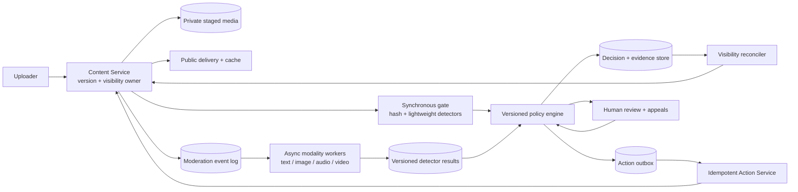
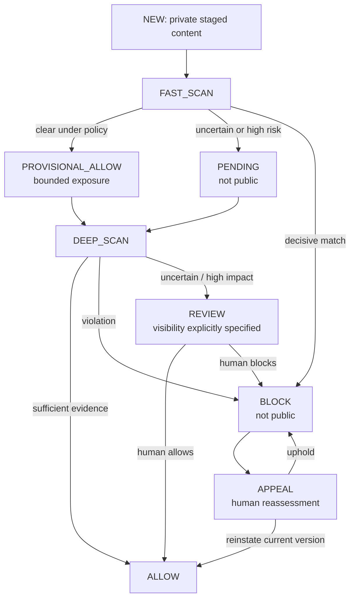
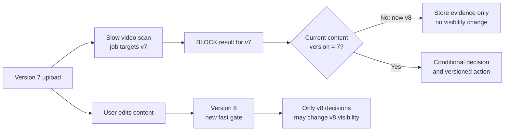
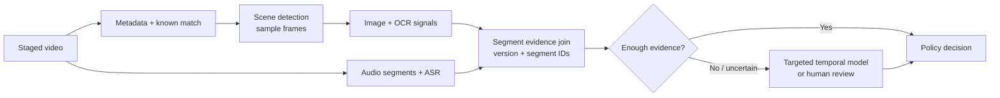

Imagine a platform where people upload text, images, audio, and video. The tempting answer is to run every upload through every machine-learning model and return `SAFE` or `HARMFUL`. That answer is both slow and incomplete. A video may take much longer to analyze than a short text post, a model score is not a product policy, and a database row saying `BLOCK` does not necessarily mean the content stopped being served.

I would design **a fast synchronous publishing gate, an asynchronous deep-scan pipeline, a versioned policy engine, and an enforcement loop owned by the Content Service**. The key contract is: **detectors produce evidence; policy produces decisions; the Content Service enforces visibility**.

## Define the contract before choosing models

The platform must support uploads, edits, user reports, moderator decisions, appeals, and policy changes. It should explain *why* an action happened without exposing sensitive evidence to ordinary users. The Content Service is the source of truth for the content bytes, current version, and effective visibility. Moderation owns signals, decisions, review tasks, and audit history. Neither service can assume one distributed transaction spans both databases.

I would name five external outcomes:

| Outcome | Meaning |
| --- | --- |
| `ALLOW` | The current version may be publicly visible under the evaluated policy. |
| `PROVISIONAL_ALLOW` | Limited or reversible visibility while more expensive checks run; its scope and expiry are explicit. |
| `PENDING` | Do not publish this version yet. |
| `RESTRICT` | Apply a specified limit, such as a reduced audience or age gate. |
| `BLOCK` | The current version must not be served. |

`REVIEW` is a **workflow state**, not an excuse to leave visibility undefined. A review task carries a separately specified visibility state (usually `PENDING`, sometimes a product-approved restriction). A detector timeout is `UNKNOWN`, not `SAFE`. The policy uses severity, uncertainty, upload surface, account risk, age, and region to decide what an unknown signal means. For high-risk surfaces, fail closed into `PENDING`; a low-risk surface might allow bounded provisional exposure. That is a product and safety decision, not a universal default.

For capacity planning only, suppose there are **one billion uploads/day**: roughly **11,600/s average**, perhaps **60,000/s peak**. If 8% are video, peak arrival is about **4,800 videos/s**. These are illustrative assumptions, not measured traffic. At 2 KB of moderation metadata per upload, even one unreplicated row per item approaches **2 TB/day** before indexes and evidence. A 0.05% review rate still yields **500,000 tasks/day**. The likely bottlenecks are video inference and human review capacity, not just the API database.

## High-level architecture

The user uploads bytes into private staging, not directly into a public CDN location. The Content Service creates `content_id` and `content_version` and invokes the fast gate. That gate can check known hashes, lightweight text/image signals, account context, and upload integrity, then ask the policy engine for an initial outcome. **It does not wait for full video decoding and every ML model.** Once the initial outcome is durably recorded and the Content Service has applied the corresponding visibility, the client receives an upload result. Deep scanning continues from a durable event stream.

The event stream should be configured for the required durability and retry semantics. But broker delivery alone does not make the workflow exactly once: a client or worker can retry after an ambiguous timeout. Give each request and action a stable idempotency key, and treat duplicate events as routine; [Amazon's Builders' Library](https://aws.amazon.com/builders-library/making-retries-safe-with-idempotent-APIs/) explains why retries need semantic idempotency rather than hope that a timeout meant failure.

The diagram deliberately has **two feedback paths**. Deep scanning and human review produce new evidence for policy. Separately, the reconciler compares the *desired* moderation decision with the *effective* Content Service visibility. A green moderation database is not proof that a blocked post disappeared from a feed or cache.

## The publish path is a state machine, not a Boolean

The exact fast-path budget is a product SLO, not a magical number every model must fit. Pre-publish `BLOCK` is especially strong because the Content Service never moves that version to public visibility. A later `BLOCK` of provisionally visible content has an unavoidable *exposure window*; the system should measure it and avoid provisional visibility where that risk is unacceptable. If any required signal is unavailable, policy makes a risk-specific decision instead of silently interpreting a missing result as benign.

This also clarifies what editing means. An edit creates a **new content version** and sends it through the gate again; it does not inherit a previous `ALLOW` as a permanent exemption. For an appeal, a human decision is tied to the appealed version. Reinstating version 3 must not automatically publish a different version 4.

## Separate detector signals from policy decisions

Each detector writes a result such as `(content_id, content_version, detector_name, model_version, segment_id, scores, evidence_reference, status)`. `segment_id` is null or a sentinel for whole-content checks; it identifies a frame, audio segment, or text chunk when work is split. A unique key on this tuple makes retries safe. Results may arrive out of order and are append-only evidence rather than direct visibility mutations.

The policy engine evaluates those signals with a **versioned rule set** and context. For example, an image classifier might output a score of 0.91. The policy decides whether that score means `BLOCK`, `RESTRICT`, or `REVIEW` for a particular surface, geography, age group, and policy version. It stores the matched rule IDs, model versions, evidence references, and decision version. This makes an appeal understandable and lets a later policy revision reuse previously computed signals.

There are two distinct version fences:

1. A detector result for content version 7 cannot decide visibility for content version 8.
2. A delayed action for decision revision 12 cannot overwrite a newer decision revision 13 for the *same* content version.

Use a conditional write or compare-and-swap on `(content_id, content_version, state_version)` when recording the current decision. The Content Service checks the same target content version and monotonic decision revision when applying an action. Keep stale results in the audit trail, but do not let them mutate current visibility.

## Deep scanning, especially for video

Text, image, audio, and video should have separate queues and worker pools so one expensive modality cannot starve the others. Within a modality, separate live uploads from lower-priority backfills. An intake classifier can route cheap, decisive cases away from expensive inference; uncertain cases take a deeper path. For video, a practical cascade is metadata and known-match checks, scene/shot sampling, selected frame analysis, OCR, speech transcription, audio checks, and temporal models only where evidence warrants them. Sampling trades compute for recall, so evaluate misses on held-out and adversarial content rather than claiming every frame was examined.

Chunking makes a long upload parallelizable, but workers must deduplicate per segment and model version. A partially failed scan should retry missing segments, not start a whole video over without bound. Keep evidence references and completion status so the join knows the difference between “no violation detected” and “three of ten segments never finished.” Dynamic batching can improve accelerator throughput, but a batch must not wait so long that the queue-age SLO fails.

Queue depth alone hides trouble: monitor **oldest item age**, per-modality completion latency, GPU utilization, retry rate, and the number of videos trapped in an incomplete state. Add admission and priority controls when arrivals exceed capacity. Merely increasing log partitions cannot create more GPU inference or human reviewers.

## A decision is not enforcement until visibility changes

The moderation service commits its decision and an action-outbox row **in one local transaction**. An outbox relay sends the action to an idempotent Action Service, which requests a version-checked visibility update from the Content Service. The Content Service acknowledges only after its authoritative state commits. An outbox pattern closes the gap between a local decision and a message that might otherwise be lost; [Debezium documents](https://debezium.io/documentation/reference/stable/transformations/outbox-event-router.html) one implementation of this pattern. It does **not** create a cross-service transaction or guarantee instantaneous enforcement.

Actions such as `BLOCK(content_id, content_version, decision_revision)` are idempotent. The Content Service ignores duplicates and stale revisions. On block, it should invalidate CDN and feed caches, stop fresh delivery, and define behavior for an invalidation failure; waiting for a normal TTL can leave harmful content exposed. The reconciler periodically compares recent desired decisions with actual Content Service state, retries discrepancies, and alerts on action-propagation age. For an already-public item, “moderation DB says BLOCK” and “users cannot see it” are separate metrics.

## Human review, reports, and appeals

Human review is for uncertain cases, severe actions, and sampled quality checks—not every upload. Store a review task with content version, policy version, queue priority, evidence pointers, and a lease or ownership state. In a relational implementation, multiple reviewers can claim queue-like rows with `FOR UPDATE SKIP LOCKED`; [PostgreSQL explicitly describes](https://www.postgresql.org/docs/current/sql-select.html) this as useful for queue consumers, not as a generally consistent query view. Keep the reviewer evidence scoped and access-controlled, and record who made each decision and why.

User reports are **signals**, not a vote that automatically bans content. Deduplicate reports, rate-limit abusive reporters, account for reporter trust, and defend against coordinated brigading. Viral items can make a single report counter hot; shard or aggregate those counters before updating a canonical score. A report may reprioritize a scan or review, but the final action still flows through versioned policy and enforcement.

An appeal should normally go to a human workflow with the original evidence and reason visible to the reviewer. Sending the same case through the same model and threshold is not a meaningful appeal. Enforce at most one active appeal per relevant decision, and fence its outcome to the appealed content version. Review overturn rate and reviewer agreement are important quality signals, but individual human decisions are not automatically perfect training labels.

## Policy change and re-evaluation

Keep detector output separate from policy output so a threshold or regional rule change can **re-evaluate stored signals** without rerunning inference. If the new rule needs a new detector or a different model output, schedule re-inference for the affected population. Either way, filter the scope by content age, surface, region, and impact; run it through a lower-priority queue so live uploads keep their latency budget.

Before activating a policy revision, shadow-evaluate it, compare decisions and appeal-sensitive cohorts, canary it on a small population, and retain a rollback pointer. Avoid a broad historical `BLOCK` rollout based solely on an unexamined score-distribution shift. If the policy is rolled back, the reconciler and action layer still need an explicit newer revision to restore visibility where appropriate; a stale `ALLOW` message must never beat a newer `BLOCK` by arrival order.

## Measure safety, not only server health

System metrics include fast-gate p95/p99 latency, queue age by modality and priority, detector timeout/unknown rates, GPU utilization, review backlog, and decision-to-enforcement lag. Quality metrics include category-specific precision and recall estimates, false-positive and false-negative samples, block/review rates, appeal rate and overturn rate, and model–human disagreement. Slice all of them by region, surface, language, and model/policy version, subject to privacy constraints.

A jump in block rate after a model release can be a serious incident even when every server returns HTTP 200. Conversely, a healthy queue with a growing discrepancy between moderation decisions and Content Service visibility is an enforcement incident. Audit evidence should have access controls and a retention/deletion policy; “append-only” does not override privacy obligations.

The interview takeaway is the boundary between **detection, decision, and enforcement**. The synchronous path protects upload latency and immediate safety; the asynchronous path pays for deeper multimodal analysis; versioning prevents stale work from corrupting new content; and the outbox, idempotent actions, and reconciliation make decisions actually take effect.
