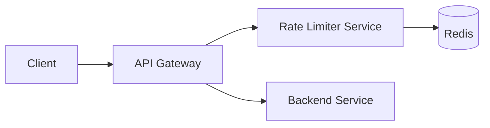

# Problem

Design a rate limiter that throttles how many requests a client (user, API key, or IP) can
make to a service in a given time window, shared correctly across many service instances.

# Requirements

## Functional Requirements

- Limit requests per client to `N` requests per time window (e.g. 100 requests/minute).
- Reject requests over the limit with a clear signal (HTTP 429) and a `Retry-After` header.
- Support different limits per client tier (free vs. paid).

## Non-Functional Requirements

- Low latency: the rate-limit check should add single-digit milliseconds.
- Correctness under concurrency: no client should be able to exceed its limit by racing
  requests across service instances.
- Availability: the limiter should fail open or closed predictably if its backing store is
  unavailable — pick one and state the tradeoff.

# Capacity Estimation

For 50,000 requests/second across all clients, a counter-per-client-per-window scheme needs
one read-modify-write per request against a shared store. That store must sustain ~50K ops/sec
with sub-millisecond latency, which points at an in-memory store like Redis rather than a
relational database.

# High-Level Design

The rate limiter sits in front of (or alongside) the API gateway. Each request increments a
counter keyed by client ID and window, checks it against the client's limit, and allows or
rejects the request before it reaches the backend service.

# Deep Dive

## Algorithm choice

- **Fixed window counter**: simplest, but allows bursts at window boundaries (2x limit for a
  brief moment).
- **Sliding window log**: exact, but stores a timestamp per request — memory-heavy at scale.
- **Sliding window counter**: approximates the sliding log using two fixed windows and a
  weighted average — good accuracy/memory tradeoff, common in production.
- **Token bucket**: naturally supports bursts up to a bucket size while enforcing an average
  rate — a common choice when short bursts should be allowed.

## Making it distributed

A single Redis instance (or cluster) as the shared counter store lets every service instance
see the same count. Use `INCR` + `EXPIRE` (or a Lua script for atomicity) so the
increment-and-check is a single atomic operation, avoiding race conditions between the read and
the write.

# Scaling

- Shard Redis by client ID so no single node becomes a bottleneck.
- Consider local, approximate rate limiting at each service instance (with periodic sync to
  Redis) to cut per-request network calls, trading strict accuracy for lower latency.

# Reliability and Failure Handling

If the Redis store is unreachable, decide explicitly: **fail open** (allow all requests,
protecting availability but risking overload) or **fail closed** (reject all requests,
protecting the backend but hurting availability). Most production systems fail open for a
short grace period and alert loudly.

# Trade-offs

| Approach | Memory | Accuracy | Burst handling |
|---|---|---|---|
| Fixed window | Low | Low | Poor (boundary bursts) |
| Sliding log | High | Exact | Good |
| Sliding window counter | Low | Approximate | Good |
| Token bucket | Low | Approximate | Configurable |

# Interviewer Follow-up Questions

- How would you rate-limit per-IP when clients sit behind a shared NAT?
- How do you avoid the rate limiter itself becoming a single point of failure?
- How would this change for a multi-region deployment?

# Common Mistakes

- Treating the increment-and-check as two separate operations (introduces a race condition).
- Ignoring what happens when the shared store is down.
- Not clarifying which limiting algorithm's burst behavior is actually acceptable.

# Summary

A distributed rate limiter needs an atomic increment-and-check against a shared, low-latency
store, a burst-tolerant algorithm (sliding window counter or token bucket), and an explicit,
stated decision for what happens when that store is unavailable.
