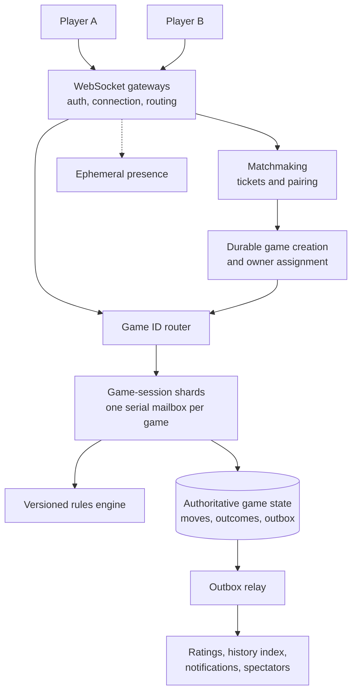
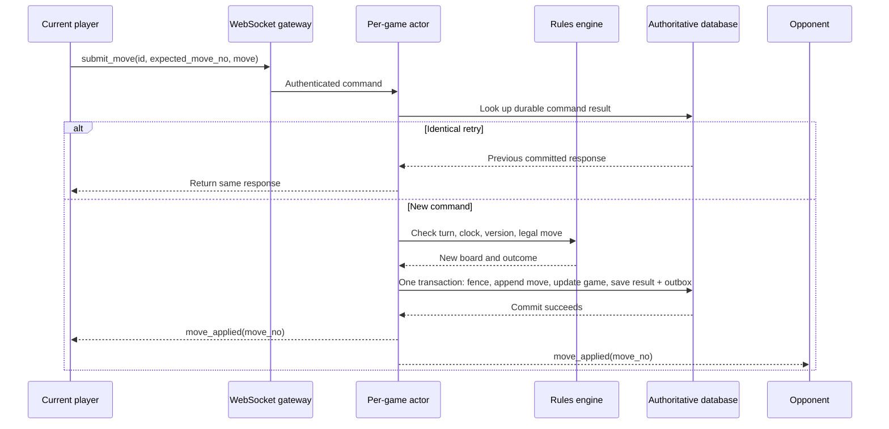
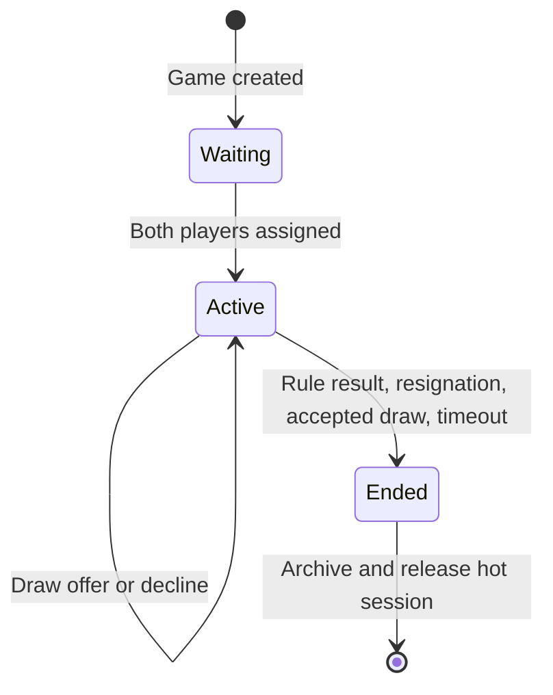
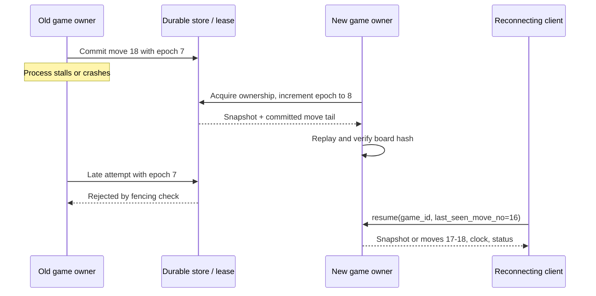

Imagine a platform for chess, checkers, Gomoku, and Othello. Two players can be matched, make moves in real time, reconnect after a network drop, play with clocks, and replay a finished game. A client can draw the board, but it cannot decide whether a move is legal, whose turn it is, or who won.

The central design choice is to make **each game a server-authoritative, recoverable state machine**. Commands for one game are processed in order; different games run independently across many machines. The hard part is not moving small JSON messages over a socket. It is ensuring that a retry, timeout, crash, or ownership handoff cannot create two valid-looking versions of the same game.

## Scope and planning assumptions

Core requirements are matchmaking or direct game creation, legal move validation, prompt updates to both players, server-controlled clocks, resignation and draw offers, reconnect, and history/replay. Chat, public spectators, tournament brackets, and rating updates are useful extensions, but they must not block a move's correctness path.

Within one game, committed moves, turn, clock, and terminal result need a single authoritative order. Presence, rankings, notifications, and spectator counts may lag. The two player screens can briefly show different *delivery progress* during a network delay; the invariant is that they eventually converge on the same committed sequence, not that their pixels change simultaneously.

For a capacity exercise, assume **10 million daily active users**, **1 million peak open connections**, and **200,000 simultaneous games**. If an active game produces one move every ten seconds on average, that is about **20,000 moves/s**, or **60,000 moves/s** at a 3× burst. Five million games/day at 40 moves/game produces 200 million move records/day. At an illustrative 100–300 bytes per record, raw moves alone consume about **20–60 GB/day**, before indexes, replicas, snapshots, and metadata. These numbers are inputs to load testing, not a performance claim.

Connection count is a separate scaling dimension: heartbeats, TLS, gateway memory, and reconnect storms may cost more than per-game rule evaluation. For same-region players under normal load, aim for roughly 100–300 ms from an accepted move to the opponent's display; measure the database commit and socket fanout portions separately. Cross-region latency needs its own SLO.

## High-level architecture



The gateways hold long-lived [WebSocket connections](https://www.rfc-editor.org/info/rfc6455/) and authenticate the user. They do not own the board. A router maps `game_id` to the current session shard. On that shard, each game has a serialized mailbox or event-loop task—not a dedicated operating-system thread. This gives one game a simple execution order while allowing thousands of quiet games to share workers.

Matchmaking groups compatible tickets by game type, time control, rating band, and region. A pair is not “matched” to users until game creation is durable. Ticket claims must be idempotent, so a retry cannot place one player into two games. The rules engine is pure and versioned: the game stores its `rules_version` and initial configuration so an old match can still be replayed after a rules deployment.

The durable store is the source of truth. A relational database is a reasonable starting point: it can atomically update a game row, append a move, record the idempotency result, and add an outbox event. [PostgreSQL transactions](https://www.postgresql.org/docs/current/tutorial-transactions.html) provide the all-or-nothing property this path needs. Redis may hold short-lived presence or matchmaking queue data, but should not be the only copy of accepted moves.

## API and data model

REST can handle `POST /v1/matchmaking/tickets`, `GET /v1/games/{game_id}`, `GET /v1/games/{game_id}/moves?after=...`, resignation, and draw offers. Player commands—including those received by REST—must enter the **same per-game sequencer**. WebSocket messages handle joining, move submission, resume, and committed updates.

```json
{
  "type": "submit_move",
  "game_id": "g123",
  "client_move_id": "c456",
  "expected_move_no": 17,
  "move": { "from": "e2", "to": "e4", "promotion": null }
}
```

The client-supplied `expected_move_no` says which committed position it acted upon; it is *not* proof that the move is legal. The server derives `player_id` from the authenticated connection. A committed response includes `move_no`, the authoritative move, next turn, clock values, and optionally a board hash. Illegal or stale commands return a reason and the latest sequence number.

| Record | Important fields | Purpose |
| --- | --- | --- |
| `games` | `game_id`, players, status, `move_no`, board, clocks, turn, `rules_version`, `owner_epoch`, result | Current committed state and fencing term |
| `game_moves` | `(game_id, move_no)`, player, move payload, clock delta, before/after board hashes | Ordered, append-only replay and audit log |
| `command_results` | `(game_id, player_id, client_move_id)`, payload hash, response | Durable idempotency, including across failover |
| `game_snapshots` | `(game_id, move_no)`, board, clocks, rules version, hash | Faster rebuild from a long event log |
| `outbox` | `event_id`, game ID, sequence, event payload | Reliable asynchronous publication |

Make `(game_id, move_no)` unique, and keep the command-result key at least as long as the game may be retried or resumed. The move log should retain enough rule context to reproduce the outcome; a board hash detects a replay mismatch, not repairs one. End-game actions such as resignation, accepted draw, and timeout are also durable **game events**, so replay has a complete terminal history.

## Accept a move exactly once in the game state



Inside the authoritative transaction, lock or conditionally update the game row, verify the current ownership epoch and expected move number, and reject commands against an ended game. Check `(game_id, player_id, client_move_id)` **before** deciding a retry is stale. If that key already has the same payload, return its original result; if it has a different payload, return a key-reuse conflict. A fast lookup before the transaction is fine, but the key and game version must be rechecked under the transaction or a uniqueness conflict must be resolved there. For a new command, validate player, turn, time, and rules against that version, then commit the move, new state, idempotency result, and outbox row together. A unique move number plus a conditional game-version update provide a second defense if routing briefly misbehaves.

The acknowledgement means **the move committed**, not merely that an actor changed memory. Only then should the gateway broadcast it. If the commit fails, clients may keep a provisional animation but must not treat the move as accepted. If the commit succeeds and the ACK is lost, the retry returns the saved result. The outbox relays history-index, rating, and spectator events after the transaction; publishing to a separate broker before or after the database write without an outbox would create a dual-write loss window.

Client state uses move numbers to discard duplicate pushes and detect gaps. It can optimistically animate a move, but a rejection or hash mismatch replaces that speculative view with server state. There is no need for a global order across unrelated games.

## Model clocks and endings as commands

The server persists both players' remaining time, whose turn it is, and an anchor for when that turn began. It sends authoritative values on move and resume events; clients can animate a local countdown between updates, but the displayed timer does not determine the result. The active player's elapsed time is charged when the game owner admits the next command. A timeout scheduler only asks the owner to *check* a deadline: it cannot declare a winner separately from the game state machine.



The move-versus-timeout race has one resolution point. If a move is admitted before the authoritative deadline under the product's time-control policy, it can be applied; otherwise the timeout transition wins and the move is rejected. An overdue scheduled job must re-read current turn and clock because a move may already have changed both. Server queueing delays should be bounded and included in the clock fairness policy, rather than silently charging players for an overloaded server.

For a running process, a monotonic timer is useful for elapsed time; it cannot be copied to a different machine on failover. Persist a recoverable wall-time anchor or deadline alongside remaining time, use bounded clock synchronization, and define a pause/grace policy if time uncertainty after a regional failover is too large for a fair result. Disconnecting a socket does **not** automatically stop the clock unless the game mode explicitly says so.

The terminal transition seals the game: later moves cannot change the result. Rating calculation and notifications consume the committed end event asynchronously and idempotently. If rating is temporarily down, the match still ends correctly.

## Reconnect, replay, and owner failover

An ordinary network drop changes presence, not the board. On reconnect, the client sends `resume_game(game_id, last_seen_move_no)`. The server authorizes that player, then returns missing numbered events if the tail is small, or a current snapshot plus subsequent events if it is large. The response also includes turn, clocks, status, and an authoritative board hash. Clients apply only contiguous sequences; a gap triggers another resume instead of guessing. Presence is ephemeral and may be briefly wrong without changing the game result.



The ownership lease helps route commands, but a lease alone does not stop a paused old process from waking up. Every authoritative write must carry a monotonically increasing **fencing epoch**, checked in the same transaction as the state update. A new owner loads the latest trusted snapshot and replays committed events after it; if the current game row already contains the full board, it can use that for fast recovery and verify against the log. Snapshot creation must itself be tied to a committed sequence, so a partial snapshot is never presented as newer than the log.

Recovery should pause acceptance for that game until one owner has the correct committed state. If the authoritative store is unavailable, do **not** acknowledge moves from RAM and promise to persist them later. The game may temporarily pause; that is better than accepting moves that vanish after a crash. A regional outage may need to move the game to another region, but retaining one authoritative owner per game is simpler than active-active multiwriter conflict resolution. State the recovery-time target and test it with killed owners, lease expiry, reconnect storms, and delayed old-owner writes.

## Scale without weakening the invariant

Shard ownership by `game_id`, and rebalance games by moving ownership epochs. This is **single-game serialism, many-game parallelism**. Hot spectator streams should not turn one game's actor into a broadcaster for thousands of sockets: publish committed events to a separate fanout service. Spectators may lag; players still receive committed sequence numbers. Gateways scale by connection count, session shards by command rate and in-memory state, and storage by committed write rate and retained history. Measure each independently.

Archive old move logs and snapshots to cheaper storage only after preserving the replay contract and verifying archive integrity. Keep recent finished games queryable; build replay views and leaderboards asynchronously. Rate-limit commands per authenticated player and game, authorize every join and resume, and never accept client-provided time or board state as truth. Legal-move validation prevents impossible moves, though it does not solve every form of external-engine cheating.

The operational dashboard should show move-commit latency, failed and duplicate commands, sequence gaps, active games per shard, socket count, clock-check lag, outbox lag, snapshot/replay duration, owner-epoch conflicts, and reconnect success. These signals tell you whether the platform is merely connected or actually preserving the game.

## Interview takeaway

The clean design is not “WebSockets plus a database.” It is a **durable per-game state machine**: one serialized command path, versioned rules, atomic move-and-result commits, idempotent retry keys, authoritative clocks, snapshot-plus-log recovery, and a fencing epoch for failover. Scale comes from running many independent games in parallel while never allowing two writers to decide the same game's next move.
