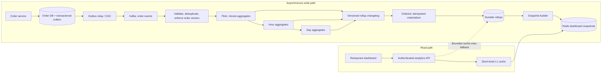
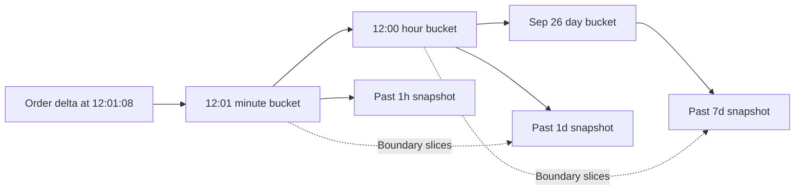
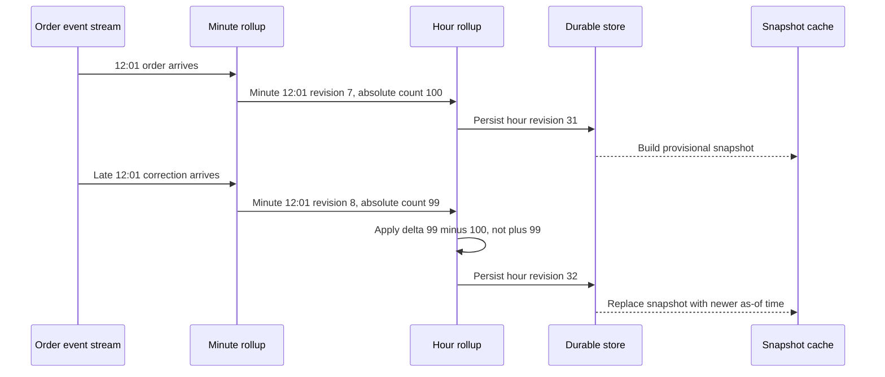

Imagine a restaurant manager opening a dashboard at lunch. They want orders, revenue, and the most popular dishes for the past hour, day, and week. Meanwhile, the platform is receiving **100,000 order-related events per second at peak**. Re-running `COUNT`, `SUM`, and `GROUP BY dish` over raw orders for every refresh is not a dashboard architecture; it is a read-amplification incident waiting to happen.

The design is to turn the order stream into small, durable time buckets, then keep ready-to-serve dashboard snapshots in a cache. The interesting part is making those snapshots fresh *and* eventually correct when events are duplicated, delayed, corrected, or replayed.

## Define the contract first

For one authorized restaurant, `GET /v1/restaurants/{restaurant_id}/analytics?window=1h|1d|7d` returns the completed-order count, net revenue, and top dishes by **net quantity sold**. Include a currency, `as_of` timestamp, `window_start`, and `window_end` in the response. The API must derive restaurant access from the authenticated principal; a guessed restaurant ID is not authorization.

I would propose these *targets*, then validate them under load:

| Requirement | Target and implication |
| --- | --- |
| Ingestion | 100K order events/s peak; analytics never blocks the order transaction. |
| Freshness | p99 event-to-visible lag under 10 seconds in normal operation. Values may be provisional. |
| Read latency | p99 API latency under 200 ms on the cache-hit path. |
| Correctness | Eventual correction after retries, refunds, and late arrivals; no permanent double counting. |
| Failure isolation | Redis loss degrades latency and capacity, but does not erase the durable aggregates. |

The dashboard is not the financial ledger. A five-second-old provisional number is acceptable if the API says when it was computed and later converges. An incorrect number that *never* converges is not acceptable.

At a 30K/s average, the stream contains about **2.59 billion events per day**. If an event averages 1 KB, that is about **2.6 TB/day of raw payload**, before replication, indexes, and compression; 100K/s peak is roughly 100 MB/s. Those numbers size the ingest path, not the dashboard query. A separate read scenario—500,000 active sessions refreshing every five seconds—would demand 100K reads/s. The write and read sides therefore need independent scaling.

## High-level architecture



The order service commits the business state and an outbox record in one database transaction. An outbox relay publishes that record to Kafka; a failed analytics consumer can recover without making order checkout depend on Flink, Cassandra, or Redis. The [Debezium outbox pattern](https://debezium.io/documentation/reference/transformations/outbox-event-router.html) is one practical implementation of this boundary.

The arrows after Kafka are *derived data*. Kafka retains a replayable event stream; Flink maintains working state and emits revised rollup values; a Cassandra- or ScyllaDB-like store keeps durable rollup rows; Redis holds disposable, precomputed API responses. The exact products can change, but these responsibilities should not be blurred. In particular, **Redis is not the source of truth**, and a cache miss must not become a scan of raw orders.

## Model an order event so corrections are possible

An analytics event needs more than `restaurant_id` and a dollar amount:

```json
{
  "event_id": "evt-8f2",
  "order_id": "ord-91",
  "order_version": 4,
  "restaurant_id": "r-123",
  "occurred_at": "2026-09-26T12:01:08Z",
  "attribution_time": "2026-09-26T12:01:08Z",
  "order_count_delta": 1,
  "revenue_delta_minor": 2750,
  "currency": "USD",
  "dish_quantity_deltas": { "pad-thai": 2, "green-curry": 1 }
}
```

Use integer minor currency units, not floating-point dollars. A completed order may emit `+1` order and positive revenue and quantities. A later partial refund might emit `0` orders, negative revenue, and optionally negative dish quantities if the metric is **net** items sold. If the product means *gross* items sold, the quantity rule changes; define it rather than letting two services interpret the field differently. Track currencies separately unless a documented conversion rate and reporting time are part of the contract.

Choose an attribution policy. For this design, net sales corrections go back to the original order's completion bucket, so `attribution_time` can differ from the refund's `occurred_at`. That can produce a correction long after normal watermark lateness expires; a reconciliation path must handle it. An alternative is to attribute refunds to the refund time and call the chart cash-flow rather than net original sales.

Deduplicate by stable event ID, and reject stale order versions before applying deltas. Flink checkpoint recovery protects its own state and source position, but it does not magically make an arbitrary external sink exactly-once; [Flink's connector guarantee documentation](https://nightlies.apache.org/flink/flink-docs-stable/docs/connectors/datastream/guarantees/) makes the sink requirement explicit. If deduplication state expires before the maximum producer retry or replay horizon, an old event may count again. For full historical rebuilds, run a deterministic rebuild in a separate namespace or retain an order-version ledger covering the replay horizon.

## Roll up minutes into hours and days

The minute bucket is keyed by `(restaurant_id, currency, minute_start)` and contains `order_count`, `revenue_minor`, and the full `dish_id -> quantity` counts needed for exact top dishes. Hour and day buckets merge their children. Store **absolute bucket revisions** with an increasing version and `as_of`, not only increments to apply in an external database.



The snapshot builder merges *non-overlapping* buckets. For a window aligned to bucket boundaries, the fast path is about 60 minute buckets for 1h, 24 hour buckets for 1d, or seven day buckets for 7d. A truly rolling window ending at, say, 12:03:27 is different: use fine-grained buckets at the two edges and coarser buckets only for the fully covered interior. With minute buckets, the result is precise only to the minute; second-level accuracy needs second buckets or an equivalent boundary mechanism. Do not call an hour-aligned approximation an exact “past 24 hours” query.

This hierarchy bounds fallback reads; it does not make them literally constant time. A miss costs the number of buckets *and* the work to merge their dish counts. The cache-hit path is effectively one snapshot lookup.

A rollup table might use `(restaurant_id, currency, granularity, partition_period)` as its partition key and `bucket_start` as its clustering key. Partition minute rows by UTC day and hour rows by UTC month so one restaurant does not create an unbounded partition. A row stores counts, `version`, `as_of`, and a final/provisional marker. If a restaurant has an enormous menu, a single map of every dish can make the row too large. Split dish counts into per-dish rows or bounded shards and merge them for snapshot construction.

### Why local top-K is not enough

Suppose Dish A is fourth in each of 60 minute buckets, while different dishes occupy the top three each minute. Dish A can still be first over the entire hour. Keeping only each bucket's top three loses A permanently. For an **exact** global top K, retain mergeable counts for every dish in the window and select the top K after merging. For a massive or unbounded item catalog, approximate heavy-hitter sketches are a valid alternative, but then the API and interview answer must state the approximation and error trade-off.

## Freshness, late events, and safe revisions

A two-minute out-of-order watermark and a ten-second dashboard freshness target are not contradictory if the first published value is provisional. Emit incremental minute-bucket revisions every few seconds or after an event-count threshold. Watermarks later indicate when a window is *probably* complete, and allowed lateness permits further firings; very late events go to a correction/reconciliation path. Configure idle-partition detection so a quiet Kafka partition does not hold back every window. These are established [Flink window](https://nightlies.apache.org/flink/flink-docs-master/docs/dev/datastream/operators/windows/) and [watermark](https://nightlies.apache.org/flink/flink-docs-master/docs/dev/datastream/event-time/generating_watermarks/) mechanisms, but the exact lateness and trigger intervals must be measured against real event delay.



Every downstream aggregator remembers the last accepted revision of each child bucket. When minute count changes from 100 to 99, the hour changes by **−1**, not +99. The same rule propagates hour revisions into day buckets. A correction that arrives beyond allowed lateness is not silently discarded: put it in a side output, fetch or reconstruct the affected bucket, write a newer revision, and rebuild affected snapshots. The [Flink documentation on late firings](https://nightlies.apache.org/flink/flink-docs-master/docs/dev/datastream/operators/windows/#allowed-lateness) explicitly treats them as updated results of a prior computation.

There is one more boundary to make precise: the Kafka rollup changelog can be written transactionally with Flink checkpoints, but the Cassandra and Redis writes still need their *own* retry and ordering strategy. Use a single ordered materializer per bucket key, writing the full absolute value. On failover, ensure an old in-flight write cannot land after a new one—either fence the old writer and drain in order, or use conditional compare-and-set on the stored version. A `version` column **without enforcement** does not prevent stale overwrite. [Cassandra's lightweight transactions](https://cassandra.apache.org/doc/stable/cassandra/architecture/guarantees.html) offer CAS semantics, at a write-cost trade-off; use them selectively if ordered ownership is insufficient.

Build Redis snapshots only from durable, committed rollup revisions, or explicitly label cache values as ahead of the fallback store. Otherwise a Redis eviction can make the dashboard move backward unexpectedly. Include `as_of` in each response so clients can detect lag. Keep the Kafka transaction/checkpoint interval short enough for the ten-second visibility budget: [Flink's Kafka exactly-once sink](https://nightlies.apache.org/flink/flink-docs-stable/docs/connectors/datastream/kafka/) makes records visible on checkpoint commit, so a long checkpoint interval consumes the freshness budget.

## Serve reads without multiplying work

The analytics API authorizes the restaurant, checks a one- or two-second process-local L1 cache, and normally returns a Redis snapshot. Redis stores the entire response for `(restaurant, currency, window)`—including top dishes and timestamps—so one page refresh is not three database aggregations. A periodic snapshot tick advances rolling-window boundaries even if no new orders arrive; otherwise the “past hour” number would remain frozen after a restaurant closes. TTL is for cleanup and fault recovery, **not** the freshness clock.

If Redis misses, the API can merge a bounded set of durable rollups. Coalesce identical concurrent misses, rate-limit fallback, and put a hard per-request budget on bucket reads. When the budget is exhausted, a clearly marked last-known snapshot or a controlled error is safer than a thundering herd against Cassandra. Rebuild cache from durable rollups, then follow the rollup changelog; replaying billions of raw events is a disaster-recovery tool, not the normal cache warm-up plan.

For hot restaurants, cache snapshots can be replicated and reads distributed, but a single `restaurant_id` Kafka partition or Flink key may become the *write* bottleneck. Partition normalization by `order_id` to preserve per-order version checks, then shard one restaurant's partial minute aggregates by a stable subkey and merge those partials in a second stage. Pick the shard count from measured skew and state size, not a magic constant. Multi-region deployments can designate a home region and single writer per restaurant, asynchronously replicate the read model, and accept documented cross-region staleness rather than conflicting writes to the same bucket.

## What I would say in the interview

The central trade-off is **more write-side aggregation and correction logic for predictable read cost**. Order transactions remain independent. Normal reads are single cached snapshots. Cache misses merge bounded, durable rollups—not raw orders. Event time, provisional firings, child-revision deltas, and version-enforced writes make the result converge after late or duplicate events. The design is strongest for a small, fixed set of dashboard windows; if the product later needs arbitrary filters or exploratory queries, a columnar analytics store such as ClickHouse may be a better complementary read path than multiplying precomputed snapshots for every possible dimension.

The most revealing follow-up question is not “Why Kafka?” It is: *what happens when a 12:01 refund arrives at 12:20, after Redis was rebuilt and an older Cassandra write is still in flight?* A sound answer traces the correction through a newer bucket revision, an ordering or CAS guard, a durable commit, and a new cache snapshot—without counting the order twice or scanning the order table.
