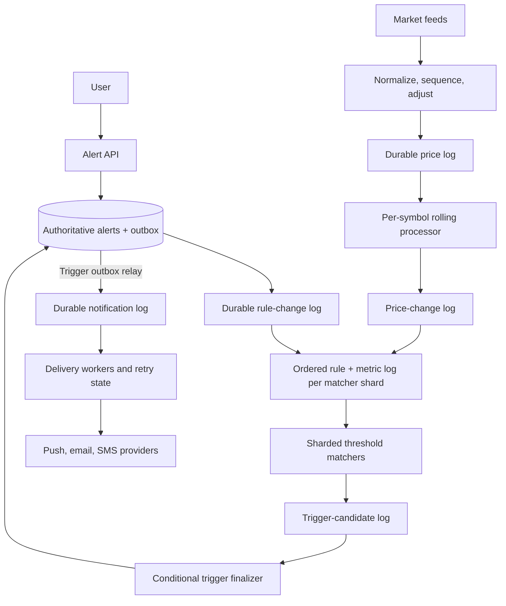
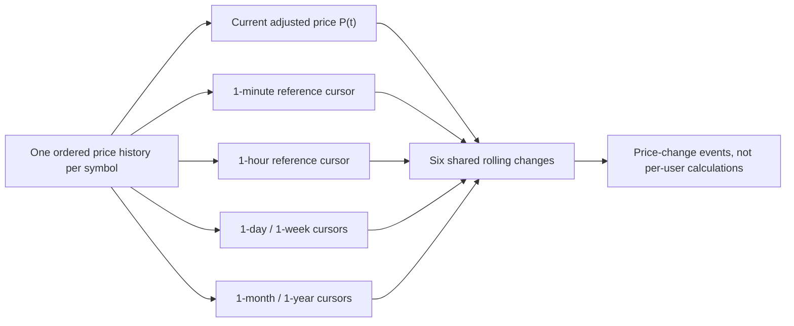
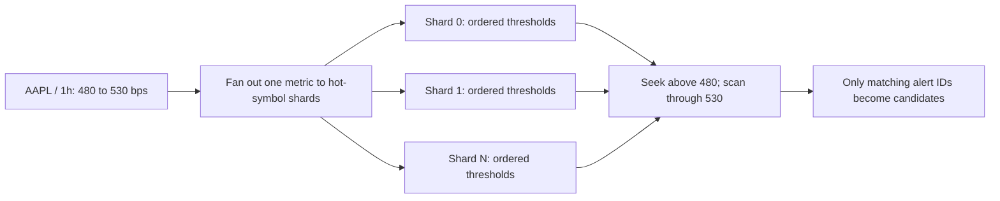
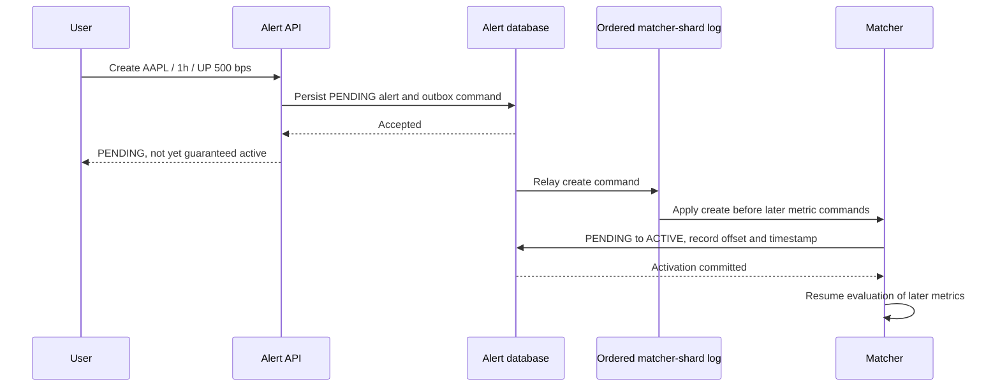

Suppose a brokerage lets users request: “Tell me once when this stock's one-hour gain crosses 5%.” The service receives a normalized price roughly every second for each of tens of thousands of symbols. A popular stock may have millions of active alerts, all watching the **same price history** but with different thresholds. The challenge is not sending a push notification. It is finding exactly the rules crossed by one market update, without scanning every subscriber, and making the one-shot state transition survive retries, cancellation, and worker failure.

I would design this as two stateful streaming problems followed by a durable decision point: compute rolling changes once per symbol, range-match those changes against a threshold index, then finalize each candidate against the authoritative alert record before delivery.

## Define what “crossed” means

For a window `W`, let `P(t)` be the adjusted price at event time `t` and `P_ref` the chosen valid price at or before `t - W`:

```text
change_W(t) = (P(t) - P_ref) / P_ref
```

For example, $105 now versus $100 one hour ago is a +5% one-hour change. This is a *rolling* window, not the change since the beginning of the calendar hour. The reference-price policy needs a maximum acceptable age: a week-ago market holiday should not silently turn a very old trade into a fresh baseline. If no acceptable reference exists, the metric is undefined and no alert is evaluated.

This design uses **crossing semantics**. An UP alert at 5% fires when the previous one-hour change was below 5% and the new one is at least 5%: `previous < threshold <= current`. A DOWN alert uses the increasing magnitude of a negative change. An EITHER alert can be indexed in both directions, but its final state transition still succeeds only once. An alert created while the metric is already above its threshold does *not* fire immediately; it waits for the metric to fall below and cross again. If the product instead wants “notify immediately whenever the current level already qualifies,” that is a different creation and evaluation contract.

Specify the six supported windows—one minute, hour, day, week, month, and year—and define whether month and year are fixed durations or calendar arithmetic. For sizing below, assume fixed durations and UTC event timestamps. Alert lifetime is an exact `expires_at` value, such as creation plus 30 × 24 hours, not an ambiguous “one month.” A crossing is valid by **market event time** while the alert is active; a late finalizer does not turn a pre-expiry crossing into an invalid one. That choice has consequences for the expiry worker, discussed below.

## Requirements and sizing

The API creates, lists, and cancels alerts. Each alert is one-shot: after a valid crossing it becomes `TRIGGERED` and leaves the matching index. Active alerts that never trigger become `EXPIRED` after their lifetime. The system should preserve alert state and accepted trigger events across worker crashes, process duplicate price messages safely, and separate detection latency from external push, email, or SMS delivery latency.

Use planning assumptions, not promises: **20,000 symbols**, one normalized sample per symbol per second on average, **six windows**, and **100 million active alerts**. This is about 20,000 price events/s and at most 120,000 window evaluations/s before hot-symbol fanout. At an illustrative 64 bytes per normalized event, continuous 24×7 ingest is about 110 GB/day before replication and indexes. At 250 logical bytes per alert, subscriptions alone are about 25 GB raw, before indexes and replicas.

Exact one-second samples for one year are larger: `20,000 × 365 × 86,400 × 16 bytes ≈ 10 TB` raw under the deliberately pessimistic 24×7 assumption. Actual exchange hours and compression change the figure, but it is enough to reject a “keep the entire year in RAM” assumption. SSD-backed state, checkpoint sizing, and restoration bandwidth deserve explicit tests.

The nastiest burst is output. If one market move legitimately crosses thresholds for a million alerts and delivery workers sustain 100,000 notifications/s, draining that batch takes at least ten seconds even with zero overhead. A ten-million-alert burst takes at least 100 seconds at that rate. We can target subsecond **detection and durable enqueue at normal load**, but cannot honestly promise every notification arrives within five seconds during an arbitrarily large crossing storm. The queue absorbs the burst; capacity and lag determine the actual user delay.

## High-level architecture



There are two asynchronous sources for the matcher: alert-rule changes and rolling price changes. A sequencer merges them into an ordered log *per matcher shard*, making the activation boundary explicit. The alert database is authoritative for user-visible status; the matcher index is a derived, locally queryable copy. The finalizer is a correctness gate, not merely another queue consumer. It conditionally moves one alert from `ACTIVE` to `TRIGGERED` and atomically records an outbox event. A relay publishes that event to notification workers. This avoids the classic crash window between “marked triggered” and “queued the notification.” A transactional outbox is a general solution to that dual-write problem; [Debezium documents one implementation](https://debezium.io/documentation/reference/transformations/outbox-event-router.html).

The API can expose `POST /v1/alerts`, `GET /v1/alerts?status=ACTIVE&cursor=...`, `GET /v1/alerts/{id}`, and an idempotent `DELETE /v1/alerts/{id}`. Derive `user_id` from authentication, never from the request body. Store `alert_id`, owner, symbol, window, direction, integer threshold in basis points, channel, `created_at`, `expires_at`, status, activation boundary, and optional trigger evidence. A user/status index serves listing; if that index is eventually consistent, the UI must tolerate short lag and filter expired records by `expires_at`. The finalizer always reads or updates the authoritative alert item.

## Compute each rolling metric once

The rolling processor owns one symbol's ordered adjusted-price history. Six logical cursors point into the *same* history at `t - 1m`, `t - 1h`, and so on. As event time advances, cursors move forward; the processor does not make six random database reads or maintain a separate year of prices for every alert. It emits the previous and current change for each window, plus a monotonically increasing metric sequence and market event time.



A one-year window is **computed on each eligible price update**; it is not computed once a year. A checkpoint interval is separate again: a checkpoint records the processor state and source position, regardless of the lengths of the six windows. With a durable state snapshot and retained price log, recovery restores the snapshot and replays only the tail since that checkpoint—not a full year of ticks. [Flink's checkpoint documentation](https://nightlies.apache.org/flink/flink-docs-stable/docs/dev/datastream/fault-tolerance/checkpointing/) describes this relationship between state, stream positions, and replay. Large state makes incremental checkpoints attractive, but recovery time still depends on snapshot size, storage bandwidth, and replay backlog.

Market feeds can duplicate or reorder events. Normalize the instrument identifier, reject invalid prices, deduplicate by feed sequence, and hold a *bounded* event-time reorder buffer. Emit metrics in a deterministic order for each symbol. If a much-later correction arrives after the chosen lateness limit, audit it and apply a documented correction policy; do not quietly pretend an already delivered notification can be “unsent.” Monitor event-time lag and stale feeds, and stop evaluating a symbol when its input no longer meets the freshness contract. [Flink's event-time debugging guidance](https://nightlies.apache.org/flink/flink-docs-stable/docs/ops/debugging/debugging_event_time/) explains why lagging input watermarks are operationally significant.

A stock split illustrates why “normalized price” needs financial meaning. A two-for-one split can turn a raw $200 price into $100 without a 50% economic collapse. Compare prices on a consistent split-adjusted basis, or suppress evaluation until the adjustment is complete. [Polygon's split-data documentation](https://polygon.io/docs/rest/stocks/corporate-actions/splits?auth=login) is one example of a market-data provider exposing the adjustment inputs. Corporate-action corrections should carry a price-series version so a rebuild does not mix adjusted and unadjusted history.

## Match only newly crossed thresholds

For each `(symbol, window, direction, virtual_shard)`, keep active rules ordered by `(threshold_bps, alert_id)`. A RocksDB-backed range index or another ordered local store lets a matcher seek to the first crossed threshold, then scan only the crossed interval. If a one-hour UP metric goes from 4.8% to 5.3%, the relevant thresholds are in `(480, 530]` basis points. A jump from 4% to 10% finds *all* thresholds in that interval, not just 10%.

Do not round both percentage values to basis points before testing the interval: 499.8 bps → 500.1 bps crosses a 500-bps rule even though naive rounding could make both endpoints 500. Use scaled integer prices and exact comparisons, or compute safe integer range bounds and verify candidates against the unrounded ratios. For positive UP thresholds, an integer key `b` is crossed when `floor(previous_bps) < b <= floor(current_bps)`. DOWN rules use the increasing magnitude of a negative change.



A quiet symbol may need one matcher shard; a symbol with 20 million alerts may need many. Route each alert to exactly one virtual shard using `hash(alert_id)`, then fan out each price-change event to those shards. The rolling processor can still have one owner for that symbol: one price update and six calculations are cheap relative to millions of subscription records. With `N` rules, `S` shards, and `K` actual candidates for one change, matching is approximately `O(S log(N/S) + K)` rather than `O(N)`—plus log fanout and storage overhead. **There is no O(1) way to emit K real alerts.** Pick `S` from measured hot-key size and output rate, not from a magic number.

The matcher should remove a rule from its local index after producing a durable candidate or receiving a terminal-status event. A delayed removal may cause duplicate candidates, but the finalizer's conditional update prevents a second trigger. Monitor stale-index hits: if they become common, the range scan is no longer close to output-sensitive.

## Make activation, cancellation, and expiry precise

Writing an alert to the database and later installing it in the matcher creates a race. A price could cross between those two actions. The API should not return an unconditional “ACTIVE now” while the matcher still knows nothing about the rule.

One precise contract is: creation first returns `PENDING`; the alert becomes active only after its rule is installed on its owner shard. Put rule commands and the shard's price-change commands into **one ordered shard log**. The matcher applies the create command, conditionally changes `PENDING` to `ACTIVE` while recording the next shard-log offset as `active_from_offset` and an activation timestamp, and waits for that acknowledgement before evaluating subsequent metric commands. A candidate carries its shard-log offset and market event time; the finalizer rejects candidates before either activation boundary or outside the alert's event-time lifetime. An API that promises active-on-return must wait for this activation acknowledgement; otherwise it returns `PENDING` and lets the client poll. Metrics ordered before the create command are outside the promise. Delayed market events from before activation must also be excluded by the timestamp boundary. This serializes a small activation step per shard, so create bursts and database latency must be capacity-tested; batch activation if necessary.



The terminal alert transition is a conditional write: `ACTIVE → TRIGGERED`, `ACTIVE → CANCELLED`, or `ACTIVE → EXPIRED`. For a trigger, atomically update the alert and write a notification outbox item. On a retry, only one transition can win; a cancel that commits first suppresses a later trigger. A trigger that commits first cannot be undone by a subsequent cancel. A DynamoDB-style store can perform the conditional update and outbox put in one [atomic transaction](https://docs.aws.amazon.com/amazondynamodb/latest/APIReference/API_TransactWriteItems.html), though transactional write capacity and the mass-trigger burst must be sized. A sharded relational store with a local transaction is another valid choice.

Expiry is subtler than setting a database TTL. [DynamoDB TTL deletion can occur days after the timestamp](https://docs.aws.amazon.com/amazondynamodb/latest/developerguide/TTL.html); it is cleanup, not a timely business transition. Use a bucketed expiry index with `(expiry_bucket, hash_suffix)` as the partitioning unit and `expires_at` as an ordered key. A sweeper advances a cursor through due records rather than rescanning an entire hour's bucket every minute. Matchers also reject candidates whose market event time is outside `[active_from_event_time, expires_at)`.

Because this design promises **event-time** expiry, the sweeper may not mark an alert `EXPIRED` merely because its wall clock reached `expires_at`. It must wait until the relevant price stream has passed that event-time boundary *and* all earlier candidates have been finalized. The finalizer checks `candidate.event_time < expires_at`, then races safely with cancellation through the terminal transition. If the product prefers the simpler rule “must reach the finalizer before expiry,” say so explicitly: it can drop a genuine pre-expiry crossing under queue delay. The choice is a contract, not an implementation detail.

## Deliver once as far as the system can actually guarantee

After `TRIGGERED` and the outbox commit, a relay sends `AlertTriggered(alert_id, trigger_id)` to a durable notification queue. Workers apply user channel preferences, provider rate limits, retries, and a delivery ledger. A worker crash before acknowledgement causes redelivery; a stable `trigger_id` lets the worker or a supporting provider deduplicate attempts.

The alert state can be **exactly one terminal transition** under the database's conditional-write contract. That is not the same as guaranteeing exactly one email or SMS arrives. If a provider accepted a message but its acknowledgement was lost, retrying may duplicate it unless that provider honors the idempotency key. Describe delivery as at-least-once with best-available deduplication, or deliberately choose at-most-once with a possible miss. [Flink's fault-tolerance guarantee table](https://nightlies.apache.org/flink/flink-docs-stable/docs/connectors/datastream/guarantees/) makes the general distinction between checkpointed state and end-to-end sink behavior.

## Failure modes and operating signals

| Failure | Response and invariant |
| --- | --- |
| Rolling processor crashes | Restore price state and log position from a durable checkpoint; replay the retained price-log tail. No full-year replay. |
| Matcher crashes | Restore its threshold index from a checkpoint plus rule/metric logs; duplicate candidates are harmless to the finalizer but count toward load. |
| Price feed stalls | Stop evaluating the stale symbol; alert on feed age, sequence gaps, and watermark lag. Do not manufacture a fresh crossing from an old price. |
| Rule-change relay lags | Keep new rules `PENDING`; monitor activation delay. A DB row alone does not promise coverage. |
| Trigger burst overloads finalizers | Buffer candidates durably, scale by `alert_id`, enforce backlog and retention budgets, and report delivery delay honestly. |
| Notification worker or provider fails | Redeliver from the queue, retry within a budget, and track ambiguous provider outcomes. |
| Expiry sweeper fails | Resume its cursor; event-time guards still prevent post-expiry market events from triggering. |
| Corporate-action adjustment is wrong | Suppress affected symbol, correct the price series under a versioned policy, and audit any notifications already sent. |

Monitor end-to-end *market-event-to-candidate*, *candidate-to-terminal-commit*, and *commit-to-provider* lag separately. Also track price-feed staleness, sequence gaps, rolling reference age, checkpoint completion and restore time, rule activation lag, matcher range-scan rows per actual candidate, stale-index hits, finalizer CAS conflicts, expiry frontier lag, outbox lag, candidate-log age, provider rejection, and duplicate-delivery attempts. Queue capacity must be sized to survive a market-wide crossing storm for longer than the downstream workers need to catch up.

If DynamoDB Streams is the change-capture source, note its [24-hour record lifetime](https://docs.aws.amazon.com/amazondynamodb/latest/developerguide/Streams.html). Relay to a longer-retained durable log and maintain a snapshot-and-offset rebuild procedure; a matcher cannot rely on a week-old stream record still existing. Multi-region failover similarly needs one fenced active owner for each price/metric partition, or the system will evaluate the same market move in two regions. The finalizer still supplies the last one-shot guard, but fencing reduces duplicate work and conflicting derived state.

## Trade-offs and the central lesson

A database query on every tick is simple until one stock has millions of subscriptions; even an indexed query that returns *all* its alerts is too much repeated work. A remote Redis sorted set can range-match thresholds and may be attractive at smaller scale, but it pays a network hop per metric, uses memory for the index, and can create a hot shard. A co-located, SSD-backed threshold index shifts more operational state into the matcher but makes the price-to-rule lookup local. Likewise, exact one-second yearly history avoids approximation near a threshold but costs far more storage and checkpoint work than tiered-resolution history. Downsampling is reasonable only if the product accepts a stated error margin or verifies near-threshold cases against exact data.

The useful abstraction is **share what does not depend on the user, index what does, and make the final side effect authoritative**. Compute a rolling change once for each stock and window. Find only thresholds crossed by that change, sharding a hot stock's rules when necessary. Then let a durable conditional transition and outbox decide whether that candidate becomes a one-shot alert. The architecture reduces unnecessary per-tick work; it does not erase the real cost of a million legitimate alerts.
