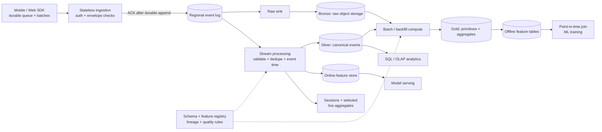
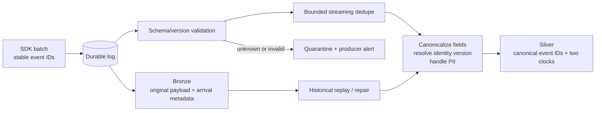
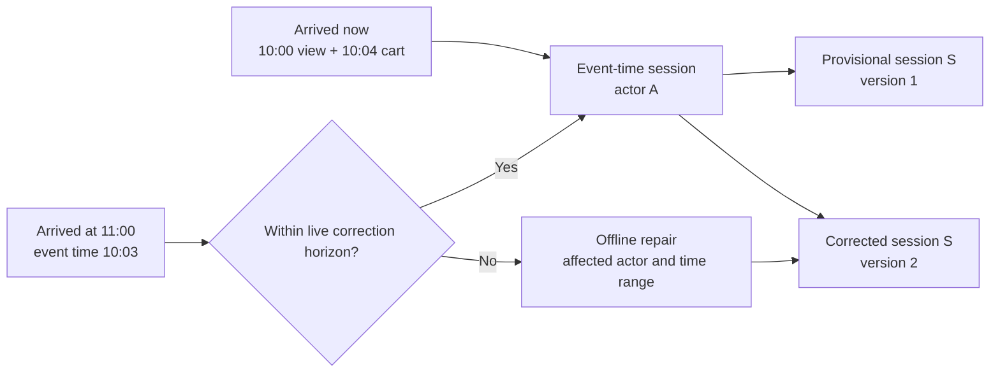
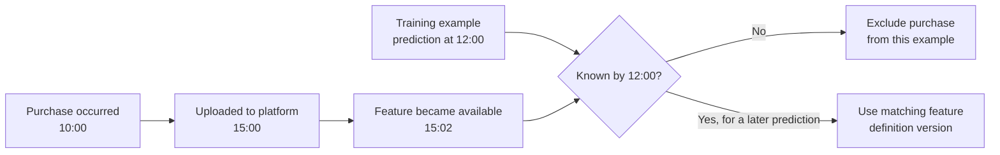

“Collect app behavior for analytics and machine learning” sounds like an event-ingestion question. Ingestion is only the front door. The harder design question is how a late, duplicated, schema-changing click becomes a **reliable data asset** that an analyst can query and a model can use without learning from the future.

I would frame the system as a **user behavior data and feature platform**. It ingests views, searches, cart actions, orders, refunds, and ratings; turns them into canonical events, sessions, funnels, and reusable aggregates; then serves both historical training data and fresh online features. The platform owns correctness and reusable computation. ML teams still choose their models, labels, and model-specific features.

## Scope, contracts, and an illustrative scale

The first contract is *at-least-once event delivery with effectively-once derived results*, not a promise that a mobile device and every sink share one global transaction. An SDK may retry after a timeout or upload hours after a user was offline. Every action therefore needs a stable `event_id`, and each stage needs a deliberate duplicate and replay policy.

For an interview, I would propose these targets and validate them against the product's actual workload:

| Workload | Design target |
| --- | --- |
| Ingestion | Acknowledge a valid batch after a durable log append; p99 under 200 ms and high availability. |
| Online features | Seconds-to-minutes freshness for selected features; low-latency keyed reads for inference. |
| Historical features | Reproducible, versioned, point-in-time training datasets; hours of latency can be acceptable. |
| Recovery | Retain raw events long enough for replay and backfill; quarantine malformed events rather than silently dropping them. |
| Governance | Track schema versions, lineage, quality, access, retention, and deletion obligations. |

Suppose, purely for capacity planning, we have 100 million daily active users producing 100 events each. That is **10 billion events/day**, about **116,000 events/s average**, and roughly **580,000 events/s at a five-times peak**. At an *assumed* 500 compressed bytes per event, raw payload alone is about **5 TB/day** before replication or derived datasets. If the SDK sends 20 events per request, peak HTTP traffic is nearer **29,000 batch requests/s**. These estimates make an important point: stateful processing, lake layout, and a large backfill may dominate the architecture more than the HTTP edge. Kafka partition counts and storage footprints require benchmarks, not a number copied from an interview template.

## High-level architecture

The edge authenticates callers, checks batch size and a minimal envelope, and writes to the log. It does **not** wait for sessionization, model features, or a data-lake commit before acknowledging the client. Use a replicated log with an appropriate `acks=all` and minimum in-sync replica policy; [Kafka documents](https://kafka.apache.org/40/configuration/producer-configs/) the producer side and its [broker configuration](https://kafka.apache.org/40/generated/kafka_config.html) defines the durability floor. If the append cannot meet that policy, return a retryable failure and leave the batch in the SDK's local queue. An accepted event is log-durable under that fault model; it is **not yet guaranteed to have reached long-term raw storage**, so raw-sink lag must remain safely below log retention.

The log fans out to two independent paths. The raw sink persists what the client actually sent, including bad payloads, subject to privacy policy. The processing path produces the platform's interpretation. Once landed and verified, Bronze is the long-lived replay source; Silver and everything after it are **versioned derived datasets**. A regional log and regional raw landing zone keep ingestion close to clients and isolate failures; global datasets can be assembled asynchronously, subject to data-residency rules.

## Make the event envelope replayable

At minimum, an event carries `event_id`, producer/tenant, `user_id` or anonymous `device_id`, `event_type`, `schema_version`, `client_event_time`, server `ingest_time`, optional device `sequence_no`, and attributes. The SDK creates the ID **once per user action** and preserves it through retries. It buffers to local durable storage, batches, compresses, and only removes a batch after an acknowledged upload. A lost response can cause a second upload; a new ID on retry would make it indistinguishable from a second action.

Partition the log by a stable processing actor key when possible, so one actor's appended events share a partition. That gives order **within that partition**, not global event-time order. Offline devices and multiple devices can still upload actions out of order. Keep both clocks: event time says *when an action occurred*; ingest time says *when the platform first knew about it*. Reject or quarantine implausible timestamps rather than trusting a misconfigured phone clock.

Do not build an eternal Redis set of every seen event ID. A keyed streaming dedupe window covers ordinary retries; a deterministic historical dedupe by `event_id` covers long-range reprocessing. Its TTL must exceed the expected retry horizon, and an exceptionally late duplicate outside that horizon needs a batch reconciliation rule. Invalid events remain in raw storage and go to quarantine for investigation rather than contaminating Silver. Flink checkpoints can recover state and source positions, but [end-to-end exactly-once delivery also depends on the sink](https://nightlies.apache.org/flink/flink-docs-stable/docs/connectors/datastream/guarantees/); online KV writes still need idempotency or enforced versions.

Mobile schema versions coexist. The registry maps `ADD_TO_CART v1`, `v2`, and `v3` into one canonical meaning, while preserving the original version for replay. Keep a cached, minimal ingestion contract so a brief registry outage does not turn into an ingestion outage. Full business validation happens asynchronously. Track volume, null rates, freshness, schema failures, and distribution shifts—not just JSON syntax.

## Turn clean events into reusable behavior

Silver is not merely “raw, but prettier.” It establishes canonical IDs, event names, timestamps, privacy handling, and identity rules that downstream teams can share. Avoid a lake partition per `user_id`; millions of high-cardinality partitions create a file and metadata problem. A date partition with bounded actor buckets and deliberate sorting/compaction is a better starting layout. Likewise, do not create one tiny Parquet file per task every few seconds; buffer and compact files to suit query and backfill workloads.

Sessionization groups an actor's events by **event time** using an inactivity gap, perhaps 30 minutes for an example product. A view at 10:05 uploaded at 11:00 belongs near the earlier 10:00 actions, not necessarily the 11:00 processing-time session. A watermark lets the stream produce a timely provisional result, but it is an estimate of completeness, not proof that no offline phone will ever reconnect. Extremely late events enter a correction path or an offline rebuild that writes a new session version. [Flink's event-time model](https://nightlies.apache.org/flink/flink-docs-stable/docs/concepts/time/) explicitly separates event time, watermarks, and lateness.

For funnels, define the semantics before writing a state machine: strict versus optional steps, maximum duration, and what constitutes a new attempt. One user may place three orders in one day, so `(user_id, funnel_id)` cannot be the only instance key. Materialize a **small number of business-critical funnels** as versioned `funnel_fact` rows keyed by a journey or attempt ID. Exploratory funnels run against canonical events or an OLAP layer; precomputing every analyst-defined funnel would multiply keyed state without bound.

Rolling features such as `orders_7d` or `refund_rate_30d` should not scan all history on each event. Maintain mergeable hourly or daily components by actor: order count, refund count, amount sum, and count. Derive a rate from numerator and denominator; a precomputed rate alone cannot be safely merged. Shared daily primitives let many seven-, thirty-, and ninety-day features reuse one computation instead of spawning a raw-data scan for every feature.

## Offline training and online inference are different paths

Store offline features as versioned, time-stamped feature groups in the lake, for example `user_commerce_features(entity_id, feature_timestamp, available_at, definition_version, orders_7d, refund_count_30d, order_count_30d)`. Grouping related columns makes training reads and lineage manageable. Keep only features required by live models in an online keyed store, grouped so a model does not make hundreds of network requests for one prediction. Redis can be a cache, but the recovery plan must not depend on it as the only copy.

For an online update, do **not** let a delayed retry overwrite newer materialized state. A late event can itself produce a *newer correction* to an older event-time window, so comparing event timestamps alone is insufficient. Write an absolute feature-group value with a monotonically increasing **materialization revision** within its definition version, and enforce that revision at the sink (single ordered writer with fencing, or a conditional write). A version field that nobody checks provides no protection. If the online store is unavailable, serving can use a declared cached/default value while the writer retries and reconciles from durable data.

The training path must prevent two kinds of future leakage. Suppose a purchase happened at 10:00, reached the server at 15:00, and was first reflected in a model feature at 15:02. A 12:00 prediction did not know it, even though the event time is 10:00. For a training example at prediction time `T`, select the latest compatible feature version that satisfies both **feature event-time cutoff ≤ T** and **feature availability time ≤ T**. In a rigorous replay, the identity mapping and feature definition also need the versions that were valid for that example. This is stricter than a simple as-of join on one timestamp; [Feast's point-in-time join documentation](https://docs.feast.dev/getting-started/concepts/point-in-time-joins) describes the historical-retrieval baseline, and the second clock is required when reconstructing *what production actually knew*.

Online and offline implementations should share feature definitions and be checked for training-serving skew. A registry records entity, window, transformation, owner, version, freshness tier, source lineage, and whether the feature is served online. It need not predict every future model feature: the platform provides reusable primitives and safe computation; model teams compose what they need.

## Replay, backfill, and safe publication

Imagine `refund_rate_30d` used the wrong denominator for three months. Do not overwrite the live feature group halfway through a repair. Create definition `v8`, compute it from retained raw/canonical history in an isolated namespace, validate coverage and sample values, and publish only after the whole intended dataset is ready. An [Iceberg table commit](https://iceberg.apache.org/spec/) atomically publishes **one table's** new snapshot; if the cutover spans multiple tables or the online store, use a separate versioned release pointer or consumer configuration so those assets switch coherently. Warm the online `v8` keys, then move model traffic from `v7` to `v8`. Keep `v7` while its models and training artifacts need reproduction.

Backfills should have an isolated, lower-priority compute pool and partition pruning; a 90-day repair at the illustrative scale touches up to 900 billion raw events before filtering. Monitor raw-sink lag against log retention, stream checkpoint duration, watermark delay, quarantine rate, small-file counts, feature freshness, and online/offline value mismatches. A bad producer rollout or a sudden 60% drop in `ORDER_COMPLETED` volume should page the owning team even if individual events remain schema-valid.

Privacy is part of the data contract. “Immutable raw” means transformations do not rewrite away history; it does **not** mean data-subject deletion or retention rules can be ignored. Classify PII, restrict access, minimize fields, and implement the required delete/expiry workflow across raw, derived, and online stores. Identity stitching from anonymous device to logged-in user is itself a versioned derived mapping, not a retroactive change to the original event.

## What I would emphasize in the interview

The core architecture is **Bronze → Silver → reusable behavioral primitives → versioned offline and online features**. A durable event log absorbs retries and fan-out, while the raw lake enables long replay. Event-time processing creates low-latency sessions and selected funnels; batch processing repairs history and builds reproducible training data. The hardest correctness question is not “Which broker?” but “Could this model have known this value at prediction time?”

If time is limited, I would deep-dive into three areas: late events and session correction, point-in-time feature joins with two clocks, and versioned backfill/cutover. Those expose the real trade-offs: freshness versus finality, online latency versus historical reproducibility, and fast iteration versus trustworthy data.
